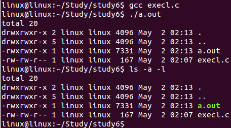

# Concurrent Program

## 1.进程概念

> 进程是程序的活跃表现，它体现了程序在计算机中的执行状态；程序则是构成进程的基础，是被动的代码存储形态。
> 程序：存放在磁盘上的指令和数据的有序集合（文件），静态的
> 进程：执行一个程序所分配的资源的总称，进程是程序的一次执行过程，动态的，包括创建、调度、执行和消亡

### 进程内容

- **代码段**：代码段通常是指用来存放程序执行代码的一块内存区域。这部分区域的大小在程序运行前就已经确定，在代码段中，也有可能包含一些只读的常数变量，例如字符串常量等。

- **数据段**：数据段通常是指用来存放程序中已初始化的全局变量的一块内存区域。

- **BSS段**：BSS段通常是指用来存放程序中未初始化的全局变量的一块内存区域。BSS是英文Block Started by Symbol的简称。

- **堆（heap）**：堆是用于存放进程运行中被动态分配的内存段，当进程调用<u>malloc等函数分配</u>内存时，新分配的内存就被动态添加到堆上（堆被扩张）；当利用<u>free等函数释放</u>内存时，被释放的内存从堆中被剔除（堆被缩减）

- **栈(stack)**：栈又称堆栈， 是用户存放程序临时创建的<u>局部变量</u>，（但<u>不包括static声明的变量</u>，static意味着在数据段中存放变量）。除此以外，在函数被调用时，其参数也会被压入发起调用的进程栈中，并且待到调用结束后，函数的返回值也会被存放回栈中。由于栈的先进后出特点，所以栈特别方便用来保存/恢复调用现场。从这个意义上讲，我们可以把堆栈看成一个寄存、交换临时数据的内存区

- **进程控制块**：用来记录进程属性，
  
  - 进程标识PID
  - 进程用户
  - 进程状态、优先级
  - 文件描述符（可储存1024个）
    ---

### **进程类型**

- 交互进程：在shell下启动。以在<u>前台</u>运行，也可以在<u>后台</u>运行
- 批处理进程：和在终端无关，被提交到一个作业队列中以便顺序执行
- 守护进程：和终端无关，一直在<u>后台</u>运行

### **进程状态**

- 运行态：进程正在运行，或者准备运行
- 可中断等待态：进程在等待一个事件的发生或某种系统资源
- 不可中断等待态：同上
- 停止态：进程被中止，收到信号后可继续运行
- 死亡态：已终止的进程，但pcb没有被释放


## 2.进程常用命令

Linux进程命令

### **进程信息**

- $ps   查看系统进程快照
- $top  查看进程动态信息
- $ls /proc 查看进程详细信息

> - ps 命令详细参数：
>   - -e：显示所有进程
>   - -l：长格式显示更加详细的信息
>   - -f 全部列出，通常和其他选项联用
>   - ==例.$ps -elf |grep a.out==
>     - 查看进程a.out
>     - grep作用为检索
> - top 命令详细参数：
>   - shift+ > 后翻页
>   - shift+ < 前翻页
>   - $top -p PID 查看某个进程 


**表头含义：**

- F 进程标志，说明进程的权限，常见的标志有两个:
  - 1：进程可以被复制，但是不能被执行；
  - 4：进程使用超级用户权限； 

- S 进程状态,常见的状态有以下几种：
  - -D：不可被唤醒的睡眠状态，通常用于 I/O 情况
  - -R：该进程正在运行
  - -S：该进程处于睡眠状态，可被唤醒
  -  -T：停止状态，可能是在后台暂停或进程处于除错状态
  - -W：内存交互状态（从 2.6 内核开始无效）
  - -X：死掉的进程（应该不会出现）
  - -Z：僵尸进程。进程已经中止，但是部分程序还在内存当中
  - -<：高优先级（以下状态在 BSD 格式中出现）
  - -N：低优先级
  - -L：被锁入内存
  - -s：包含子进程
  - -l：多线程（小写 L）
  - -+：位于后台     

- UID: 运行此进程的用户的 ID
- PID: 进程的 ID
- PPID: 父进程的 ID
- C: 该进程的 CPU 使用率，单位是百分比
- PRI: 进程的优先级，数值越小，该进程的优先级越高，越早被 CPU 执行
- NI:   进程的优先级，数值越小，该进程越早被执行；  
- ADDR:   该进程在内存的哪个位置；  
- SZ: 该进程占用多大内存；
- WCHAN: 该进程是否运行。"-"代表正在运行；
- TTY: 该进程由哪个终端产生；
- TIME: 该进程占用 CPU 的运算时间，注意不是系统时间；
- CMD: 产生此进程的命令名；

### 进程优先级

- $nice  按用户指定的优先级运行进程
  - $nice -n [NI值] [命令]
  - NI 范围是 -20~19。数值越大优先级越低
  - 普通用户调整 NI 值的范围是 0~19，而且只能调整自己的进程。
  - 普通用户只能调高 NI 值，而不能降低。如原本 NI 值为 0，则只能调整为大于 0。
  - 只有 root 用户才能设定进程 NI 值为负值，而且可以调整任何用户的进程。

- $renice  改变正在运行进程的优先级
  -  $renice [优先级] [PID]

### 后台进程

- $jobs  查看后台进程
- $bg [进程序号]  将挂起的进程在后台运行
- $fg [进程序号]  把后台运行的进程放到前台运行
- ctrl+Z 把刚运行的程序转到后台运行
- ./a.out& 把a.out程序后台运行

## 3.子进程

子进程概念：子进程为由另外一个进程（对应称之为父进程）所创建的进程

### 创建子进程

> **子进程创建-fork**
> \#include <unistd.h>
> pid_t fork(void);
>
> - 创建新的进程，失败时返回-1
> - 成功时父进程(执行fork的进程)返回子进程的进程号，子进程（通过fork产生的进程）中为0
> - 子进程会执行父进程中fork下面的程序
> - 通过fork的返回值区分父进程和子进程

> **示例1**-fork
> 在父进程中打印"pid = 进程号"，在子进程中打印"pid = 0"
>
> ```c
> #include <stdio.h>
> #include <unistd.h>
> int main(int argc, const char *argv[])
> {
> 	pid_t pid;
> 	pid = fork();
> 	printf("pid = %d\n",pid);
> 	return 0;
> }
> ```

> **示例2**
>
> fork的一般用法
>
> ```c
> #include <stdio.h>
> #include <unistd.h>
> int main(int argc, const char *argv[])
> {
> 	pid_t pid;
> 	pid = fork();
> 	printf("pid = %d\n",pid);
> 
> 	if(pid > 0)//父进程
> 	{
> 		printf("Father\n");
> 	}
> 	else if(pid == 0)//子进程
> 	{
> 		printf("Child\n");
> 	}
> 	else//出错
> 	{
> 		perror("fork\n");
> 		return 0;
> 	}
> 	return 0;
> }
> ```
>
> >  [!NOTE]
> >
> >  - 子进程只执行fork之后的代码
> >  - 父子进程执行顺序是操作系统决定的
> >  - 子进程继承了父进程的内容
> >  - 父子进程有独立的地址空间，互不影响
> >  - 若父进程先结束，子进程成为孤儿进程，被init进程收养，子进程变成后台进程
> >  - 若子进程先结束，父进程如果没有及时*回收*，子进程变成僵尸进程

> **示例3**
>
> ```c
> #include <stdio.h>
> #include <unistd.h>
> int main(int argc, const char *argv[])
> {
> 	pid_t pid;
> 	int i;
> 	for(i=0; i<3; i++)
> 	{
> 		pid = fork();
> 		if(pid < 0)
> 		{
> 			perror("fork");
> 			return 0;
> 		}
> 		else if(pid == 0)
> 	 	{
> 			printf("%d Child %d\n",i,pid);
> 			sleep(5);
> 		}
> 		else if(pid > 0)
> 		{
> 			printf("%d Father%d\n",i,pid);
> 			sleep(5);
> 		}
> 	}
> 	return 0;
> }
> ```
>
> 生成3个子进程3个孙进程1个曾孙进程
>
> - 子进程：2、3、5 （1 生的）
> - 孙进程：4、6、7  （2、3、5 生的）
> - 曾孙进程：8   （4、6、7 生的）
>
> 

### 结束进程

-  进程结束 – exit/_exit
   -  头文件
      -  \#include <stdlib.h> 
      -  \#include <unistd.h>
   -  void exit(int status);
      -  结束当前的进程并将status返回
      -  exit结束进程时会刷新(流)缓冲区
   -  void _exit(int status);
      -  不刷新(流)缓冲区

>  [!NOTE]
>
>  return 和 exit 的区别：
>  	main函数结束时会隐式地调用exit函数，普通函数return是返回上一级。

示例：

```c
#include <stdio.h>
#include <stdlib.h>
int main(void) 
{
    printf(“before exit”);
    exit(0);
    printf(“after exit”);
}
```

编译运行后只打印“before exit”

### 回收子进程

> 子进程结束时由父进程回收
> 孤儿进程由init进程回收
> 若没有及时回收会出现僵尸进程

- 进程回收 – wait
  - \#include <sys/wait.h>
  -  pid_t wait(int *status); 
  -  成功时返回回收的子进程的进程号；失败时返回EOF
  -  若子进程没有结束，父进程一直阻塞
  -  若有多个子进程，哪个先结束就先回收
  -  status 指定保存子进程返回值和结束方式的地址
  -  status为NULL表示直接释放子进程PCB,不接收返回值

**读取status参数**
> 子进程通过exit / _exit / return 返回某个值(0-255)
>
> 父进程调用wait(&status) 回收
>
> - 通过调用宏来将返回值解读
>   - WIFEXITED(status)  判断子进程是否正常结束
>   - WEXITSTATUS(status)  获取子进程返回值
>   - WIFSIGNALED(status)  判断子进程是否被信号结束
>   - WTERMSIG(status)  获取结束子进程的信号类型

示例：

```c
#include <stdio.h>
#include <sys/wait.h>
#include <unistd.h>
#include <stdlib.h>

int main(int argc, char** argv)
{
   pid_t pid;
   pid_t rpid;
   pid = fork();
   int status;
   if(pid<0)//出错
   {
      perror("fork");
      return 0;
   }
   else if(pid == 0)//子进程
   {
       sleep(2);
       printf("child 2 \n");
       exit(2);
   }
   else if(pid >0)//父进程
   {
       rpid = wait(&status);
       printf("Get child status=%d\n",WEXITSTATUS(status));
   }
}
```

- 进程回收-waitpid
  - \#include <unistd.h>
  -  pid_t waitpid(pid_t pid, int *status, int option);
- 参数：
  - pid
    - pid>0时，只等待进程ID等于pid的子进程，不管其它已经有多少子进程运行结束退出了，只要指定的子进程还没有结束，waitpid就会一直等下去。
    - pid=-1时，等待任何一个子进程退出，没有任何限制，此时waitpid和wait的作用一模一样。
    - pid=0时，等待同一个进程组中的任何子进程，如果子进程已经加入了别的进程组，waitpid不会对它做任何理睬。
    - pid<-1时，等待一个指定进程组中的任何子进程，这个进程组的ID等于pid的绝对值。
  - options 
    - options提供了一些额外的选项来控制waitpid，目前在Linux中只支持WNOHANG和WUNTRACED两个选项，这是两个常数，可以用"|"运算符把它们连接起来使用
    - WNOHANG ：若由pid指定的子进程未发生状态改变(没有结束)，则waitpid()不阻塞，立即返回0
    - WUNTRACED： 返回终止子进程信息和因信号停止的子进程信息
-  wait(wait_stat) 等价于waitpid(-1,wait_stat,0) 

示例

```c
#include <stdio.h>
#include <sys/wait.h>
#include <unistd.h>
#include <stdlib.h>

int main(int argc, char** argv)
{
   pid_t pid;
   pid_t rpid;
   pid = fork();
   int status;
   if(pid<0)//出错
   {
      perror("fork");
      return 0;
   }
   else if(pid == 0)//子进程
   {
       sleep(10);
       printf("child 2 \n");
       exit(2);
   }
   else if(pid >0)//父进程
   {
       waitpid(pid,&status,0);
       printf("Get child status=%d\n",WEXITSTATUS(status));
   }
}
```

### 示例

> 创建一个进程链，父进程->子进程->孙进程->重孙进程->重重孙进程
>
> ```c
>#include <stdio.h>
> #include <unistd.h>
> 
> int main(int argc, const char *argv[])
> {
> 	pid_t pid;
> 	int i;
> 
> 	for(i=0; i<5; i++)
> 	{
> 		pid=fork();
> 		if(pid < 0)
> 		{
> 			perror("fork");
> 			return 0;
> 		}
> 		if(pid > 0)
> 		{
> 			printf("father %d\n",i);
> 			break;
> 		}
> 		if(pid == 0)
> 		{
> 			printf("child %d\n",i);
> 		}
> 	}
> 	sleep(20);
> 	wait(0);
> 	return 0;
> }
> ```
> 
> 通过ps指令查看
>
> 

## 4.exec函数族

- 进程调用exec函数族执行某个程序
- 进程当前内容被指定的程序替换
- 实现让父子进程执行不同的程序
  - 父进程创建子进程
  - 子进程调用exec函数族
  - 父进程不受影响

### execl / execlp

-  \#include <unistd.h>

-  int execl(const char *path, const char *arg, …);
-  int execlp(const char *file, const char *arg, …);
  - 成功时执行指定的程序；失败时返回EOF
  - path  执行的程序名称，包含路径
  - arg… 传递给执行的程序的参数列表
  - file  执行的程序的名称，在PATH中查找

>  [!NOTE]
>
>  1. execlp不需要写文件名全路径
>  2. 在PATH查找最后一个参数必须用空指针(NULL)作结束
>  3. ==进程当前内容被指定的程序替换==，但进程号不变
>  4. ==第0个参数必须要写，虽然它没有使用==

> 示例1：
>
> ```c
> #include <stdio.h>
> #include <unistd.h>
> int main(int argc, const char *argv[])
> {
> 	if(execl("/bin/ls","ls","-a","-l","./",NULL)<0)
> 	{
> 		perror("execl");
> 	}
> 	return 0;
> }
> ```
>
> 编译运行a.out 和 shell命令$ls -a -l 做对比
>
> 
>
> 运行效果一致

> 示例2：
>
> ```c
> #include <stdio.h>
> #include <unistd.h>
> int main(int argc, const char *argv[])
> {
> 	if(execlp("ls","-a","-l","./",NULL)<0)
> 	{
> 		perror("execl");
> 	}
> 	return 0;
> }
> ```
>
> 运行效果同示例1

### execv / execvp

-  \#include <unistd.h>
-  int execv(const char *path, char *const argv[]);
-  int execvp(const char *file, char *const argv[]);
  - 成功时执行指定的程序；失败时返回EOF
  - **arg… 封装成指针数组的形式**
  - path  执行的程序名称，包含路径
  - file  执行的程序的名称，在PATH中查找

> 示例
>
> ```c
> #include <stdio.h>
> #include <unistd.h>
> int main(int argc, const char *argv[])
> {
>     char *arg[] = {“ls”, “-a”, “-l”, “/etc”, NULL};
>     if  (execv(“/bin/ls”, arg) < 0) {
>      perror(“execv”);
>     }  
>     if  (execvp(“ls”, arg) < 0) {
>      perror(“execvp”);
>     }  
> 	return 0;
> }
> ```
>
> 运行效果同上

### system

> -  \#include <stdlib.h>
> -  int system(const char *command);
>   - 成功时返回命令command的返回值；失败时返回EOF
>   - 当前进程等待command执行结束后才继续执行
>
> 示例
>
> ```c
> #include <studio.h>
> #include <stdlib.h>
> int main()
> {
>     system("ls -a -l ./");
> }
> ```
>

## 5.守护进程

**概念：**

守护进程又叫精灵进程（Daemon Process），它是一个生存期较长的进程，通常独立于控制终端并且周期性地执行某种任务或等待处理某些发生的事件。

**特点：**

始终在后台运行，独立于任何终端，周期性的执行某种任务或等待处理特定事件。

它是个特殊的孤儿进程，这种进程脱离终端，为什么要脱离终端呢？之所以脱离于终端是为了避免进程被任何终端所产生的信息所打断，其在执行过程中的信息也不在任何终端上显示。由于在 Linux 中，每一个系统与用户进行交流的界面称为终端，每一个从此终端开始运行的进程都会依附于这个终端，这个终端就称为这些进程的控制终端，当控制终端被关闭时，相应的进程都会自动关闭

**举例：**

http 服务的守护进程叫 httpd，mysql 服务的守护进程叫 mysqld。

**相关名词：**

- 进程组（Process Group）： 进程集合，每个进程组有一个组长（Leader），其进程 ID 就是该进程组 ID。
- 会话（Session）： 进程组集合，每个会话有一个组长，其进程 ID 就是该会话组 ID。
- 控制终端（Controlling Terminal）：每个会话可以有一个单独的控制终端，与控制终端连接的 Leader 就是控制进程（Controlling Process）。

**用到的函数：**

> - setsid函数：
>   - pid_t setsid(void);
>   - 成功：返回调用进程的会话ID；失败：-1，设置errno。
>   - 调用了setsid函数的进程，既是新的会长，也是新的组长
>
> - getsid函数
>   - pid_t getsid(pid_t pid)
>   - 成功：返回调用进程的会话ID；失败：-1，设置errno
>   - pid为0表示察看当前进程session ID
> - getpid：
>   - pid_t getpid(void);    
>   - 获取进程id
> - getpgid：
>   - pid_t getpgid(pid_t pid);  
>   - 获取进程组id
>
> - $ps ajx命令
>   - 查看系统中的进程
>   - 参数a表示不仅列当前用户的进程,也列出所有其他用户的进程,
>   - 参数x表示不仅列有控制终端的进程,也列出所有无控制终端的进程,
>   - 参数j表示列出与作业控制相关的信息。

组长进程不能成为新会话首进程,新会话首进程必定会成为组长进程。

### 创建步骤

1. 创建子进程，父进程退出

   > 创建子进程然后结束父进程，子进程变成孤儿进程，被init进程收养，子进程在后台运行
   >
   > ```c
   > if (fork() > 0)  
   > {
   >  exit(0);
   > }
   > ```
   >
   > 查看进程：$ps -ef|grep a.out
   > 结束进程：$kill -9 [进程号]
   >
   > > 更简便的创建后台进程（不建议使用）
   > >
   > > 通过这条命令运行代码:$ <u>nohub ./a.out &</u>
   > > 进程进入后台运行

2. 子进程创建新会话

   > ```c
   > if (setsid() < 0)  
   > {
   > 	exit(-1);
   > }
   > ```
   >
   > 子进程成为新的会话组长
   > 子进程脱离原先的终端

3. 更改当前工作目录

   >   ```c 
   >   chdir(“/”);//更改当前工作目录到根目录
   >   ```
   >
   >  守护进程一直在后台运行，其工作目录不能被卸载
   >  重新设定当前工作目录cwd

4. 重设文件权限掩码

   > ```c
   > if (umask(0) < 0)  
   > {
   > 	exit(-1);
   > }
   > ```
   >
   > 文件权限掩码设置为0
   > 只影响当前进程

5. 关闭打开的文件描述符

   > ```c
   > close(0);
   > close(1);
   > close(2);
   > ```
   > 关闭所有从父进程继承的打开文件
   > 已脱离终端，stdin / stdout / stderr无法再使用

守护进程创建完成

```c
#include <stdio.h>
#include <unistd.h>
#include <stdlib.h>
#include <sys/stat.h>
int main(int argc, const char *argv[])
{
  pid_t pid;
  pid = fork();
  if(pid<0)
  {
    perror("fork");
    return 0;
  }
  else if(pid>0)
  {
    exit(0);//1.结束父进程
  }
  printf("Deamon\n");
  printf("sid=%d,pid=%d,pgid=%d\n",
         getsid(getpid()),
         getpid(),
         getpgid(getpid()));
  if(setsid()<0)//2.子进程创建新会话
  {
    perror("setsid");
    exit(0);
  }
  printf("after sid=%d,pid=%d,pgid=%d\n",
         getsid(getpid()),
         getpid(),
         getpgid(getpid()));
  chdir("/");//3.更改当前工作目录到根目录
    
  if(umask(0)<0)//4.文件权限掩码设置为0
  {
    perror("unmask");
    exit(0);
  }
  close(0);//5.关闭打开的文件描述符
  close(1);
  close(2);
  printf("after close \n");  
  
  sleep(100);
  return 0；
}
```

### GDB调试多进程程序

> gcc编译.c程序时加入 -g 参数
>
> ```shell
> gcc -g xxx.c
> gdb a.out #进入调试
> ```
>
> 
>
> 出现上图表示进入了gdb调试

gdb相关命令

> - (gdb) run 全速运行
> - (gdb) star 单步调试
> - (gdb) n 下一步
> - (gdb) set follow-fork-mode child/parent 设置GDB只跟踪 子/父 进程代码
> - (gdb) set setach-on-fork on/off 设置GDB跟踪调试单个进程或多个(默认为on)
>   - on: 只调试父进程或子进程的其中一个，(根据follow-fork-mode来决定)，这是默认的模式
>   - off：父子进程都在gdb的控制之下，其中一个进程正常调试(根据follow-fork-mode来决定),另一个进程会被设置为暂停状态。
> - (gdb) info inferiors  显示GDB调试的进程
> - (gdb) inferiors [进程序号] (1,2,3....)切换GDB调试的进程

## 6.线程创建

概念

> 进程有独立的地址空间
> Linux为每个进程创建task_struct
> 每个进程都参与内核调度，互不影响
> 进程在切换时系统开销大
> 很多操作系统引入了轻量级进程LWP
> 同一进程中的线程共享相同地址空间
> Linux不区分进程、线程

线程特点

> - 通常线程指的是共享相同地址空间的多个任务
> - 使用多线程的好处
>   - 大大提高了任务切换的效率
>   - 避免了额外的TLB & cache的刷新

线程共享资源

> 一个进程中的多个线程共享以下资源：
>
> - 可执行的指令
> - 静态数据
> - 进程中打开的文件描述符
> - 当前工作目录
> - 用户ID
> - 用户组ID

线程私有资源

> 每个线程私有的资源包括：
>
> - 线程ID (TID)
> - PC(程序计数器)和相关寄存器
> - 堆栈
> - 错误号 (errno)
> - 优先级
> - 执行状态和属性

### 线程创建

pthread_create函数

> - \#include <pthread.h>
> -  int pthread_create(pthread_t *thread, const pthread_attr_t *attr, void *(*routine)(void *), void *arg);
>   -  thread 线程对象
>   -  attr 线程属性，NULL代表默认属性
>   - routine 线程执行的函数
>   -  arg 传递给routine的参数 ，参数是void * ，注意传递参数格式，NULL代表无参数
>   - 成功返回0，失败时返回错误码
>
> > 使用pthread_create函数时出现的错误：
> > test_createP.c:(.text+0x4b)：对‘pthread_create’未定义的引用
> > collect2: error: ld returned 1 exit status  
> > 这个为链接错误，因为pthread_create函数的库为<u>动态链接库</u>
> > 解决：在编译时加上 -lpthread 
> > 例：$gcc test.c -lpthread
>
> >  [!NOTE]
> >
> >  创建线程后，若主进程运行结束，它创建的线程也会随之结束。
> >
> >  所以，要在主进程预留一段时间等待线程结束，避免线程中断。

### 线程结束

pthread_exit函数

> -  \#include <pthread.h>
> -  void pthread_exit(void *retval);
>   - 结束当前线程
>   - retval可被其他线程通过pthread_join获取
>   - 线程私有资源被释放

### 线程查看

pthread_self函数
> pthread_t pthread_self(void);
> \#include <pthread.h>
> 查看自己的TID

----

## 7.线程传参

> 值传递 和 地址传递
> 示例：arg1 arg2 作为传递的参数
>
> ```c
> #include <stdio.h>
> #include <pthread.h>
> #include <unistd.h>
> 
> int * test_pth1(void *arg)
> {
> 	printf("p1 tid = %lu\n",pthread_self());//线程ID
> 	printf("p1 pid = %d\n",getpid());//进程ID
> 	printf("p1 arg = %d\n",*(int *)arg);//传的参数
> 	pthread_exit(NULL);//退出线程
> }
> int * test_pth2(void *arg)
> {
> 	printf("p2 tid = %lu\n",pthread_self());//线程ID
> 	printf("p2 pid = %d\n",getpid());//进程ID
> 	printf("p2 arg = %d\n",(int)arg);//传的参数
> 	pthread_exit(NULL);//退出线程
> }
> int main(int argc, const char *argv[])
> {
> 	pthread_t tid;//线程ID
> 	int ret;
> 	int arg1,arg2;
> 	/*创建线程*/
> 
> 	for(arg1=0; arg1<4; arg1++)
> 	{//地址传递
> 		ret = pthread_create(&tid,NULL,(void *)test_pth1,(void *)&arg1);
> 	}
> sleep(1);
> 	for(arg2=0; arg2<4; arg2++)
> 	{//值传递
> 		ret = pthread_create(&tid,NULL,(void *)test_pth2,(void *)arg2);
> 	}
> 	printf("main tid%lu\n",tid);
> 	sleep(1);//等待线程结束
> 	return 0;
> }
> ```
> 运行结果：
>
> 
>
> <u>地址传递</u>arg的值都为4，而<u>值传递</u>的arg值为创建线程时传入的值
>
> 地址传递的值会随着地址指向的数改变而改变，而线程创建的速度要比线程运行的速度要快，四个线程创建完后arg 的值为4，然后线程才开始运行，所以都打印出arg=4。

----

## 8.线程回收

两种方法回收线程

1. 使用pthread_join 函数
2. 使线程分离

pthread_join 函数：

> \#include <pthread.h>
> int pthread_join(pthread_t thread, void **retval);
> thread 线程ID
> retval 线程返回值
>
> >  [!NOTE]
> >
> >  pthread_join 是阻塞函数，如果回收的线程没有结束，则一直等待
>
> 示例
>
> ```c
> #include <stdio.h>
> #include <pthread.h>
> #include <unistd.h>
> void *fun(void * arg)
> {
> 	int i;
> 	pthread_detach(pthread_self());
> 	for(i=0; i<3; i++)
> 	{
> 		printf("child %d\n",i);
> 		sleep(1);
> 	}
> 	pthread_exit("fun return");
> }
> int main(int argc, const char *argv[])
> {
> 	int i = 0;
> 	void *retf;
> 	pthread_t tid;
> 	pthread_create(&tid,NULL,fun,(void *)i);
> 	pthread_join(tid,&retf);//等待线程结束
> 	printf("%s\n",(char*)retf);
> 	return 0;
> }
> ```

---

### 线程分离

分离后的线程结束后会自己回收，不会产生僵尸线程

两种方式使线程分离

1.pthread_detach函数

> \#include <pthread.h>
> int pthread_detach(pthread_t thread);
> - thread 线程ID
> - 成功：0；失败：error;
> 指定该状态，线程主动与主控线程断开关系。线程结束后（不会产生僵尸线程）
>
> 示例：
>
> ```c
> #include <stdio.h>
> #include <pthread.h>
> #include <unistd.h>
> void *fun(void * arg)
> {
> 	pthread_detach(pthread_self());//分离线程
> 	printf("child %d\n",(int)arg);
> 	pthread_exit(NULL);
> }
> int main(int argc, const char *argv[])
> {
> 	int i;
> 	pthread_t tid[10];
> 	for(i=0; i<10; i++)//创建十个线程
> 	{
> 		pthread_create(&tid[i],NULL,fun,(void *)i);
> 	}
> 	sleep(10);//等待线程运行
> 	return 0;
> }
> ```
>
> 

2.设置线程属性为分离

> pthread_attr_init函数
> > \#include <pthread.h>
> > pthread_attr_init(pthread_arrt_t *attr);
> > - attr 线程属性
> > 初始化线程属性
>
> pthread_attr_setdetachstate函数
> > \#include <pthread.h>
> > pthread_attr_setdetachstate(pthread_arrt_t *attr, int detachstate);
> >
> > - attr 线程属性
> > - detachstate  分离状态
> > 设置分离属性
>
> 示例
>
> ```c
> pthread_attr_t attr;//定义线程属性变量
> pthread_attr_init(&attr);//初始化该变量
> pthread_attr_setdetachstate(&attr, PTHREAD_CREATE_DETACHED);//设置属性为分离
> pthread_create(&tid,&attr,fun,NULL);//创建线程
> ```
>
> 该线程在创建时就是分离的线程

可以通过top命令查看进程占用的内存空间大小，检验线程是否被回收

**注意**：分离后，进程结束，线程也会随之结束。

---

### 取消线程

pthread_cancel函数

>  \#include <pthread.h>
>
>  int pthread_cancel(pthread_t thread);
>
>  取消一个线程

**注意**：线程的取消要有取消点才可以，不是说取消就取消，线程的取消点主要是==阻塞的系统调用==如sleep();

>  若没有取消点，可手动设置一个取消点
>
>  -  void pthread_testcancel(void);

>  设置取消使能或禁止
>
>  -  int pthread_setcancelstate(int state, int *oldstate);
>  -  state：使能或失能
>     -  PTHREAD_CANCEL_ENABLE
>     -  PTHREAD_CANCEL_DISABLE

>  设置取消类型
>
>  -  int pthread_setcanceltype(int type, int *oldtype);
>     -  PTHREAD_CANCEL_DEFERRED 等到取消点才取消
>     -  PTHREAD_CANCEL_ASYNCHRONOUS 目标线程会立即取消

示例：线程设置为可取消后，被取消，线程结束

```c
#include <stdio.h>
#include <pthread.h>
#include <unistd.h>
void *fun(void * arg)
{
	int i;
	pthread_setcancelstate(PTHREAD_CANCEL_DISABLE,NULL);//设置线程为不能取消
	for(i=0; i<10; i++)
	{
		printf("child %d\n",i);
		sleep(1);
	}
	pthread_setcancelstate(PTHREAD_CANCEL_ENABLE,NULL);//设置线程为可以取消
	for(i=10; i<20; i++)
	{
		printf("child %d\n",i);
		sleep(1);
	}
	pthread_exit(NULL);
}
int main(int argc, const char *argv[])
{
	int i = 0;
	pthread_t tid;
	pthread_create(&tid,NULL,fun,(void *)i);
	sleep(5);//等待五秒	
	pthread_cancel(tid);//取消线程

	while(1)
	{
		sleep(1);
	}
	return 0;
}
```

---

### 线程的清理

当线程非正常终止，需要清理一些资源。

>  -  void pthread_cleanup_push(void (*routine) (void *), void *arg);
>  -  void pthread_cleanup_pop(int execute);
>
>  routine 回调函数被执行的条件：
>
>  1.  被pthread_cancel取消掉。
>  2.  执行pthread_exit 
>  3.  非0参数执行pthread_cleanup_pop()

>  [!NOTE]
>
>  1.  ==必须成对使用==，即使pthread_cleanup_pop不会被执行到也必须写上，否则编译错误。
>  2.  pthread_cleanup_pop()被执行且参数为0，pthread_cleanup_push回调函数routine不会被执行.
>
>  3.  pthread_cleanup_push 和pthread_cleanup_pop可以写多对，routine执行顺序正好相反
>
>  4.  线程内的 return 可以结束线程，也可以给pthread_join返回值，但不能触发pthread_cleanup_push里面的回调函数，所以我们结束线程尽量使用pthread_exit退出线程。

---

## 9.线程的同步和互斥

**概念**

>  1.  临界资源： 一次只允许一个任务(进程、线程)访问的共享资源
>
>  2.  临界区：访问临界资源的程序
>
>  3.  互斥机制：mutex互斥锁，任务访问临界资源前申请锁，访问完后释放锁

### 互斥锁

**互斥锁创建**

​	两种方法创建互斥锁，**静态方式**和**动态方式**

>  **动态方式：**
>
>  int pthread_mutex_init(pthread_mutex_t *restrict **mutex**,const pthread_mutexattr_t *restrict attr);
>
>  其中mutexattr用于指定互斥锁属性，如果为NULL则使用缺省属性。

>  **静态方式：**
>
>  pthread_mutex_t **mutex** = PTHREAD_MUTEX_INITIALIZER;
>
>  mutex：锁的名称

**锁的销毁**

>  int pthread_mutex_destroy(pthread_mutex_t *mutex)
>
>  在Linux中，互斥锁并不占用任何资源，因此LinuxThreads中的 pthread_mutex_destroy()除了检查锁状态以外（锁定状态则返回EBUSY）没有其他动作。

 **锁的使用**

>   \#include <pthread.h>
>
>  申请锁：
>
>  -  int pthread_mutex_lock(pthread_mutex_t *mutex);
>  -  int pthread_mutex_trylock(pthread_mutex_t *mutex);
>
>  释放锁：
>
>  -  int pthread_mutex_unlock(pthread_mutex_t *mutex);
>
>  1. 成功时返回0，失败时返回错误码
>  2. mutex 指向要初始化的互斥锁对象
>  3. pthread_mutex_lock 如果无法获得锁，任务阻塞
>  4. pthread_mutex_trylock 如果无法获得锁，返回EBUSY而不是挂起等待
>  5. 执行完临界区要及时释放锁

示例：使用互斥锁，用两个线程写文件

```c
#include <pthread.h>
#include <stdio.h>
#include <unistd.h>
#include <string.h>

pthread_mutex_t mutex1 = PTHREAD_MUTEX_INITIALIZER;//互斥锁创建锁
FILE *fp;
void *fun1(void *arg)
{
	int i;
	char c = 'A';
	pthread_detach(pthread_self());//分离线程
	printf("fun1...\n");
	i=0;
	pthread_mutex_lock(&mutex1);//互斥锁上锁
	while(i<26)
	{
		printf("%d\n",i);
		fputc(c+i,fp);
		usleep(1);
		i++;
	}
    fputc('\n',fp);
	fflush(fp);//刷新流	
	pthread_mutex_unlock(&mutex1);//互斥锁解锁
	pthread_exit("fun1 exit");
}
void *fun2(void *arg)
{
	int i;
	char c = 'a';
	pthread_detach(pthread_self());//分离线程
	printf("fun2...\n");
	i=0;
	pthread_mutex_lock(&mutex1);//互斥锁上锁
	while(i<26)
	{
		printf("%d\n",i);
		fputc(c+i,fp);
		usleep(1);
		i++;
	}
    fputc('\n',fp);
	fflush(fp);//刷新流	
	pthread_mutex_unlock(&mutex1);//互斥锁解锁
	pthread_exit("fun2 exit");
}
int main()
{
	pthread_t tid1,tid2;
	void *retv;
	int i;
	fp = fopen("1.txt","a+");//读写方式打开文件
	if(fp==NULL)
	{
		perror("fopen");
		return 0;
	}
	pthread_create(&tid1,NULL,fun1,NULL);
	pthread_create(&tid2,NULL,fun2,NULL);
    pthread_join(tid1,NULL);//回收
	pthread_join(tid2,NULL);
    return 0;
}
```

#### man手册找不到

pthread_mutex_xxxxxxx （提示No manual entry for pthread_mutex_xxx）的解决方法：

 输入命令：sudo apt-get install manpages-posix-dev

---

### 读写锁

​	提高线程执行效率

**特性**：

>  写者：写者使用写锁，如果当前没有读者，也没有其他写者，写者立即获得写锁；否则写者将等待，直到没有读者和写者。
>
>  读者：读者使用读锁，如果当前没有写者，读者立即获得读锁；否则读者等待，直到没有写者。

**注意**：

>  同一时刻只有一个线程可以获得写锁，同一时刻可以有多个线程获得读锁。
>
>  读写锁出于写锁状态时，所有试图对读写锁加锁的线程，不管是读者试图加读锁，还是写者试图加写锁，都会被阻塞。
>
>  读写锁处于读锁状态时，有写者试图加写锁时，之后的其他线程的读锁请求会被阻塞，以避免写者长时间的不写锁

**相关函数**：

>   #include <pthread.h>
>
>  -  pthread_rwlock_init  初始化一个读写锁
>     -  int pthread_rwlock_init(pthread_rwlock_t *restrict rwlock,const pthread_rwlockattr_t *restrict attr);
>  -  pthread_rwlock_rdlock  读锁定读写锁
>     -  int pthread_rwlock_rdlock(pthread_rwlock_t *rwlock);
>  -  pthread_rwlock_tryrdlock  非阻塞读锁定
>     -  int pthread_rwlock_tryrdlock(pthread_rwlock_t *rwlock);
>  -  pthread_rwlock_wrlock  写锁定读写锁
>     -  int pthread_rwlock_wrlock(pthread_rwlock_t *rwlock);
>  -  pthread_rwlock_trywrlock  非阻塞写锁定
>     -  int pthread_rwlock_trywrlock(pthread_rwlock_t *rwlock);
>  -  pthread_rwlock_unlock  解锁读写锁
>     -  int pthread_rwlock_unlock(pthread_rwlock_t *rwlock);
>  -  pthread_rwlock_destroy  释放读写锁
>     -  int pthread_rwlock_destroy(pthread_rwlock_t *rwlock);
>
>  示例：创建两个读进程两个写进程，利用读写锁让它们互不干扰
>
>  ```c
>  #include <pthread.h>
>  #include <stdio.h>
>  #include <unistd.h>
>  #include <string.h>
>  
>  pthread_rwlock_t rwlock;//创建读写锁
>  FILE *fp;
>  void *fun1(void *arg)
>  {
>  	int i;
>  	char c = 'A';
>  	pthread_detach(pthread_self());//分离线程
>  	printf("fun1...\n");
>  	i=0;
>  	pthread_rwlock_wrlock(&rwlock);//写锁上锁
>  	while(i<26)
>  	{
>  		fputc(c+i,fp);
>  		usleep(1);
>  		i++;
>  	}
>  	fputc('\n',fp);
>  	fflush(fp);//刷新流	
>  	pthread_rwlock_unlock(&rwlock);//解锁
>  	pthread_exit("fun1 exit");
>  }
>  void *fun2(void *arg)
>  {
>  	int i;
>  	char c = 'a';
>  	pthread_detach(pthread_self());//分离线程
>  	printf("fun2...\n");
>  	i=0;
>  	pthread_rwlock_wrlock(&rwlock);//写锁上锁
>  	while(i<26)
>  	{
>  		fputc(c+i,fp);
>  		usleep(1);
>  		i++;
>  	}
>  	fputc('\n',fp);
>  	fflush(fp);//刷新流	
>  	pthread_rwlock_unlock(&rwlock);//解锁
>  	pthread_exit("fun2 exit");
>  }
>  
>  void * fun3_read(void *arg)//读进程
>  {
>  	pthread_detach(pthread_self());//分离线程
>  	printf("fun3_read...\n");
>  	char buf[32]={0};
>  	while(1)
>  	{
>  		pthread_rwlock_rdlock(&rwlock);//读锁上锁
>  		while(fgets(buf,32,fp)!=NULL)
>  		{
>  			printf("%d,rd=%s\n",(int)arg,buf);
>  			usleep(1000);
>  		}
>  		pthread_rwlock_unlock(&rwlock);//读锁解锁
>  		sleep(1);
>  	}
>  	pthread_exit("fun3 exit");
>  }
>  void * fun4_read(void *arg)//读进程
>  {
>  	pthread_detach(pthread_self());//分离线程
>  	printf("fun4_read...\n");
>  	char buf[32]={0};
>  	while(1)
>  	{
>  		//rewind(fp);
>  		pthread_rwlock_rdlock(&rwlock);//读锁上锁
>  		while(fgets(buf,32,fp)!=NULL)
>  		{
>  			printf("%d,rd=%s\n",(int)arg,buf);
>  			usleep(1000);
>  		}
>  		pthread_rwlock_unlock(&rwlock);//读锁解锁
>  		sleep(1);
>  	}
>  	pthread_exit("fun4 exit");
>  }
>  
>  int main()
>  {
>  	pthread_t tid1,tid2,tid3,tid4;
>  	void *retv;
>  	int i;
>  	fp = fopen("1.txt","a+");//读写方式打开文件
>  	if(fp==NULL)
>  	{
>  		perror("fopen");
>  		return 0;
>  	}
>  	pthread_rwlock_init(&rwlock,NULL);//初始化读写锁
>  	pthread_create(&tid1,NULL,fun1,NULL);
>  	pthread_create(&tid2,NULL,fun2,NULL);
>  	pthread_create(&tid3,NULL,fun3_read,(void *)3);
>  	pthread_create(&tid4,NULL,fun4_read,(void *)4);
>      pthread_join(tid1,NULL);//回收
>  	pthread_join(tid2,NULL);
>  	pthread_join(tid3,NULL);//回收
>  	pthread_join(tid4,NULL);
>  	return 0;
>  }
>  ```

---

### 死锁

死锁是指**两个或多个进程在执行过程中，因争夺资源而造成的一种相互等待的永久阻塞状态**。

死锁通常发生在多任务环境中，当两个或多个进程各自持有一部分资源，同时又互相等待对方释放另一部分资源时，就会产生死锁。这种现象在操作系统、数据库系统以及并发程序中都有可能出现。

产生死锁需要满足以下四个必要条件：

>  1. **互斥条件**：资源至少有一个是不能被共享的，即一次只能由一个进程使用。
>  2. **占有和等待条件**：一个进程至少已经持有一个资源，且正在请求额外的资源，而该资源可能被其他进程持有。
>  3. **非抢占条件**：已经分配给进程的资源在未使用完之前不能被其他进程强行夺走，只能被占有它的进程释放。
>  4. **循环等待条件**：存在一种进程资源的循环等待链，每个进程持有下一个进程所需的至少一个资源。

解决和避免死锁的方法包括：

>  1. **按照顺序加锁**：对资源进行编号，并规定所有进程按照固定的顺序请求资源，以避免循环等待。
>  2. **设置获取锁的超时时间**：限制进程等待资源的时间，若在指定时间内无法获取所需资源，则放弃已占有的资源或者回退操作。
>  3. **死锁检测与恢复**：通过系统工具定期检测系统的资源分配情况，一旦发现死锁，采取措施解除死锁，如中断其中一个进程或者回收资源等

---

## 10.条件变量使用

应用场景：生产者消费者问题，是线程同步的一种手段。

必要性：为了实现等待某个资源，让线程休眠。提高运行效率

相关函数

>  -  int pthread_cond_wait(pthread_cond_t *restrict cond, pthread_mutex_t *restrict mutex);
>  -  int pthread_cond_timedwait(pthread_cond_t *restrict cond, pthread_mutex_t *restrict mutex, const struct timespec *restrict abstime);
>  -  int pthread_cond_signal(pthread_cond_t *cond);
>  -  int pthread_cond_broadcast(pthread_cond_t *cond);

使用步骤

>  1.  初始化
>
>      >  静态初始化
>      >
>      >  -  pthread_cond_t  cond = PTHREAD_COND_INITIALIZER;   //初始化条件变量
>      >  -  pthread_mutex_t mutex = PTHREAD_MUTEX_INITIALIZER; //初始化互斥量
>
>      >  动态初始化
>      >
>      >  pthread_cond_init(&cond);
>
>  2.  
