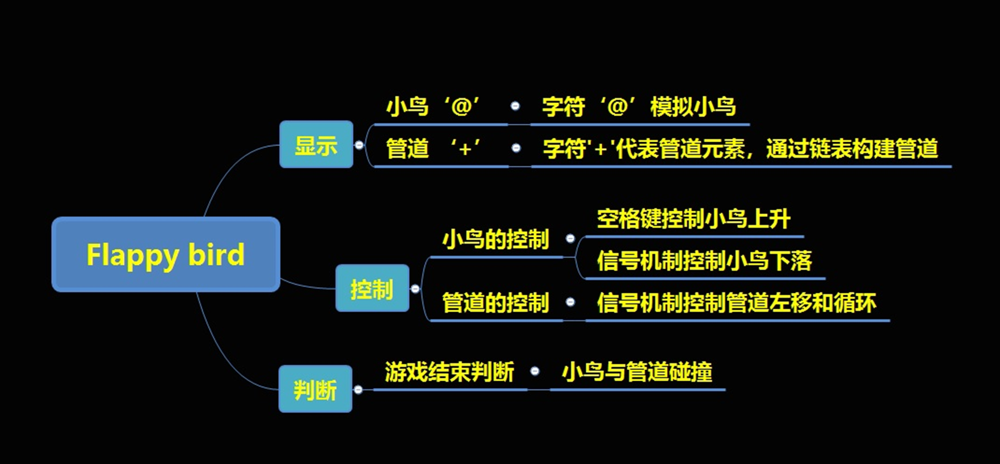
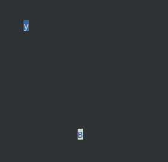
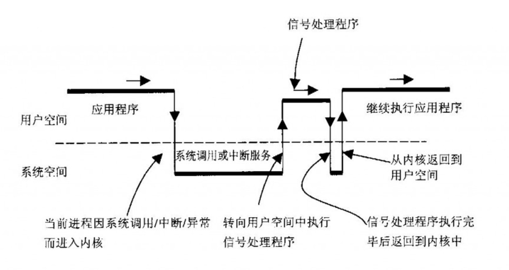
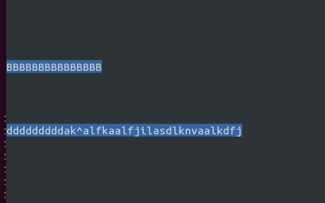

# Flappy_bird_project

# 1.项目介绍


## 项目功能总结

1. 按下空格键小鸟上升，不按小鸟下落
2. 搭建小鸟需要穿过的管道
3. 管道自动左移和创建
4. 小鸟撞到管道游戏结束

## 知识储备

1. C语言
2. 数据结构-链表
3. Ncurses库
4. 信号机制

## 项目框图



# 2.Ncurses库

Ncurses是最早的System V Release 4.0 (SVr4)中 curses的一个克隆和升级。这是一个可自由配置的库，完全兼容旧版本curses。

Ncurses构成了一个工作在底层终端代码之上的封装，并向用户提供了一个灵活高效的API（Application Programming Interface 应用程序接口）。它提供了创建窗口界面，移动光标，产生颜色，处理键盘按键等功能。使程序员编写应用程序不需要关心那些底层的终端操作。

简而言之，**它是一个管理应用程序在字符终端显示的函数库**。

## Ncurses库安装

安装命令：`sudo apt-get install libncurses5-dev`

**注**：为了能够使用Ncurses库,必须在源程序中将`#include<curses.h>`包括进来,而且在编译的需要与它链接起来， 在`gcc`中可以使用参数`-lncurses`进行编译.

## 常用库函数

1. `initscr(void);`
   是curses模式的入口。将终端屏幕初始化为curses模式，为当前屏幕和相关的数据结构分配内存。

2. `int  endwin(void);` 
   是curses模式的出口,退出curses模式，释放curses子系统和相关数据结构占用的内存。

3. `int curs_set(int visibility);` 
   设置光标是否可见，visibility：0（不可见），1（可见）

4. `int move(int  new_y, int  new_x);`
   将光标移动到new_y所指定的行和new_x所指定的列

5. `int addch(const  chtype  char);` 
   在当前光标位置添加字符

6. `int addstr(const char *str);`

   在当前光标位置添加字符串

7. `int  refresh(void);` 

   刷新物理屏幕。将获取的内容显示到显示器上。	

8. `int  keypad(WINDOW  *window_ptr,  bool  key_on);` 
   允许使用功能键。例:`keypad(stdscr,1);`//允许使用功能按键

9. `int getch(void);` 
   读取键盘输入的一个字符

10. `chtype inch(void);` 

   获取当前光标位置的字符。
   注：curses有自己的字符类型chtype，使用时强制类型转换为char

11. `int start_color(void);` 
    启动color机制，初始化当前终端支持的所有颜色

12. `int init_pair(short  pair_number,  short  foreground,  short  background);`

    初始化一个颜色对，将前景色和背景色组合成一个颜色对。

    -  `pair`：颜色对的编号，范围为1到COLOR_PAIRS - 1。
    -  `foreground`：前景色的编号，范围为0到COLORS - 1。
    -  `background`：背景色的编号，范围为0到COLORS - 1。

    ```c
    /*配置颜色对*/
    COLOR_BLACK	     黑色		COLOR_MAGENTA 	 品红色
    COLOR_RED  	     红色		COLOR_CYAN 	     青色
    COLOR_GREEN	     绿色		COLOR_WHITE 	 白色
    COLOR_YELLOW     黄色     COLOR_BLUE       蓝色
    ```

13. `int  COLOR_PAIR(int  pair_number);` 
    设置颜色属性，设置完颜色对，可以通过COLOR_PAIR实现

14. `int  attron(chtype  attribute);` 
    启用属性设置

15. `int  attroff(chtype  attribute);` 
    关闭属性设置

## 示例-打印字符

>  将字符A打印到屏幕，5秒后退出
>
>  ```c
>  #include <stdio.h>
>  #include <unistd.h>
>  #include <curses.h>
>  int main(int argc, const char *argv[])
>  {
>  	initscr();//进入curses模式
>  	curs_set(1);//显示光标
>  	move(10,10);//移动光标到(10,10)
>  	addch('A');//添加字符A
>  	refresh();//刷新屏幕，若不刷新则不显示字符
>  	sleep(5);
>  	endwin();//退出curses模式
>  	return 0;
>  }
>  ```
>


## 示例-设置字符颜色

>  初始化部分设置来两种颜色，分别赋给两个打印出来的字符
>
>  读取键盘输入的字符并打印，如何判断字符是否为'y'，若是则打印'B'
>
>  ```c
>  #include <stdio.h>
>  #include <unistd.h>
>  #include <curses.h>
>  int main(int argc, const char *argv[])
>  {
>  	char ch;
>  	//屏幕初始化
>  	initscr();//进入curses模式
>  	curs_set(0);//设置光标不可见
>  	noecho();//禁止输入字符显示
>  
>  	//设置颜色
>  	start_color();//启动颜色属性设置
>  	init_pair(1,COLOR_WHITE,COLOR_BLUE);//设定颜色对1的颜色
>  	init_pair(2,COLOR_BLUE,COLOR_WHITE);
>  
>  
>  	//将键盘输入的字符打印到屏幕
>  	attron(COLOR_PAIR(1));//开启颜色1设置
>  	ch = getch();//读取键盘输入的一个字符
>  	move(10,10);//移动光标到(10,10)
>  	addch(ch);//添加字符A
>  	refresh();//刷新屏幕
>  	attroff(COLOR_PAIR(1));//关闭颜色1设置
>  	
>  	//从屏幕(10,10)处，获取字符并判断
>  	move(10,10);
>  	ch = (char)inch();
>  	if(ch == 'y')
>  	{
>  		attron(COLOR_PAIR(2));//开启颜色2设置
>  		move(20,20);
>  		addch('B');
>  		refresh();
>  		attroff(COLOR_PAIR(2));//关闭颜色2设置
>  	}
>  
>  	sleep(5);
>  	endwin();//退出curses模式
>  	return 0;
>  }
>  ```
>
>  


# 3.信号机制

`getch()`阻塞获取键盘按键输入，怎么操作才能不影响小鸟下落和管道移动？

​	在Linux中，软中断信号（signal，简称为信号）是在软件层次上对中断的一种模拟，用来通知进程发生了异步事件。内核可以因为内部事件而给进程发送信号，通知进程发生了某个事件。

**信号响应的方式：**

1. 忽略信号，即对信号不做任何处理；

2. 捕捉信号，即信号发生时执行用户自定义的信号处理函数。

3. 执行缺省操作，Linux对每种信号都规定了默认操作。

   

通过信号中断的方式解决`gatch()`阻塞的问题；

## signal 函数

1. **原型**：

   ```c
   #include <signal.h>
   typedef void (*sighandler_t)(int);//定义了一个名为 sighandler_t的函数指针类型
   void (*signal(int signum, void (*handler)(int)))(int);
   ```

2. **功能**：signal函数用于注册一个信号处理函数，当接收到指定的信号时，会调用该处理函数。

3. **参数**：

   -  `signum`：要处理的信号编号，例如SIGINT、SIGTERM等。
   -  `handler`：指向信号处理函数的指针，该函数的原型为`void handler(int signum)`，其中`signum`是接收到的信号编号。

4. **返回值**：

   -  如果成功注册了信号处理函数，则返回之前的信号处理函数指针；
   -  如果注册失败，则返回SIG_ERR。

## setitimer 函数

1. **原型**：

   ```c
   #include <sys/time.h>
   int setitimer(int which, const struct itimerval *new_value, struct itimerval *old_value);
   
   struct itimerval {
       struct timeval it_interval; /* 计时器重新启动的间歇值 */
       struct timeval it_value;    /* 计时器安装后首次启动的初始值，之后就没有用 */
   }                               
   struct timeval {
       long tv_sec;       /* 秒 */
       long tv_usec;      /* 微妙*/
   };
   ```

2. **功能**：用于设置一个定时器，当定时器到期时，会发送一个信号给进程。

3. **参数**：

   -  `which`：指定要设置的定时器类型，可以是以下三个值之一
      -  `ITIMER_REAL`：实时（real-time）定时器，用于测量进程实际运行的时间。当定时器到期时，会发送`SIGALRM`信号给进程。
      -  `ITIMER_VIRTUAL`：虚拟（virtual-time）定时器，用于测量进程在用户模式下花费的时间。当定时器到期时，会发送`SIGVTALRM`信号给进程。
      -  `ITIMER_PROF`：分析（profiling）定时器，用于测量进程在用户模式和内核模式下花费的时间。当定时器到期时，会发送`SIGPROF`信号给进程。
   -  `new_value`：指向一个`itimerval`结构体的指针，该结构体包含了定时器的初始值和间隔时间。如果设置为NULL，则不改变定时器的值。
   -  `old_value`：指向一个`itimerval`结构体的指针，用于保存定时器的当前值。如果设置为NULL，则不保存当前值。

4. **返回值**：

   -  成功时返回0
   -  失败时返回-1。

## 示例-信号机制使用

>  ```c
>  #include <stdio.h>
>  #include <unistd.h>
>  #include <curses.h>
>  #include <signal.h>
>  #include <sys/time.h>
>  
>  int handler_x=5,handler_y=0;
>  void handler(int srg)
>  {
>  	move(handler_x,handler_y);
>  	addch('B');
>  	refresh();
>  	handler_y++;
>  }
>  
>  int main(int argc, const char *argv[])
>  {
>  	char ch;
>  	int ch_y = 0;
>  	//屏幕初始化
>  	initscr();//进入curses模式
>  	curs_set(0);//设置光标不可见
>  	noecho();//禁止输入字符显示
>  
>  	//设置颜色
>  	start_color();//启动颜色属性设置
>  	init_pair(1,COLOR_WHITE,COLOR_BLUE);//设定颜色对1的颜色
>  	init_pair(2,COLOR_BLUE,COLOR_WHITE);
>  
>  	/*设置信号捕获*/
>  	signal(SIGALRM,handler);
>  	
>  	//设定定时器
>  	struct itimerval timer;
>  	timer.it_value.tv_sec = 3;//首次启动定时时间
>  	timer.it_value.tv_usec = 0;
>  	timer.it_interval.tv_sec = 1;//之后每次的定时时间
>  	timer.it_interval.tv_usec = 0;
>  	/*启动定时*/
>  	setitimer(ITIMER_REAL, &timer, NULL);
>  
>  	while(1)
>  	{
>  		//将键盘输入的字符打印到屏幕
>  		attron(COLOR_PAIR(1));//开启颜色1设置
>  		ch = getch();//读取键盘输入的一个字符
>  		move(10,ch_y);//移动光标到(10,ch_y)
>  		addch(ch);//添加字符A
>  		refresh();//刷新屏幕
>  		attroff(COLOR_PAIR(1));//关闭颜色1设置
>  		ch_y++;
>  	}
>  	endwin();//退出curses模式
>  	return 0;
>  }
>  ```
>
>  
>
>  上面一行字符B每秒打印一个，依次向后延申
>
>  下面一行字符，根据键盘输入打印，不输入就不打印
>
>  两行字符打印互不干扰


