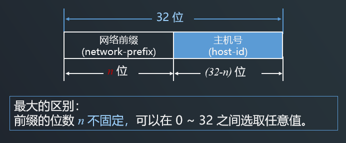
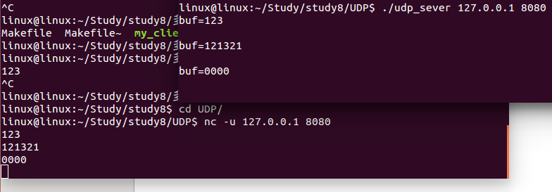

# 网络编程开发

两台计算机要互相传送文件需解决很多问题：

1. 必须有一条传送数据的通路。
2. 发起方必须激活通路。
3. 要告诉网络如何识别接收方。
4. 发起方要清楚对方是否已开机，且与网络连接正常。
5. 发起方要清楚对方是否准备好接收和存储文件。
6. 若文件格式不兼容，要完成格式的转换。
7. 要处理各种差错和意外事故，保证收到正确的文件。

# 1.网络结构

**OSI七层体系结构、TCP/IP四层协议与五层体系结构是计算机网络中三个关键的概念，它们各自代表了不同的网络设计哲学和实现方式**。

首先，OSI（开放式系统互联）七层模型是由国际标准化组织（ISO）提出的一个用于理解和设计网络系统的框架。它包括物理层、数据链路层、网络层、传输层、会话层、表示层和应用层。每一层都有特定的功能和协议，旨在促进不同计算机系统之间的互操作性。

其次，TCP/IP（传输控制协议/网际协议）四层模型则是实际在互联网中使用的模型，它包括网络接口层、网际层、传输层和应用层。TCP/IP模型以其实用性和灵活性而广受欢迎，是目前互联网的基础。

最后，五层体系结构是一个折中的模型，结合了OSI和TCP/IP的优点，通常用于教学和简化概念的理解。它包括物理层、数据链路层、网络层、运输层和应用层。

下面是 OSI七层模型与 TCP/IP四层模型历史渊源：

1. **网络分层的必要性**：网络分层是为了将复杂的网络问题分解成更小、更易管理的子问题。每一层只与紧邻的层直接通信，降低了设计的复杂性，并允许每一层独立地进行改进和发展。
2. **早期网络体系结构的多样性**：在OSI模型提出之前，不同的公司和组织开发了自己的网络体系结构，如IBM的SNA。这些体系结构虽然采用了分层的方法，但层次划分和功能分配各不相同。
3. **ISO的介入与OSI模型的诞生**：为了统一网络体系结构，ISO在1977年提出了OSI参考模型，旨在创建一个统一的标准，使不同的网络能够互联。
4. **TCP/IP的兴起**：尽管OSI模型得到了国际标准的地位，但TCP/IP因其早期在ARPANET中的应用和互联网的迅速发展而成为了事实上的标准。
5. **五层体系结构的提出**：为了在教学和设计中简化概念，同时保留OSI和TCP/IP的优点，提出了五层体系结构。这种模型在保持层次化设计的同时，减少了层次的数量，使得理解和应用更为直观。

## OSI七层体系结构


| 高层，负责主机之间的数据传输   | 功能                         |
| ------------------------------ | ---------------------------- |
| 应用层（Applications Layer）： | 网络服务与最终用户的一个接口 |
| 表示层（Presentation Layer）： | 数据的表示、安全、压缩       |
| 会话层 （Session Layer）：     | 建立、管理、中止会话         |

| 低层：负责网络之间的数据传输      | 功能                                           |
| --------------------------------- | ---------------------------------------------- |
| 运输层 （Transport Layer）：      | 定义传输数据的协议端口号，以及流控和差错校验   |
| 网络层 （Network Layer）：        | 进行逻辑地址寻址、差错校验等功能               |
| 数据链路层  （Data Link Layer）： | 建立逻辑连接、进行硬件地址寻址、差错校验等功能 |
| 物理层 （Physical Layer）：       | 建立、维护、断开物理连接                       |

## TCP/IP四层体系结构


-  是事实上的国际标准

-  实质上TCP/IP只有最上面的三层，最下面的网络接口层（链路层）并没有具体内容

-  链路层所使用的各种局域网标准是由IEEE的802委员会下属的各工作组负责制定的
-  路由器在转发分组时最高只用到网际层，没有使用运输层和应用层。 
-  现在互联网使用的 TCP/IP 体系结构已经发生了演变，即某些应用程序**可以直接使用** **IP** **层**，或甚至**直接使用最下面的网络接口层**。


## 五层体系结构


**计算机网络的五层体系结构包括应用层、运输层、网络层、数据链路层和物理层**。这个模型结合了OSI七层模型和TCP/IP四层模型的优点，旨在简化网络设计并易于理解。以下是对各层功能的详细分析：

1. **应用层**
   - **主要功能**：应用层是五层体系结构中的最高层，直接为用户的应用程序提供服务。它负责确定进程之间通信的性质，以满足用户的需要。应用层处理数据的格式和语义，使得源端和目标端能够理解和处理数据内容。
   - **常见协议**：应用层协议包括HTTP（用于网页浏览）、FTP（文件传输协议）、SMTP（简单邮件传输协议）等。这些协议定义了如何通过网络进行特定的数据处理和传输。
2. **运输层**
   - **主要功能**：运输层负责主机中两个进程之间的通信。它提供了端到端的数据传输服务，确保数据的完整性和顺序。运输层通过端口号来区分同一台机器上运行的不同应用程序，从而实现多路复用。
   - **核心协议**：运输层的核心协议包括TCP（传输控制协议）和UDP（用户数据报协议）。TCP提供可靠的连接导向服务，而UDP则提供快速的无连接服务。
3. **网络层**
   - **主要功能**：网络层负责为分组交换网上的不同主机提供通信。它通过使用逻辑地址（如IP地址）来确定数据包的最佳传输路径。网络层还处理路由选择、分组的分段与重组以及拥塞控制。
   - **关键设备**：路由器是网络层的关键设备，它根据网络层的地址信息来决定数据包的转发路径。
4. **数据链路层**
   - **主要功能**：数据链路层的主要任务是将原始比特流划分为逻辑数据单元（帧），并通过物理网络进行传输。这一层还负责错误检测和校正，以确保数据的可靠传输。它还定义了如何格式化数据以进行传输，以及如何控制对物理介质的访问。
   - **设备例子**：交换机是数据链路层的关键设备，它根据数据帧的MAC地址来进行局部网络内的数据传递。
5. **物理层**
   - **主要功能**：物理层负责在传输媒体（如电缆、光纤）上建立、维护和终止物理连接。它处理与物理设备相关的所有功能，包括电压变化、信号调制和比特率控制等。物理层的主要作用是传输比特流，即由1和0组成的数据序列。
   - **硬件标准**：物理层的硬件标准包括网线的接口类型、光纤的接口类型以及各种传输介质的传输速率等。

这种分层的设计思想不仅简化了网络系统的设计与教学，也促进了不同网络系统之间的互操作性和兼容性。

# 2.IP地址与端口号

## IP地址简介

**IP地址是互联网协议（IP）提供的一种统一的地址格式，它为互联网上的每一个网络和每一台主机分配一个逻辑地址，以此来屏蔽物理地址的差异**。

为了全面理解IP地址的重要性和功能，以下将从多个角度进行分析：

1. **IP地址的定义与作用**
   - **定义**：IP地址是一个由数字组成的标识符，用于标识互联网上的设备。这个地址确保数据能够被正确地发送到目标设备。
   - **作用**：IP地址使得终端设备之间的通信成为可能，无论这些设备的物理位置如何。它允许数据包在全球范围内的网络中路由和传输。
2. **IP地址的发展历程**
   - **起源**：随着互联网的发展，需要一个统一的地址系统来识别和定位连网的设备。因此，IP地址的概念应运而生。
   - **发展**：最初的IP地址设计是基于32位的IPv4协议，随着互联网用户数量的增加，IPv4地址逐渐不足以满足需求，这导致了新版本IPv6的推出，它使用128位地址长度，极大地扩展了地址空间。
3. **IP地址的类型**
   - **公有地址**：公有地址在互联网中是唯一的，用于公网上的设备，使得这些设备可以直接从互联网访问。
   - **私有地址**：私有地址用于内部网络中，如家庭、企业的内部网络。这些地址不能直接在互联网中使用，需要通过网络地址转换（NAT）技术转换为公有地址后才能访问互联网。
4. **IP地址的编址方式**
   - IP地址根据网络ID的不同分为5种类型，分别是A类地址、B类地址、C类地址、D类地址和E类地址
5. **IP地址的分配与管理**
   - **手动分配**：网络管理员可以手动配置每个设备的IP地址，这种方法适用于小规模网络。
   - **自动分配**：通过DHCP（动态主机配置协议）服务器自动分配IP地址，当设备连接到网络时，会自动获取一个IP地址。这种方式简化了网络管理，特别是在设备频繁变动的大型网络中。

此外，在深入了解IP地址的配置和管理之后，还需要考虑一些实际操作时的注意事项：

1. **子网划分**：通过子网划分，可以将一个大网络划分为多个小网络，有助于优化网络的管理和安全性。
2. **无类间路由**：无类间路由（CIDR）是一种用于IP网络路由的技术，它旨在解决IPv4地址耗尽的问题，通过更灵活的路由策略来减少IP浪费。
3. **IPv6过渡**：随着IPv4地址的耗尽，越来越多的网络正在向IPv6过渡。这一过程中需要解决两种协议的兼容性问题，确保平滑过渡。

## IP地址表示方法


## IP地址的分类


IP地址根据网络ID的不同分为5种类型，分别是A类地址、B类地址、C类地址、D类地址和E类地址。以下是对各类IP地址的详细阐述：

1. **A类IP地址**：A类地址主要设计用于大型网络，其由1字节的网络地址和3字节的主机地址组成。网络地址的最高位必须是“0”，可用的A类网络有127个，每个网络能容纳约1677万个主机。地址范围从1.0.0.0到127.0.0.0，其中127.0.0.1是特殊的回环测试地址，用于本地机器的测试。
2. **B类IP地址**：B类地址适用于中型网络，包含2个字节的网络地址和2个字节的主机地址。这类地址的网络部分以“10”开头，地址范围为128.0.0.0至191.255.255.255。每个B类网络可以容纳约6万多个主机。
3. **C类IP地址**：C类地址是为小型网络设计的，包括3字节的网络地址和1字节的主机地址。这些地址的网络部分以“110”开始，地址范围从192.0.0.0到223.255.255.255。每个C类网络可容纳254个主机。
4. **D类IP地址**：D类地址用于多点广播（Multicast）。它们的第一个字节以“1110”开始，专门保留用于多点广播。多点广播地址用来一次寻址一组计算机，通常标识共享同一协议的一组计算机。这类地址的范围是从224.0.0.0到239.255.255.255。
5. **E类IP地址**：E类地址以“1111”开始，被保留用于将来使用或研究目的。这类地址的范围是从240.0.0.0到255.255.255.254，而255.255.255.255被定义为广播地址。

此外，在IP地址中还特别定义了一些私有地址范围，这些地址不会被路由到互联网上，而是用于内部网络中。私有地址范围包括：

- **A类私有地址**：10.0.0.0至10.255.255.255
- **B类私有地址**：172.16.0.0至172.31.255.255
- **C类私有地址**：192.168.0.0至192.168.255.255

了解这些分类对于正确配置网络设备和进行网络规划至关重要。每一类地址的设计都旨在满足不同规模网络的需求，从而有效管理IP地址资源并优化网络性能。

## 无类间路由（CIDR）



-  CIDR表示法将IP地址与斜杠“/”和前缀长度结合，例如192.168.1.1/24，其中24是前缀长度，表示网络部分的位数。

优点：

-  CIDR通过精确的地址分配避免了传统分类方式中的地址浪费，尤其在IPv4地址资源紧张的情况下，这一点显得尤为重要。
-  通过聚合相邻的地址块，CIDR减少了路由表中的条目数量，从而提高了路由器的性能和网络的稳定性。
-  CIDR允许根据需要划分子网，不再受传统类别的限制，这使得网络管理员可以更好地适应组织内部结构的变化。

## 子网掩码

-  位数：32 位。
-  目的：让机器从 IP 地址迅速算出网络地址。
-  由一连串 1 和接着的一连串 0 组成，而 1 的个数就是网络前缀的长度。

>  
>
>  默认地址的子网掩码

在实际应用中，子网掩码与IP地址结合使用，通过对IP地址和子网掩码进行逻辑AND操作，可以得到网络地址，从而确定某台主机是否处于同一网络或子网内。

## IPv6表示

-  在 IPv6 中，每个地址占 128 位，地址空间大于 3.4 ^1038^ 。
-  使用冒号十六进制记法(colon hexadecimal notation, 简写为 colon hex)：16 位的值用十六进制值表示，各值之间用冒号分隔。

```c
//点分十进制数记法：
104.230.140.100.255.255.255.255.0.0.17.128.150.10.255.255
//冒号十六进制记法：
68E6:8C64:FFFF:FFFF:0000:1180:960A:FFFF
//冒号十六进制记法（零压缩）：
68E6:8C64:FFFF:FFFF:0:1180:960A:FFFF
```

### 零压缩

零压缩 (zero compression)：一串连续的零可以用一对冒号取代。

例：

```c
FF05:0:0:0:0:0:0:B3
//压缩为：
FF05::B3
```

**注意**：在任一地址中，只能使用一次零压缩。

## 端口号

**端口号的作用是区分不同的应用程序和会话，解决的问题是网络通信中不同应用的识别和服务定位**。在深入理解端口号的重要性和应用之后，可以发现端口号不仅仅是简单的数字标识，而是网络通信中不可或缺的一部分。


1. 区分应用程序
   -  **识别服务**：端口号使得操作系统能够识别并转发数据到正确的应用程序。
   -  **多任务处理**：通过端口号，同一台计算机上的多个程序可以同时进行网络通信而不会相互干扰。
2. 支持并发操作
   -  **独立通信**：每个应用程序可以独立地发起和接收数据，端口号确保了数据传输的准确性和独立性。
   -  **资源优化**：系统能更有效地管理网络资源和处理进程，提高了整体的网络效率。
3. 网络安全控制
   -  **过滤数据**：端口号使防火墙能够基于特定的端口来允许或阻止数据流，增强了安全性。
   -  **防止冲突**：为不同的应用程序分配不同的端口号，避免了地址冲突和服务混乱的问题。
4. 实现动态分配
   -  **灵活通信**：系统可以根据需要动态分配端口号，使得网络通信更为灵活和高效。
   -  **自动释放**：使用完的端口可以被释放重用，优化了端口资源的利用率。
5. 提供远程访问
   -  **访问控制**：端口号允许外部设备通过特定的端口访问内部运行的服务，如HTTP服务通常监听80端口。
   -  **安全隔离**：通过限制可访问的端口，系统可以更好地控制哪些服务可以从外部访问，增加了安全性。

### 端口的类型


### 常用端口


### BSD端口

**BSD端口，也称为BSD套接口，是UNIX系统中通用的网络接口，支持多种网络类型和内部进程间的通信机制**。

1. 概念功能
   -  BSD套接口是UNIX系统下用于网络通信的一种标准接口。
   -  它不仅支持各种网络类型，还能用于同一台计算机内部不同进程之间的通信。
2. 主要特点
   -  BSD套接口能够处理多种类型的套接口，每种套接口都有自己的寻址方法。
   -  与管道不同，套接口对于可以容纳的数据大小没有限制。
3. 套接口类型
   -  流式套接口提供可靠的双向顺序数据流连接，如TCP协议所使用。
   -  数据报套接口提供双向数据传输但不保证数据的完整到达，如UDP协议所使用。
4. 通信模式
   -  在客户机/服务器模式下，服务器通过套接口提供服务，而客户机则使用这些服务。
   -  服务器创建一个套接口并绑定到特定地址，然后监听来自客户机的连接请求。

**BSD保留端口和用户端口的不同用途**

-  0-1023： BSD保留端口，也叫系统端口，这些端口只有系统特许的进程才能使用
-  1024~65535为用户端口，其中：
   -  1024-5000： BSD临时端口，一般的应用程序使用1024到4999来进行通讯；
   -  5001-65535：BSD服务器(非特权)端口，用来给用户自定义端口。

# 3.字节序

字节序分为大端序和小端序，**大端序和小端序是两种不同的字节存储顺序**。在计算机系统中，由于历史和技术的原因，不同的处理器架构采用了不同的字节序策略。以下是对大端序和小端序的相关介绍：

1. **概念理解**：
   - **大端序（Big-endian）**：将最高位字节（即最重要的字节）存储在内存的最低地址处，最低位字节存储在最高地址处。
   - **小端序（Little-endian）**：将最低位字节存储在内存的最低地址处，最高位字节存储在最高地址处。
2. **实例演示**：
   - 假设有一个32位整数0x12345678，如果采用大端序存储，则内存中从低地址到高地址的顺序为0x12 0x34 0x56 0x78；而采用小端序时，顺序则为0x78 0x56 0x34 0x12。这种区别对于设计跨平台的软件和进行网络通信尤为重要，因为不同的处理器可能采用不同的字节序。
3. **应用场景**：
   - **大端序**：通常被许多网络协议采用，因此也被称为网络字节序。此外，某些处理器如PowerPC也默认使用大端序。
   - **小端序**：多数现代个人电脑和服务器采用的x86及x86_64架构支持小端序。由于其与处理器的读取顺序一致，这在一定程度上能提高数据处理的效率。

## 示例

>  查看主机字节序
>
>  ```c
>  #include <stdio.h>
>  uint32_t val32 = 0x11223344;
>  uint8_t val8 = *( (uint8_t *)&val32 );
>  if(val8 == 0x44)
>  	printf("本机是小端字节序\n");
>  else
>  	printf("本机是大端字节序\n");
>  ```
>
>  1.  定义了一个无符号32位整型变量`val32`，并且初始化为`0x11223344`
>
>  2.  定义一个8位的无符号整型变量`val8`，并且将强转以后的`val32`的数据赋值给`val8`
>
>  3.  这样做的目的是获取变量`val32`第一个字节的值，后面就可通过判断`val8`的值是`0x44`或者`0x11`来确定主机字节序是大端还是小端

# 4.socket套接字及TCP的实现框架

## Socket套接字

**Socket套接字是网络编程中用于实现不同计算机之间通信的一个基本构建块**。

在现代计算机网络中，Socket套接字扮演着至关重要的角色。它们为应用程序提供了一种方式，通过这种方式，程序能够通过网络发送和接收数据包。以下是对socket的相关介绍：

1. **定义功能**：
   - Socket，译为“套接字”，是一种软件形式的"插座"，使得不同主机之间的进程可以通过网络进行通信。它基本上充当了应用程序、操作系统与网络硬件之间的接口。
   
2. **核心作用**：
   - Socket套接字允许一个程序通过网络将信息传递给另一个程序。这涉及到底层的网络协议操作，如TCP/IP，但Socket API提供了一个更简单的抽象，使得程序员无需深入了解这些复杂协议的细节即可进行网络编程。
   
3. **类型应用**：
   - 流式套接字（SOCK_STREAM）基于TCP协议，提供面向连接的可靠数据传输服务，适用于需要确保数据完整性的应用，如网页浏览。
   - 数据报套接字（SOCK_DGRAM）基于UDP协议，提供无连接的服务，适用于对实时性要求高但可以容忍少量数据丢失的应用，如视频通话。
   
4. **工作过程**：
   
   - 服务器端创建一个Socket并绑定到一个特定的IP地址和端口上，然后开始监听来自客户端的连接请求。
   - 客户端创建一个Socket，并尝试连接到服务器的IP地址和端口。一旦连接建立，双方就可以通过这个Socket进行数据的发送和接收。
   
   | **特征** | **监听套接字**                                             | **数据通信套接字**                                           |
   | -------- | ---------------------------------------------------------- | ------------------------------------------------------------ |
   | 主要用途 | 用于服务器端等待和接受新的客户端连接请求。                 | 用于已连接的服务器和客户端之间的数据传输。                   |
   | 创建方式 | 通过socket()函数创建，然后绑定到特定IP地址和端口。         | 由accept()函数在接受新连接时自动创建。                       |
   | 绑定地址 | 通常绑定到服务器的公认端口号，代表服务器的公开访问点。     | 继承监听套接字的地址和端口，但只服务于一个客户端。           |
   | 调用函数 | 使用listen()和accept()函数来设置监听状态并接受连接。       | 直接用于发送(send()/write())和接收(recv()/read())数据。      |
   | 连接对象 | 不直接对应任何客户端，而是等待任何客户端的连接请求。       | 对应一个已经建立连接的具体客户端。                           |
   | 生命周期 | 在服务器运行期间持续存在，直到服务器停止服务。             | 与客户端的连接周期一致，连接断开后即关闭。                   |
   | 并发处理 | 单个监听套接字可以处理多个连接请求，但本身不参与数据传输。 | 每个数据通信套接字处理与其对应的一个客户端的所有通信，支持多个客户端的并行数据处理。 |
   | 资源管理 | 需要管理一个监听队列，但不需要频繁创建和关闭。             | 根据客户端的连接和断开管理资源的分配和回收。                 |
   
5. **高级功能**：
   - 使用Socket，可以实现多种网络应用程序，包括聊天应用、文件传输、远程控制等。在多用户游戏、实时数据处理等方面也广泛应用Socket技术。
   - 在多线程或多进程的环境中，Socket也能有效地处理并发连接，提高系统的响应速度和处理能力。

## TCP实现框架


以下是C语言中常见的Socket API及其功能：

以下是C语言中常见的Socket API及其功能：

1. **socket函数**：该函数用于创建一个套接字，并返回一个套接字描述符。
   
   ```c
   #include <sys/types.h>
   #include <sys/socket.h>
   int socket(int domain, int type, int protocol);
   /*
   参数：
   	domain：指定协议族，如AF_INET表示IPv4地址。
   	type：指定套接字类型，如SOCK_STREAM表示提供有序、可靠、双向字节流的连接。
   	protocol：通常设置为0，表示系统将选择与指定类型相匹配的默认协议。
   返回值：
   	成功时返回一个非负整数，表示新创建的套接字描述符。
   	失败时返回-1，并设置errno为相应的错误码。
   */
   ```
   
2. **bind函数**：此函数用于将套接字绑定到一个特定的地址和端口号上。这对于服务器来说尤其重要，因为它们需要在已知的地址上监听来自客户端的连接请求。
   ```c
   #include <sys/types.h>
   #include <sys/socket.h>
   int bind(int sockfd, const struct sockaddr *addr, socklen_t addrlen);
   /*
   参数：
   	sockfd：表示套接字的描述符。
   	addr：指向特定于域的套接字地址结构的指针，该结构包含了要绑定的地址信息。
   	addrlen：指定地址结构的大小。
   返回值：
   	成功时返回0。
   	失败时返回-1，并设置errno为相应的错误码。
   */
   ```

3. **listen函数**：服务器使用此函数将套接字设置为监听状态，等待客户端的连接请求。可以指定一个队列限制，以控制同时可处理的连接数。
   
   ```c
   #include <sys/types.h>
   #include <sys/socket.h>
   int listen(int sockfd, int backlog);
   /*
   参数：
   	sockfd：表示套接字的描述符。
   	backlog：指定在未完成连接队列中允许的最大连接数。
   返回值：
   	成功时返回0。
   	失败时返回-1，并设置errno为相应的错误码。
   */
   ```
   
4. **accept函数**：当有客户端连接请求时，服务器使用此函数接受连接，并返回一个新的套接字，用于与客户端通信。
   ```c
   #include <sys/types.h>
   #include <sys/socket.h>
   int accept(int sockfd, struct sockaddr *addr, socklen_t *addrlen);
   /*
   参数：
   	sockfd：表示套接字的描述符。
   	addr：指向特定于域的套接字地址结构的指针，该结构用于接收客户端的地址信息。
   	addrlen：指向一个变量的指针，该变量用于接收地址结构的大小。
   返回值：
   	成功时返回一个新的套接字描述符，用于与客户端通信。
   	失败时返回-1，并设置errno为相应的错误码。
   */
   ```

5. **connect函数**：该函数用于建立一个到服务器的连接。对于TCP套接字，这将触发TCP的三次握手过程。
   ```c
   #include <sys/types.h>
   #include <sys/socket.h>
   int connect(int sockfd, const struct sockaddr *addr, socklen_t addrlen);
   /*
   参数：
   	sockfd：表示套接字的描述符。
   	addr：指向特定于域的套接字地址结构的指针，该结构包含了服务器的地址信息。
   	addrlen：指定地址结构的大小。
   返回值：
   	成功时返回0。
   	失败时返回-1，并设置errno为相应的错误码。
   */
   ```

6. **send和recv函数**：这两个函数分别用于发送和接收数据。它们是TCP通信中常用的数据传输函数。
   ```c
   #include <sys/types.h>
   #include <sys/socket.h>
   ssize_t send(int sockfd, const void *buf, size_t len, int flags);
   ssize_t recv(int sockfd, void *buf, size_t len, int flags);
   /*
   参数：
   	sockfd：表示套接字的描述符。
   	buf：指向要发送或接收数据的缓冲区的指针。
   	len：指定要发送或接收的数据的长度。
   	flags：可选的标志位，用于控制发送或接收的行为。
   返回值：
   	成功时返回实际发送或接收的字节数。
   	失败时返回-1，并设置errno为相应的错误码。
   */
   ```

7. **sendto和recvfrom函数**：对于UDP通信，不需要建立连接，直接使用sendto和recvfrom函数进行数据报文的发送和接收。
   ```c
   #include <sys/types.h>
   #include <sys/socket.h>
   ssize_t sendto(int sockfd, const void *buf, size_t len, int flags, const struct sockaddr *dest_addr, socklen_t addrlen);
   ssize_t recvfrom(int sockfd, void *buf, size_t len, int flags, struct sockaddr *src_addr, socklen_t *addrlen);
   /*
   参数：
   	sockfd：表示套接字的描述符。
   	buf：指向要发送或接收数据的缓冲区的指针。
   	len：指定要发送或接收的数据的长度。
   	flags：可选的标志位，用于控制发送或接收的行为。
   	dest_addr：指向目标地址结构的指针，用于UDP发送操作。
   	src_addr：指向源地址结构的指针，用于UDP接收操作。
   	addrlen：指向一个变量的指针，用于UDP接收操作，该变量用于接收源地址结构的大小。
   返回值：
   	成功时返回实际发送或接收的字节数。
   	失败时返回-1，并设置errno为相应的错误码。
   */
   ```

## 示例-服务端

TCP_socket.c

```c
#include <stdio.h> // 引入标准输入输出库
#include <sys/socket.h> // 引入套接字库
#include <sys/types.h> // 引入类型定义库
#include <stdlib.h> // 引入标准库
#include <arpa/inet.h> // 引入互联网协议库
#include <unistd.h> // 引入Unix标准库
#include <string.h> 


#define PORT 5001 // 定义端口号为5001
#define BACKLOG 5 // 定义最大连接数为5

int main(int argc, char *argv[]) // 主函数，参数为命令行参数个数和参数列表
{

    int fd,newfd,ret; // 定义文件描述符变量
    char buf[BUFSIZ] = {}; //BUFSIZ 8142
    struct sockaddr_in addr; // 定义IPv4地址结构体

	if(argc < 3){
		fprintf(stderr,"%s<addr><PORT>",argv[0]);
	}

    // 创建套接字
    fd = socket(AF_INET, SOCK_STREAM, 0);
    if(fd < 0){
        perror("socket"); 
        exit(0); 
    }

    // 设置地址结构体
    addr.sin_family = AF_INET; // 使用IPv4协议
    addr.sin_port = htons(atoi(argv[2])); // 设置端口号,atoi()将字符串转换为整数
	if(inet_aton(argv[1],&addr.sin_addr)==0){//inet_aton()函数将字符串形式的IP地址转换为网络字节序的二进制形式
		fprintf(stderr,"Invalid address\n");
		exit(EXIT_FAILURE);
	}

    // 绑定通信结构体
    if(bind(fd, (struct sockaddr *)&addr, sizeof(addr) ) == -1){
        perror("bind"); 
        exit(0); 
    }

    // 设置套接字为监听模式
    if(listen(fd, BACKLOG) == -1){
        perror("listen"); 
        exit(0); 
    }

    // 接受客户端的连接请求，生成新的用于和客户端通信的套接字
    newfd = accept(fd, NULL, NULL);
    if(newfd < 0){
        perror("accept"); 
        exit(0);
    }
    
    /*循环接收*/
	while(1){
		memset(buf,0,BUFSIZ);
		ret = read(newfd,buf,BUFSIZ);
		if(ret < 0){
			perror("read");
			exit(0);
		}
		else if(ret == 0)
			break;
		else
			printf("buf = %s\n",buf);
	}
	close(newfd);
    close(fd); // 关闭套接字
    return 0; 
}
```

## 示例-客户端

TCP_socket2.c

>  ```c
>  #include <stdio.h> // 引入标准输入输出库
>  #include <sys/socket.h> // 引入套接字库
>  #include <sys/types.h> // 引入类型定义库
>  #include <stdlib.h> // 引入标准库
>  #include <arpa/inet.h> // 引入互联网协议库
>  #include <unistd.h> // 引入Unix标准库
>  #include <string.h>
>  
>  
>  #define PORT 5001 // 定义端口号为5001
>  #define BACKLOG 5 // 定义最大连接数为5
>  #define STR "Hello World!" // 定义要发送的字符串为"Hello World!"
>  
>  int main(int argc, char *argv[]) // 主函数，参数为命令行参数个数和参数列表
>  {
>      int fd; // 定义文件描述符变量
>      struct sockaddr_in addr; // 定义IPv4地址结构体
>      char buf[BUFSIZ] = {}; //BUFSIZ 8142
>  
>  	if(argc < 3){
>  		fprintf(stderr,"%s<addr><port>\n",argv[0]);
>  		exit(0);
>  	}
>  
>      // 创建套接字
>      fd = socket(AF_INET, SOCK_STREAM, 0);
>      if(fd < 0){
>          perror("socket"); // 如果创建失败，打印错误信息
>          exit(0); // 退出程序
>      }
>  
>      // 设置地址结构体
>  	addr.sin_family = AF_INET; // 使用IPv4协议
>      addr.sin_port = htons(atoi(argv[2])); // 设置端口号,atoi()将字符串转换为整数
>  	if(inet_aton(argv[1],&addr.sin_addr)==0){//inet_aton()函数将字符串形式的IP地址转换为网络字节序的二进制形式
>  		fprintf(stderr,"Invalid address\n");
>  		exit(EXIT_FAILURE);
>  	}    
>  
>      // 向服务端发起连接请求
>      if(connect(fd, (struct sockaddr *)&addr, sizeof(addr) ) == -1){
>          perror("connect"); 
>          exit(0); 
>      }
>      /*循环发送*/
>      while(1){
>  		printf(">");
>  		fgets(buf,BUFSIZ,stdin);
>  		write(fd,buf,strlen(buf));
>  	}
>  
>      // 关闭套接字
>      close(fd);
>  
>      return 0; // 返回0表示程序正常结束
>  }
>  
>  ```
>
>  
>
>  通信成功
>
>  如果结束程序，再次运行服务端程序，会出现报错如下（地址已经被使用）
>
>  
>
>  解决办法：
>
>  在程序中加入如下程序段：
>
>  ```c
>  /*地址快速重用*/
>  int flag=1,len= sizeof (int); 
>  if ( setsockopt(fd, SOL_SOCKET, SO_REUSEADDR, &flag, len) == -1) { 
>  	perror("setsockopt"); 
>  	exit(1); 
>  } 
>  ```
>


# 5.TCP多进程并发

## 示例-服务端

my_sever.c

```c
#include <stdio.h> // 引入标准输入输出库
#include <sys/socket.h> // 引入套接字库
#include <sys/types.h> // 引入类型定义库
#include <stdlib.h> // 引入标准库
#include <arpa/inet.h> // 引入网络地址库
#include <unistd.h> // 引入Unix系统调用库
#include <string.h> // 引入字符串处理库
#include <strings.h> // 引入字符串操作库
#include <signal.h> // 引入信号处理库
#include <sys/wait.h> // 引入进程等待库

#define BACKLOG 5 // 定义最大连接数为5

void ClinetHandle(int newfd); // 客户端处理函数

/*信号处理函数，防止出现僵尸进程*/
void SigHandle(int sig){ 
	if(sig == SIGCHLD){ // 如果接收到SIGCHLD信号
		printf("client exited\n"); // 打印客户端退出信息
		wait(NULL); // 等待子进程结束
	}
}

/*主函数*/
int main(int argc, char *argv[])
{
	int fd, newfd; // 定义文件描述符变量
	struct sockaddr_in addr, clint_addr; // 定义套接字地址结构体
	socklen_t addrlen = sizeof(clint_addr); // 定义地址长度变量

#if 0
	struct sigaction act; // 定义信号处理结构体
	act.sa_handler = SigHandle; // 设置信号处理函数
	act.sa_flags = SA_RESTART; // 设置信号处理标志
	sigemptyset(&act.sa_mask); // 清空信号屏蔽集
	sigaction(SIGCHLD, &act, NULL); // 注册信号处理函数
#else
	signal(SIGCHLD, SigHandle); // 注册信号处理函数
#endif

	pid_t pid; // 定义进程ID变量
	
	if(argc < 3){ // 如果参数个数小于3
		fprintf(stderr, "%s<addr><port>\n", argv[0]);
		exit(0); 
	}

	/*创建套接字*/
	fd = socket(AF_INET, SOCK_STREAM, 0); // 创建TCP套接字
	if(fd < 0){ 
		perror("socket"); 
	}
	addr.sin_family = AF_INET; // 设置地址族为IPv4
	addr.sin_port = htons( atoi(argv[2]) ); // 设置端口号
	if ( inet_aton(argv[1], &addr.sin_addr) == 0) { // 如果转换IP地址失败
		fprintf(stderr, "Invalid address\n"); 
		exit(EXIT_FAILURE); 
	}

	/*地址快速重用*/
	int flag=1,len= sizeof (int); 
	if ( setsockopt(fd, SOL_SOCKET, SO_REUSEADDR, &flag, len) == -1) { // 如果设置失败
		      perror("setsockopt"); 
			        exit(1); 
	} 
	/*绑定通信结构体*/
	if(bind(fd, (struct sockaddr *)&addr, sizeof(addr) ) == -1){ // 如果绑定失败
		perror("bind"); 
		exit(0); 
	}
	/*设置套接字为监听模式*/
	if(listen(fd, BACKLOG) == -1){ 
		perror("listen"); 
		exit(0); 
	}
	while(1){ // 循环监听连接请求
		/*接受客户端的连接请求，生成新的用于和客户端通信的套接字*/
		newfd = accept(fd, (struct sockaddr *)&clint_addr, &addrlen); // 接受连接请求
		if(newfd < 0){ 
			perror("accept"); 
			exit(0); 
		}
        /*打印客户端地址和端口号*/ 
        // inet_ntoa()将网络字节序转换为点分十进制IP地址格式的字符串；
        // ntohs()将一个16位数从网络字节顺序转换为主机字节顺序
		printf("addr:%s port:%d\n", inet_ntoa(clint_addr.sin_addr), ntohs(clint_addr.sin_port) ); 
		if( (pid = fork() ) < 0){ 
			perror("fork"); 
			exit(0); 
		}else if(pid == 0){ // 如果当前进程是子进程
			close(fd); // 关闭父进程的文件描述符
			ClinetHandle(newfd); // 处理客户端请求
			exit(0); 
		}
		else
			close(newfd); // 关闭子进程的文件描述符
	}
	close(fd); // 关闭服务器套接字
	return 0; 
}

/*客户端处理函数*/
void ClinetHandle(int newfd){
	int ret; // 定义返回值变量
	char buf[BUFSIZ] = {}; // 定义缓冲区数组并初始化为0
	while(1){ // 循环读取客户端数据
		//memset(buf, 0, BUFSIZ); // 清空缓冲区数组
		bzero(buf, BUFSIZ); // 使用bzero函数清空缓冲区数组
		ret = read(newfd, buf, BUFSIZ); // 从客户端读取数据
		if(ret < 0) 
		{
			perror("read"); 
			exit(0); 
		}
		else if(ret == 0) // 如果读取到EOF标志
			break; // 跳出循环
		else
			printf("buf = %s\n", buf); // 打印读取到的数据
	}
	close(newfd); // 关闭与客户端的连接
}
```

## 示例-客户端

my_client.c

```c
#include <stdio.h> // 引入标准输入输出库
#include <sys/socket.h> // 引入套接字库
#include <sys/types.h> // 引入类型定义库
#include <stdlib.h> // 引入标准库
#include <arpa/inet.h> // 引入互联网协议族库
#include <unistd.h> // 引入Unix标准库
#include <string.h> // 引入字符串处理库

#define BACKLOG 5 // 定义最大连接数为5

int main(int argc, char *argv[]) // 主函数，参数为命令行参数个数和参数列表
{
	int fd; // 定义文件描述符变量
	struct sockaddr_in addr; // 定义套接字地址结构体
	char buf[BUFSIZ] = {}; // 定义缓冲区数组并初始化为0

	if(argc < 3){ // 如果参数个数小于3
		fprintf(stderr, "%s<addr><port>\n", argv[0]); // 打印错误信息
		exit(0); // 退出程序
	}

	/*创建套接字*/
	fd = socket(AF_INET, SOCK_STREAM, 0); // 创建TCP套接字
	if(fd < 0){ 
		perror("socket"); 
		exit(0); 
	}

	addr.sin_family = AF_INET; // 设置地址族为IPv4
	addr.sin_port = htons( atoi(argv[2]) ); // 设置端口号
	if ( inet_aton(argv[1], &addr.sin_addr) == 0) { 
		fprintf(stderr, "Invalid address\n"); 
		exit(EXIT_FAILURE); 
	}

	/*向服务端发起连接请求*/
	if(connect(fd, (struct sockaddr *)&addr, sizeof(addr) ) == -1){ // 如果连接失败
		perror("connect"); 
		exit(0); 
    }
	while(1){ // 循环读取用户输入的数据
		printf("Input->"); // 提示用户输入
		fgets(buf, BUFSIZ, stdin); // 从标准输入读取数据到缓冲区
		write(fd, buf, strlen(buf) ); // 将缓冲区的数据发送给服务器
	}
	close(fd); // 关闭套接字
	return 0; 
}
```


# 6.UDP通信

## UDP实现框架


### send 函数

>  1. **原型**：
>
>     ```c
>     #include <sys/socket.h>
>     ssize_t send(int sockfd, const void *buf, size_t len, int flags);
>     ```
>
>  2. **功能**： `send` 函数的主要功能是向指定的套接字发送数据。
>
>  3. **参数**：
>
>     -  `sockfd`：一个有效的套接字描述符，表示要发送数据的套接字。
>     -  `buf`：指向要发送数据的缓冲区的指针。
>     -  `len`：要发送的数据的长度。
>     -  `flags`：一组标志，一般设置为0，用于控制发送行为。常用的标志包括：
>        -  `MSG_CONFIRM`：请求确认消息已成功发送。
>        -  `MSG_DONTROUTE`：不查找路由表，直接发送数据包。
>        -  `MSG_DONTWAIT`：非阻塞模式发送数据。
>        -  `MSG_EOR`：指示发送方已完成发送操作。
>        -  `MSG_OOB`：发送带外数据。
>        -  `MSG_NOSIGNAL`：在发送过程中忽略信号。
>
>  4. **返回值**：
>
>     -  如果成功发送数据，则返回实际发送的字节数。
>     -  如果发生错误，则返回-1。

### recv 函数

>  1. **原型**：
>
>     ```c
>     #include <sys/socket.h>
>     ssize_t recv(int sockfd, void *buf, size_t len, int flags);   
>     ```
>
>  2. **功能**： `recv` 函数的主要功能是从指定的套接字接收数据。
>
>  3. **参数**：
>
>     -  `sockfd`：一个有效的套接字描述符，表示要接收数据的套接字。
>     -  `buf`：指向用于存储接收到的数据的缓冲区的指针。
>     -  `len`：缓冲区的大小，即可以接收的最大字节数。
>     -  `flags`：一组标志，一般设置为0，用于控制接收行为。常用的标志包括：
>        -  `MSG_PEEK`：查看数据而不从输入队列中移除。
>        -  `MSG_DONTWAIT`：非阻塞模式接收数据。
>        -  `MSG_TRUNC`：返回截断的数据。
>
>  4. **返回值**：
>
>     -  如果成功接收数据，则返回实际接收的字节数。
>     -  如果发生错误，则返回-1。

### sendto 函数

>  1. **原型**：
>
>     ```c
>     #include <sys/socket.h>
>     ssize_t sendto(int sockfd, const void *buf, size_t len, int flags, const struct sockaddr *dest_addr, socklen_t addrlen);   
>     ```
>
>  2. **功能**： `sendto` 函数的主要功能是将数据发送到==指定的网络地址==。
>
>  3. **参数**：
>
>     -  `sockfd`：一个有效的套接字描述符，表示要发送数据的套接字。
>     -  `buf`：指向要发送数据的缓冲区的指针。
>     -  `len`：要发送的数据的长度。
>     -  `flags`：一组标志，一般设置为0，用于控制发送行为。常用的标志包括：
>        -  `MSG_CONFIRM`：请求确认消息已成功发送。
>        -  `MSG_DONTROUTE`：不查找路由表，直接发送数据包。
>        -  `MSG_DONTWAIT`：非阻塞模式发送数据。
>        -  `MSG_EOR`：指示发送方已完成发送操作。
>        -  `MSG_OOB`：发送带外数据。
>        -  `MSG_NOSIGNAL`：在发送过程中忽略信号。
>     -  `dest_addr`：指向目标地址结构的指针，用于指定接收方的网络地址。
>     -  `addrlen`：目标地址结构的大小。
>
>  4. **返回值**：
>
>     -  如果成功发送数据，则返回实际发送的字节数。
>     -  如果发生错误，则返回-1。

###  recvfrom 函数

>  1. **原型**：
>
>     ```c
>     #include <sys/socket.h>
>     ssize_t recvfrom(int sockfd, void *buf, size_t len, int flags, struct sockaddr *src_addr, socklen_t *addrlen);   
>     ```
>
>  2. **功能**： `recvfrom` 函数的主要功能是从指定的套接字接收数据，并返回==发送方的网络地址==。
>
>  3. **参数**：
>
>     -  `sockfd`：一个有效的套接字描述符，表示要接收数据的套接字。
>     -  `buf`：指向用于存储接收到的数据的缓冲区的指针。
>     -  `len`：缓冲区的大小，即可以接收的最大字节数。
>     -  `flags`：一组标志，一般设置为0，用于控制接收行为。常用的标志包括：
>        -  `MSG_PEEK`：查看数据而不从输入队列中移除。
>        -  `MSG_DONTWAIT`：非阻塞模式接收数据。
>        -  `MSG_TRUNC`：返回截断的数据。
>     -  `src_addr`：指向源地址结构的指针，用于存储发送方的网络地址。
>     -  `addrlen`：源地址结构的大小。
>
>  4. **返回值**：
>
>     -  如果成功接收数据，则返回实际接收的字节数。
>     -  如果发生错误，则返回-1。

### nc 命令

>  1. **格式**：`nc [options] [hostname] [port]`
>  2. **功能**：
>     -  监听入站连接：通过指定一个端口，nc可以作为服务器监听来自客户端的连接请求。
>     -  连接远程系统：nc可以主动连接到远程主机的指定端口，建立一个TCP或UDP连接。
>     -  连接UDP端口：与TCP类似，nc也支持通过UDP协议连接到远程端口。
>     -  作为聊天工具：nc可以用来在两台机器之间建立一个简单的聊天环境。
>     -  作为代理：nc可以被用作代理，转发数据到另一个网络地址。
>  3. **参数**：
>     -  `-l`：监听模式，用于接收连接请求。
>     -  `-p`：指定本地端口号。
>     -  `-u`：使用UDP协议进行连接。
>     -  `-v`：显示详细的连接信息。
>     -  `-w`：设置超时时间（以秒为单位）。
>     -  `-z`：扫描远程主机的端口是否开放。
>  4. **示例**：
>     -  监听入站连接：`nc -l 8080`
>     -  连接远程系统：`nc example.com 8080`
>     -  连接UDP端口：`nc -u example.com 53`
>     -  作为聊天工具：`nc -l 8080 | nc example.com 8080`
>     -  作为代理：`nc -l 8080 | nc example.com 8080`

## 示例-服务端

>  udp_sever.c
>
>  ```c
>  #include <stdio.h>
>  #include <sys/types.h>
>  #include <sys/socket.h>
>  #include <stdlib.h>
>  #include <strings.h>
>  #include <netinet/in.h>
>  #include <arpa/inet.h>
>  #include <unistd.h>
>   
>  int main(int argc, char *argv[])
>  {
>      int fd;
>      struct sockaddr_in addr;
>      char buf[BUFSIZ] = {};
>  
>      /*主函数传参*/
>      if(argc < 3){
>          fprintf(stderr, "%s<addr><port>\n", argv[0]);
>          exit(EXIT_FAILURE);
>      }
>  
>      /*创建套接字*/
>      if( (fd = socket(AF_INET, SOCK_DGRAM, 0) ) < 0){
>          perror("socket");
>          exit(EXIT_FAILURE);
>      }
>  
>      /*设置通信结构体*/
>      bzero(&addr, sizeof(addr) );// 初始化为0
>  	addr.sin_family = AF_INET;// 
>      addr.sin_port = htons( atoi(argv[2]) );// 端口号
>      if(inet_aton(argv[1], &addr.sin_addr) == 0) {// IP 地址
>          fprintf(stderr, "Invalid address\n");
>          exit(EXIT_FAILURE);
>      }
>  
>      /*绑定通信结构体*/
>      if(bind(fd, (struct sockaddr *)&addr, sizeof(addr) ) == -1){
>          perror("bind");
>          exit(EXIT_FAILURE);
>      }
>  
>      /*接收数据*/
>      while(1){
>          bzero(buf, BUFSIZ);// 缓冲区清零
>          recvfrom(fd, buf, BUFSIZ, 0, NULL, NULL);
>          printf("buf=%s\n", buf);
>      }
>      close(fd);
>      return 0;
>  }
>  ```
>
>  
>
>  使用`nc`命令检验服务端程序

## 示例-客户端

>  udp_client.c
>
>  ```c
>  #include <stdio.h>
>  #include <sys/types.h>
>  #include <sys/socket.h>
>  #include <stdlib.h>
>  #include <strings.h>
>  #include <netinet/in.h>
>  #include <arpa/inet.h>
>  #include <unistd.h>
>  #include <string.h>
>   
>  int main(int argc, char *argv[])
>  {
>      int fd;
>      struct sockaddr_in addr;
>      char buf[BUFSIZ] = {};
>      socklen_t addrlen = sizeof(addr);
>  
>      /*主函数传参*/
>      if(argc < 3){
>          fprintf(stderr, "%s<addr><port>\n", argv[0]);
>          exit(EXIT_FAILURE);
>      }
>  
>      /*创建套接字*/
>      if( (fd = socket(AF_INET, SOCK_DGRAM, 0) ) < 0){
>          perror("socket");
>          exit(EXIT_FAILURE);
>      }
>  
>      /*设置通信结构体*/
>      bzero(&addr, sizeof(addr) );
>  	addr.sin_family = AF_INET;
>      addr.sin_port = htons( atoi(argv[2]) );
>      if(inet_aton(argv[1], &addr.sin_addr) == 0) {
>          fprintf(stderr, "Invalid address\n");
>          exit(EXIT_FAILURE);
>      }
>  
>      /*发送*/
>      while(1){
>          bzero(buf, BUFSIZ);
>          printf("Input->");
>          fgets(buf, BUFSIZ, stdin);
>          sendto(fd, buf, strlen(buf), 0, (struct sockaddr *)&addr, addrlen);
>      }
>      close(fd);
>      return 0;
>  }
>  
>  ```
>
>  

# 7.TCP可靠传输的原理

**TCP实现可靠传输的原理主要基于序列号和确认应答、超时重传、滑动窗口、连接管理机制以及拥塞控制等多重机制**。

TCP（Transmission Control Protocol），即传输控制协议，是网络通信中的一种重要协议，它提供了面向连接的、可靠的、全双工的数据流传输服务。可靠性是TCP协议的核心目标之一，其确保数据能够在复杂的网络环境下无差错、不丢失、不重复且按序到达目的地。以下是对TCP实现可靠传输原理的详细解析：

## 1.序列号和确认应答


- **序列号**：TCP协议为每一个字节分配一个唯一的序列号，这对于跟踪数据的传输状态至关重要。发送方按照序列号将数据分割成多个报文段，通过网络进行传输。
- **确认应答**：接收方在接收到数据后，会向发送方返回一个确认应答（ACK），其中包含已成功接收的数据字节序列号。这告诉发送方哪些数据已被成功接收，而未被确认的数据将被重新发送。

## 2.超时重传


- **定时器**：TCP在发送数据后会启动一个重传定时器，如果在规定时间内未收到接收方的确认应答，发送方会假定数据丢失，并重新发送相应的数据。
- **动态调整**：超时重传的时间并非固定，而是根据网络的实际延迟和拥塞情况动态调整，以优化传输效率和减少不必要的重传。

## 3.滑动窗口


- **窗口机制**：滑动窗口机制允许发送方在未收到确认应答前发送多个数据报文段，提升了传输效率。接收方通过窗口大小控制发送方的发送速率，以避免超出其处理能力。
- **流量控制**：通过滑动窗口的调整，TCP实现流量控制，确保接收方不会被过多的数据淹没，同时发送方可以根据网络状况调节数据发送速率。

## 4.累积确认


-  **工作原理**：当接收方收到一个序列号为N的数据包时，它会使用确认号来告知发送方，它已经成功接收所有直到序列号N-1的数据包。这种方式减少了确认的次数，因为接收方不需要为每个数据包发送单独的确认消息。

## 5.连接管理

- **三次握手**：TCP使用三次握手机制来建立连接，这一过程中双方交换序列号、窗口大小等信息，确保数据传输的初始化状态是可靠的。
- **四次挥手**：连接的终止通过四次挥手来完成，确保了所有数据都能完整地传输到对方，同时优雅地关闭连接。

## 6.拥塞控制

- **拥塞检测**：TCP通过拥塞控制算法来监测网络状况，当检测到拥塞时，会适当降低发送数据的速率，避免加剧网络拥塞。
- **拥塞避免**：除了响应拥塞，TCP还采用一系列机制（如慢启动、快重传、快恢复）来避免拥塞的发生，提高网络利用率。

## 7.TCP头部结构


- **端口号**：提供了源端口号和目的端口号，这确保了在网络层多工环境下，数据能够被正确地发送到目标应用。
- **序列号**：对于字节流中的每个字节都有唯一的序列号，这对于接收方重组数据包、删除重复数据以及实现超时重传等至关重要。
- **确认号**：通过这个字段，发送方可以知道哪些数据已被对方成功接收，从而实现可靠的数据传输。
- **头部长度**：由于TCP头部可包含变长的选项字段，头部长度字段告诉接收方实际的头部长度，这对于正确解析TCP报文段非常重要。
- **标志位**：包括URG、ACK、PSH、RST、SYN、FIN等，这些标志位控制了TCP连接的状态转换，如连接的建立、数据的紧急传输、连接的关闭等。
- **窗口大小**：用于流量控制，告知发送方其接收缓冲区还能容纳多少字节的数据，从而防止发送方向接收方发送过多数据导致其缓冲区溢出。
- **校验和**：用于检测数据在传输过程中是否发生错误，增加了TCP传输的可靠性。
- **紧急指针**：当URG标志被设置时，此字段表示紧急数据的结束位置，使得接收方可以优先处理某些数据。

## 8.标志位的作用


- **SYN**：用于在TCP连接建立时的握手过程。客户端和服务端通过交换SYN报文来同步序列号，并协商连接参数。
- **ACK**：在所有数据传输过程中起着确认作用，确保了数据的可靠传输。每个ACK报文都包含了下一个期望接收的数据序列号。
- **FIN**：用于有序地关闭TCP连接。当一端完成数据发送后，会发送一个FIN报文，表示不再有数据传输，但仍可接收数据。
- **RST**：用于异常关闭连接。当检测到错误或需要取消一个已断开的连接时使用RST报文。
- **PSH**：提示接收方应用程序尽快将数据从TCP缓冲区中读走，通常用在需要快速响应的场合。
- **URG**：当该位被设置时，紧急指针有效，指示紧急数据的结束位置，以便接收方优先处理这部分数据。

# 8.TCP连接管理与UDP协议

## 三次握手

三次握手的过程在TCP/IP网络通信中起着至关重要的作用，它不仅确保了数据的可靠传输，还为两端的数据传输提供了稳定的连接初始化过程。这一过程涉及到几个关键步骤，每个步骤都有其特定的目的和功能。


**步骤**：

1. **初始化**：B 的 TCP 服务器进程先创建传输控制块 TCB，准备接受客户进程的连接请求。
2. **第一次握手**：
   -  A 的 TCP 向 B 主动发出连接请求报文段，其包头中的同步位 SYN = 1，并选择序号 seq = x，表明传送数据时的第一个数据字节的序号是 x。
   -  **注意**：TCP规定，SYN 报文段（即SYN = 1的报文段）不能携带数据，但要消耗掉一个序号。
   -  **通过这一步，服务器知道了客户端具有发送数据的能力，但此时服务器还未确认自己能够接收和发送数据到客户端。**
3. **第二次握手**：
   -  B 的 TCP 收到连接请求报文段后，如同意，则发回确认。
   -  B 在确认报文段中应使 SYN = 1，使 ACK = 1，其确认号 ack = x + 1，自己选择的序号 seq = y。
   -  这个报文段也不能携带数据，但同样要消耗掉一个序号。
   -  **通过这一步，客户端确认了服务器既能接收数据也能发送数据。**
4. **第三次握手**：
   -  A 收到此报文段后向 B 给出确认，其 ACK = 1，确认号 ack = y + 1。
   -  A 的 TCP 通知上层应用进程，连接已经建立。
   -  TCP 标准规定：ACK 报文段可以携带数据。
      但如果不携带数据，则不消耗序号。下一个数据报文段的序号仍是 seq = x + 1。
   -  **这一步完成了整个握手过程，现在服务器知道客户端既能接收数据也能发送数据。只有当服务器收到这个最后的ACK包时，连接才算正式建立，随后双方可以开始数据传输。**
5. **数据开始传输**：B 的 TCP 收到主机 A 的确认后，也通知其上层应用进程：TCP 连接已经建立。双方可以开始数据传送。

## 四次挥手

四次挥手过程是TCP连接释放的核心机制，**它确保了数据传输的完整性和可靠性**。在网络通信中，TCP（传输控制协议）提供可靠的、面向连接的服务，确保数据在互联网中的准确传输。这一过程中，“四次挥手”是TCP协议关闭连接的一个重要环节，它涉及客户端和服务器之间的数据交换确认，确保双方都没有数据传输后，才正式关闭连接。


TCP四次挥手的过程具体如下：

1. **第一次挥手**：当一端（通常是客户端）完成数据发送后，会向另一端（服务器）发送一个FIN报文，试图关闭这一方向的连接。此时，客户端不再发送数据，但可以接受数据。
   -  A 的应用进程先向其 TCP 发出连接释放报文段，并停止再发送数据，主动关闭 TCP 连接。
   -  A 把连接释放报文段首部的 FIN = 1，其序号seq = u，等待 B 的确认。
   -  TCP规定：FIN 报文段即使不携带数据，也消耗掉一个序号。
2. **第二次挥手**：另一端（服务器）收到这个FIN报文后，会发送一个ACK报文作为响应，确认序号ack为收到的序号加1，表明已经接收到客户端的关闭请求，此时服务器还可以继续发送数据。
   -  B 发出确认，ACK=1，确认号 ack = u+1，这个报文段的序号 seq = v。
   -  TCP 服务器进程通知高层应用进程。
   -  从 A 到 B 这个方向的连接就释放了，TCP 连接处于半关闭 (half-close) 状态。B 若发送数据，A 仍要接收。
3. **第三次挥手**：当服务器也没有数据需要发送时，同样会发送一个FIN报文给客户端，表示自己也准备关闭连接。
   -  若 B 已经没有要向 A 发送的数据，其应用进程就通知 TCP 释放连接。
   -  FIN=1，ACK=1，确认号 ack = u+1。
4. **第四次挥手**：客户端收到来自服务器的FIN报文后，会发送ACK报文进行确认，ack序列号设为收到的序号加1。此后，客户端进入TIME_WAIT状态，等待2MSL（最大段生存时间）以确保对方正确接收到了ACK报文。之后，客户端也会关闭连接。
   -  A 收到连接释放报文段后，必须发出确认。
   -  ACK=1，确认号 ack=w+1，自己的序号 seq = u + 1

## 保活计时器

-  用来防止在 TCP 连接出现长时期空闲。

-  通常设置为 2 小时 。

-  若服务器过了 2 小时还没有收到客户的信息，它就发送探测报文段。

-  若发送了 10 个探测报文段（每一个相隔 75 秒）还没有响应，就假定客户出了故障，因而就终止该连接。 

# 9.IP协议与ethernet协议

## IP 数据报首部的固定部分中的各字段


1. **版本（Version）**：这个字段占4位，用于标识IP数据报遵循的IP协议版本。常见的版本有IPv4（0100）和IPv6（0110）。版本字段确保了与相应IP版本的兼容性。
2. **首部长度（Header Length）**：用4位表示，说明IP数据报首部的长度。由于单位是4字节，首部长度的最大值为60字节。通常首部长度为20字节，这适用于大多数情况。
3. **服务类型（Type of Service）**：占8位，旧称服务类型（Service Type），在现代网络中被称为区分服务（Differentiated Services）。该字段用于处理特殊服务要求，如低延迟、高可靠性等。
4. **总长度（Total Length）**：总长度字段为16位，表明整个IP数据报的长度，包括首部和数据载荷。其单位为字节，因此数据报的最大长度可达65535字节。这个字段对于确定数据报的大小及是否需要分片至关重要。
5. **标识（Identification）**：这是一个16位的字段，用于唯一标识一个IP数据报。相同的标识值意味着分片来源于同一个IP数据报。这在分片后的重组过程中是必不可少的。
6. **标志（Flags）**：占3位，其中关注最多的是最后两位。最低位是MF（More Fragments），若设置为此位，则表示后面还有更多分片。中间位是DF（Don't Fragment），若设置为此位，则不允许对该数据报进行分片处理。
7. **片偏移（Fragment Offset）**：这个13位的字段指示分片相对于原始数据报的偏移量，以8字节为单位。这对于接收端正确重组分片非常重要。
8. **生存时间（Time to Live, TTL）**：占8位，用于设置数据报可以经过的最多路由器数。每经过一个路由器，TTL减1，当TTL减至0时，数据报被丢弃，从而防止数据报在网络中无限循环。
9. **协议（Protocol）**：此8位字段表明数据报的数据部分使用的协议类型，例如TCP、UDP或ICMP。
10. **首部检验和（Header Checksum）**：这个16位的字段仅对数据报的首部进行错误检查，保证首部的正确性。数据部分的错误检测由更高层的协议负责。

此外，还有源IP地址和目标IP地址字段，各占4字节。这两个字段分别指定了发送数据报的主机和数据报目的地的IP地址。

## 分片


-  假设一个IP数据报首部20字节，数据部分3800字节，需要分片。由于MTU限制为1500字节，每个分片的最大数据长度应为1480字节（1500字节扣除20字节首部）。

-  分片处理开始，首先根据1480字节的限制，将数据分为三个分片。第一个分片包含首部和前1400字节的数据，第二个分片包含首部和接下来的1400字节的数据，第三个分片包含剩余的数据和首部。

-  每个分片的标识相同，表明它们属于同一个IP数据报。第一个和第二个分片的MF标志设置为1，表示后续还有更多分片。最后一个分片的MF标志设置为0，表示这是最后一个分片。

-  片偏移量分别设置为0, 175, 和350（以8字节为单位），这表示每个分片的数据部分在原始数据报中的相对位置。


## Ethernet协议

**Ethernet协议是一种重要的链路层协议，专门用于实现局域网(LAN)内的数据传输和地址封装**。

Ethernet协议由DIX联盟开发，是计算机网络中应用最广泛的局域网通信协议之一。该协议基于冲突检测的共享媒体访问控制方法，允许多个设备在同一个局域网上同时传输数据。

**以太网 V2 的 MAC 帧格式**


1. **类型字段**
   -  2字节
   -  类型字段用来标志上一层使用的是什么协议，
   -  以便把收到的 MAC 帧的数据上交给上一层的这个协议。
2. **数据字段** 
   -  46 ~ 1500 字节
   -  数据字段的正式名称是 MAC 客户数据字段。
   -  最小长度 64 字节 - 18 字节的首部和尾部 = 数据字段的最小长度（46字节）
3. **无效的 MAC 帧**
   -  数据字段的长度与长度字段的值不一致；
   -  帧的长度不是整数个字节；
   -  用收到的帧检验序列 FCS 查出有差错；
   -  数据字段的长度不在 46 ~ 1500 字节之间。有效的 MAC 帧长度为 64 ~ 1518 字节之间。
   -  对于检查出的无效 MAC 帧就简单地丢弃。以太网不负责重传丢弃的帧。 

# 10.UNIX套接字域

**UNIX域套接字是用于在同一台计算机上运行的进程之间进行通信的一种机制**。它与传统基于TCP/IP协议栈的套接字不同，UNIX域套接字操作更为高效，因为它避免了网络层的开销，不涉及网络报头、检验和、顺序号等复杂的网络协议处理过程。UNIX域套接字的特点包括：

1. **高效的本地通信**：由于不需要网络层面的处理，UNIX域套接字在本地进程间通信时比使用TCP套接字更高效。
2. **路径名作为地址**：UNIX域套接字使用文件系统中的路径名作为地址，创建套接字时会在文件系统相应位置创建一个类型为套接字的文件。
3. **两种类型的套接字**：UNIX域套接字提供流式（SOCK_STREAM）和数据包式（SOCK_DGRAM）两种类型的套接字，且都是可靠的。
4. **权限问题**：绑定UNIX域套接字时，调用进程需要有对应目录部分的可写权限，并且默认情况下，创建的文件具有777的权限。
5. **抽象路径名**：Linux特有的特性，允许将UNIX域套接字绑定到一个名字上，而不会实际在文件系统中创建文件。
6. **传递文件描述符**：UNIX域套接字可以在同一台主机上的各进程之间传递文件描述符。
7. **编程接口**：虽然API调用方式与TCP/IP套接字类似，但在UNIX域套接字中，地址是以sockaddr_un结构体来表示的。

## 流式和数据包式的区别

| 特性           | 流式 SOCK_STREAM         | 数据包式 SOCK_DGRAM              |
| -------------- | ------------------------ | -------------------------------- |
| 连接方式       | 面向连接（TCP协议）      | 无连接（UDP协议）                |
| 可靠性         | 高（错误检测和重传机制） | 低（无错误检测和重传）           |
| 数据传输方式   | 字节流（可能分段）       | 数据报文（独立单位）             |
| 资源消耗       | 较大（维护连接状态）     | 较小（无需维护连接）             |
| 处理速度       | 较慢（保证可靠性）       | 较快（不保证可靠性）             |
| 适用场景       | 文件传输、远程登录等     | 音视频传输、广播消息等           |
| 网络环境适应性 | 适用于稳定网络环境       | 适用于局域网或实时性要求高的环境 |

## UNIX流式套接字

### 示例代码

在Linux终端输入命令：`man bind`  滑到下面查看示例代码


复制示例代码并稍作修改

### 服务端

UNIX_sever.c

```c
#include <sys/socket.h>
#include <sys/un.h>
#include <stdlib.h>
#include <stdio.h>
#include <string.h>
#include <unistd.h>

#define MY_SOCK_PATH "/tmp/my_sock_file" // 套接字文件地址
#define LISTEN_BACKLOG 50 // 监听队列长度

#define handle_error(msg) \n	do { perror(msg); exit(EXIT_FAILURE); } while (0) // 错误处理宏

int main(int argc, char *argv[])
{
	int sfd, cfd; // 服务器套接字描述符和客户端套接字描述符
	struct sockaddr_un my_addr, peer_addr; // 地址结构体
	socklen_t peer_addr_size; // 客户端地址结构体大小
	char buf[BUFSIZ] = {}; // 缓冲区

	sfd = socket(AF_UNIX, SOCK_STREAM, 0); // 创建套接字
	if (sfd == -1)
		handle_error("socket"); // 错误处理

	memset(&my_addr, 0, sizeof(struct sockaddr_un)); // 清空地址结构体
	my_addr.sun_family = AF_UNIX; // 设置地址类型为AF_UNIX
	strncpy(my_addr.sun_path, MY_SOCK_PATH, sizeof(my_addr.sun_path) - 1); // 设置套接字文件路径

	if (bind(sfd, (struct sockaddr *) &my_addr, sizeof(struct sockaddr_un)) == -1) // 绑定套接字
		handle_error("bind"); // 错误处理

	if (listen(sfd, LISTEN_BACKLOG) == -1) // 监听套接字
		handle_error("listen"); // 错误处理

	peer_addr_size = sizeof(struct sockaddr_un); // 获取客户端地址结构体大小
	cfd = accept(sfd, (struct sockaddr *) &peer_addr, &peer_addr_size); // 接受客户端连接
	if (cfd == -1)
		handle_error("accept"); // 错误处理

	recv(cfd, buf, BUFSIZ, 0); // 接收客户端发送的数据
	printf("buf = %s\n", buf); // 打印接收到的数据

	close(cfd); // 关闭客户端套接字
	close(sfd); // 关闭服务器套接字

	return 0;
}
```

1. 编译：`gcc -o UNIX_sever UNIX_sever.c -Wall`
2. 运行：`./UNIX_sever`
3. 结束运行：ctrl+c
4. 再次运行：`./UNIX_sever`报错，bind: Address already in use


5.  删除套接字文件：`rm /tmp/my_sock_file` 
6.  再次运行：`./UNIX_sever`，报错消失
7.  原因：ctrl+c 强制结束没有执行`remove(MY_SOCK_PATH);`  所以要手动删除

### 客户端

```c
#include <sys/socket.h>
#include <sys/un.h>
#include <stdlib.h>
#include <stdio.h>
#include <string.h>
#include <unistd.h>

#define MY_SOCK_PATH "/tmp/my_sock_file"//套接字文件地址

#define handle_error(msg) \n	do { perror(msg); exit(EXIT_FAILURE); } while (0)

int main(int argc, char *argv[])
{
	int fd; // 文件描述符
	struct sockaddr_un peer_addr; // UNIX域套接字地址结构体
	char buf[BUFSIZ] = {"Hello World"}; // 发送缓冲区

	fd = socket(AF_UNIX, SOCK_STREAM, 0); // 创建套接字
	if (fd == -1)
		handle_error("socket"); // 错误处理

	memset(&peer_addr, 0, sizeof(struct sockaddr_un)); // 清空地址结构体
	peer_addr.sun_family = AF_UNIX; // 设置地址类型为AF_UNIX
	strncpy(peer_addr.sun_path, MY_SOCK_PATH, sizeof(peer_addr.sun_path) - 1); // 设置套接字文件路径

	if (connect(fd, (struct sockaddr *) &peer_addr, sizeof(struct sockaddr_un)) == -1) // 连接服务器
		handle_error("connect"); // 错误处理

	send(fd, buf, strlen(buf), 0); // 发送数据

	close(fd); // 关闭套接字
	remove(MY_SOCK_PATH); // 删除套接字文件
	return 0;
}

```


## UNIX数据包式套接字

### 服务端

```c
#include <sys/socket.h>
#include <sys/un.h>
#include <stdlib.h>
#include <stdio.h>
#include <string.h>
#include <unistd.h>

#define MY_SOCK_PATH "/tmp/my_sock_file"
#define handle_error(msg) \n	do { perror(msg); exit(EXIT_FAILURE); } while (0)

int main(int argc, char *argv[])
{
	int fd;
	struct sockaddr_un my_addr, peer_addr;
	socklen_t peer_addr_size;
	char buf[BUFSIZ] = {};

	// 创建UDP套接字
	fd = socket(AF_UNIX, SOCK_DGRAM, 0);
	if (fd == -1)
		handle_error("socket");

	// 清空地址结构体并设置类型和路径
	memset(&my_addr, 0, sizeof(struct sockaddr_un));
	my_addr.sun_family = AF_UNIX;
	strncpy(my_addr.sun_path, MY_SOCK_PATH,
			sizeof(my_addr.sun_path) - 1);

	// 绑定套接字到指定路径
	if (bind(fd, (struct sockaddr *) &my_addr,
				sizeof(struct sockaddr_un)) == -1)
		handle_error("bind");

	// 接收数据并打印
	peer_addr_size = sizeof(struct sockaddr_un);
	recvfrom(fd, buf, BUFSIZ, 0, (struct sockaddr *) &peer_addr,&peer_addr_size);
	printf("%s\n",buf);

	// 关闭套接字并删除文件
	close(fd);
	remove(MY_SOCK_PATH);
	return 0;
}

```

### 客户端

```c
#include <sys/socket.h> 
#include <sys/un.h> 
#include <stdlib.h> 
#include <stdio.h> 
#include <string.h> 
#include <unistd.h> 

#define MY_SOCK_PATH "/tmp/my_sock_file" // 定义套接字文件路径
#define handle_error(msg) \n	do { perror(msg); exit(EXIT_FAILURE); } while (0) // 定义错误处理宏

int main(int argc, char *argv[]) 
{
	int fd; // 文件描述符
	struct sockaddr_un peer_addr; // UNIX域套接字地址结构体
	socklen_t peer_addr_size; // UNIX域套接字地址大小
	char buf[BUFSIZ] = {"Hello World!"}; // 发送缓冲区

	fd = socket(AF_UNIX, SOCK_DGRAM, 0); // 创建UDP套接字
	if (fd == -1)
		handle_error("socket"); 

	memset(&peer_addr, 0, sizeof(struct sockaddr_un)); // 清空地址结构体
	peer_addr.sun_family = AF_UNIX; // 设置地址类型为AF_UNIX
	strncpy(peer_addr.sun_path, MY_SOCK_PATH,
			sizeof(peer_addr.sun_path) - 1); // 设置套接字文件路径

	peer_addr_size = sizeof(struct sockaddr_un); // 获取地址大小
	printf("%s\n", buf); // 打印发送缓冲区内容
	sendto(fd, buf, strlen(buf), 0, (struct sockaddr *) &peer_addr,peer_addr_size); // 向服务器发送数据
	close(fd); // 关闭套接字
	remove(MY_SOCK_PATH); // 删除套接字文件
	return 0; 
}
```


通信成功

# 11.IO模型

**什么是IO:**

>  IO 是 Input/Output 的缩写，指的是输入和输出。在计算机当中，IO 操作通常指将数据从一个设备或文件中读取到计算机内存中，或将内存中的数据写入设备或文件中。这些设备可以包括硬盘驱动器、网卡、键盘、屏幕等。
>
>  通常用户进程中的一个完整I/O分为两个阶段：
>  用户进程空间→内核空间
>  内核空间→设备空间
>  I/O分为内存I/O、网络I/O和磁盘I/O三种

## IO操作的两个阶段

Linux中进程无法直接操作I/O设备，其必须通过系统调用请求内核来协助完成I/O操作。
内核会为每个I/O设备维护一个缓冲区。
对于一个输入操作来说，进程I/O系统调用后，内核会先看缓冲区中有没有相应的缓存数据，没有的话再到设备（比如网卡设备）中读取（因为设备I/O一般速度较慢，需要等待）；
内核缓冲区有数据则直接复制到用户进程空间。
所以，对于一个网络输入操作通常包括两个不同阶段：

1. 等待网络数据到达网卡，把数据从网卡读取到内核缓冲区，准备好数据。
2. 从内核缓冲区复制数据到用户进程空间。

网络I/O的本质是对socket的读取，socket在Linux系统中被抽象为流，I/O可以理解为对流的操作。
网络I/O的模型可分为两种：

- 异步I/O(asynchronous I/O)
- 同步I/O(synchronous I/O)

同步I/O又包括

- 阻塞I/O(blocking I/O)
- 非阻塞I/O(non-blocking I/O)
- 多路复用I/O(multiplexing I/O)
- 信号驱动I/O(signal-driven I/O)

强调一下：信号驱动I/O属于同步I/O，原因往后看。
**信号驱动I/O和异步I/O只作概念性的讲解，不作为学习重点。**

## 五种I/O模型

### 阻塞I/O(blocking I/O)

对于一个套接字上的输入操作，第一步通常涉及等待数据从网络中到达，当所有等待分组到达时，它被复制到内核中的某个缓冲区。第二步是把数据从内核缓冲区复制到应用程序缓冲区。
同步阻塞I/O模型是最常用、最简单的模型。在Linux中，默认情况下，所有套接字都是阻塞的。下面我们以阻塞套接字的recvfrom的调用图来说明阻塞，如图所示


### 非阻塞I/O(non-blocking I/O)

非阻塞的recvform系统调用之后，进程并没有被阻塞，内核马上返回给进程，如果数据还没准备好，此时会返回一个`error`（`EAGAIN`或`EWOULDBLOCK`）。
进程在返回之后，可以先处理其他的业务逻辑，稍后再发起recvform系统调用。
采用轮询的方式检查内核数据，直到数据准备好。再拷贝数据到进程，进行数据处理。
在Linux下，可以通过设置套接字选项使其变为非阻塞。非阻塞的套接字的recvfrom操作如图所示

可以看到前三次调用recvfrom请求时，并没有数据返回，内核返回`errno`(`EWOULDBLOCK`)，并不会阻塞进程。
当第四次调用recvfrom时，数据已经准备好了，于是将它从内核空间拷贝到程序空间，处理数据。
在非阻塞状态下，I/O执行的等待阶段并不是完全阻塞的，但是第二个阶段依然处于一个阻塞状态（调用者将数据从内核拷贝到用户空间，这个阶段阻塞)。

### 多路复用I/O(multiplexing I/O)

I/O多路复用的好处在于单个进程就可以同时处理多个网络连接的I/O。它的基本原理是不再由应用程序自己监视连接，而由内核替应用程序监视文件描述符。
以select函数为例，当用户进程调用了select，那么整个进程会被阻塞，而同时，kernel会“监视”所有select负责的socket，当任何一个socket中的数据准备好，select就会返回。
这个时候用户进程再调用read操作，将数据从内核拷贝到用户进程，如下图所示。


### 信号驱动I/O(signal-driven I/O)

该模型允许socket进行信号驱动I/O，并注册一个信号处理函数，进程继续运行并不阻塞。当数据准备好时，进程会收到一个SIGIO信号，可以在信号处理函数中调用I/O操作函数处理数据，如图所示

注意：虽然信号驱动IO在注册完信号处理函数以后，就可以做其他事情了。但是第二阶段拷贝数据的过程当中进程依然是被阻塞的，而后要介绍的异步IO是完全不会阻塞进程的，所以信号驱动虽然具有异步的特点，但依然属于异步IO

### 异步I/O(asynchronous I/O)

相对于同步I/O，异步I/O不是按顺序执行。用户进程进行`aio_read`系统调用之后，就可以去处理其他逻辑了，无论内核数据是否准备好，都会直接返回给用户进程，不会对进程造成阻塞。这是因为`aio_read`只向内核递交申请，并不关心有没有数据。
等到数据准备好了，内核直接复制数据到进程空间，然后内核向进程发送通知，此时数据已经在用户空间了，可以对数据进行处理。


## 五种I/O模型比较


前四种I/O模型都是同步I/O操作，它们的区别在于第一阶段，而第二阶段是一样的：在数据从内核复制到应用缓冲区期间（用户空间)，进程阻塞于recvfrom调用。
相反，异步I/O模型在等待数据和接收数据的这两个阶段都是非阻塞的，可以处理其他的逻辑，用户进程将整个I/O操作交由内核完成，内核完成后会发送通知。在此期间，用户进程不需要检查I/O操作的状态，也不需要主动拷贝数据。
在了解了Linux的I/O模型之后，我们就可以进行服务器设计了。

# 12.IO多路复用

I/O多路复用的好处在于单个进程就可以同时处理多个网络连接的I/O。它的基本原理是不再由应用程序自己监视连接，而由内核替应用程序监视文件描述符。

在Linux系统中，select、poll和epoll是三种常用的I/O多路复用技术，它们用于处理多个I/O流，以实现高效的并发服务器设计。

| 特性           | select函数                     | poll函数                     | epoll函数族                      |
| -------------- | ------------------------------ | ---------------------------- | -------------------------------- |
| 支持平台       | 几乎所有类Unix系统             | Unix及类Unix系统             | 主要为Linux系统                  |
| 数据结构       | 位图（限制文件描述符数量）     | 链表（无文件描述符数量限制） | 红黑树（高效管理事件）           |
| 文件描述符限制 | 通常最多1024个                 | 无限制                       | 无限制                           |
| 拷贝开销       | 每次调用时拷贝整个集合         | 每次调用时拷贝整个集合       | 通过回调机制，避免拷贝           |
| 返回就绪描述符 | 需要遍历所有描述符识别就绪状态 | 直接返回就绪状态的描述符     | 高效返回只包含就绪事件的描述符   |
| 并发性能       | 低至中等（因位图扫描）         | 中等（因链表扫描）           | 高（高效的事件通知和数据结构）   |
| 触发模式       | 不支持                         | 不支持                       | 支持水平触发和边缘触发           |
| API复杂度      | 简单直观                       | 类似select但更灵活           | 功能丰富但使用相对复杂           |
| 适用场景       | 小规模并发服务器或客户端       | 中规模并发服务器             | 大规模并发服务器，尤其是网络服务 |


## select函数

>  1. **原型**：
>
>     ```c
>     #include <sys/select.h>
>     int select(int nfds, fd_set *readfds, fd_set *writefds, fd_set *exceptfds, struct timeval *timeout);
>     ```
>
>  2. **功能**：监视文件描述符集合，等待其中任意一个文件描述符准备好进行I/O操作。
>
>  3. **参数**：
>
>     -  `nfds`：文件描述符集合中最大的文件描述符值加1。
>     -  `readfds`：需要监视可读状态的文件描述符集合。
>     -  `writefds`：需要监视可写状态的文件描述符集合。
>     -  `exceptfds`：需要监视异常状态的文件描述符集合。
>     -  `timeout`：设置select函数的超时时间。
>        -  NULL，永久阻塞。
>        -  0，非阻塞。
>
>  4. **返回值**：
>
>     -  成功：返回准备好的文件描述符个数。
>     -  超时：返回0。
>     -  出错：返回-1，并设置errno。
>
>  5. **`fd_set`:**
>
>     -  表示文件描述符集合的数据结构
>     -  在fd_set中，每个文件描述符都对应一个位，如果该位为1，则表示对应的文件描述符处于准备好的状态；如果该位为0，则表示对应的文件描述符未准备好。
>     -  fd_set提供了一些宏操作来方便地对文件描述符集合进行操作:
>        -  `FD_ZERO(fd_set *set)`：清空文件描述符集合。
>        -  `FD_SET(int fd, fd_set *set)`：将指定的文件描述符添加到集合中。
>        -  `FD_CLR(int fd, fd_set *set)`：从集合中移除指定的文件描述符。
>        -  `FD_ISSET(int fd, fd_set *set)`：检查指定的文件描述符是否在集合中。
>        -  `FD_COPY(fd_set *src, fd_set *dst)`：复制源文件描述符集合到目标文件描述符集合。
>
>  6. **`struct timeval`**：
>
>     -  ```c
>        struct timeval {
>            long    tv_sec;         /* 秒 */
>            long    tv_usec;        /* 微秒 */
>        };
>        ```

## select实现多路复用

### sever.c

```c
#include "net.h" 
#include <sys/select.h> 
#define MAX_SOCK_FD 1024 // 定义最大文件描述符数量为1024

int main(int argc, char *argv[])
{
	int i, ret, fd, newfd; 
	fd_set set, tmpset; 
	Addr_in clientaddr;
	socklen_t clientlen = sizeof(Addr_in); // 定义客户端地址长度clientlen
	/*检查参数，小于3个 直接退出进程*/
	Argment(argc, argv);
	/*创建已设置监听模式的套接字*/
	fd = CreateSocket(argv);

	FD_ZERO(&set);
	FD_ZERO(&tmpset);
	FD_SET(fd, &set);
	while(1){ 
		tmpset = set;
		if( (ret = select(MAX_SOCK_FD, &tmpset, NULL, NULL, NULL)) < 0) // 调用select函数监听文件描述符集合tmpset中的文件描述符
			ErrExit("select"); 
		if(FD_ISSET(fd, &tmpset) ){
			/*接收客户端连接，并生成新的文件描述符*/
			if( (newfd = accept(fd, (Addr *)&clientaddr, &clientlen) ) < 0) 
				perror("accept");
			printf("[%s:%d]已建立连接\n", 
					inet_ntoa(clientaddr.sin_addr), ntohs(clientaddr.sin_port)); // 输出客户端地址和端口号
			FD_SET(newfd, &set); // 将新的文件描述符加入文件描述符集合set
		}else{ 
			for(i = fd + 1; i < MAX_SOCK_FD; i++){ 
				if(FD_ISSET(i, &tmpset)){ 
					if( DataHandle(i) <= 0){ 
						if( getpeername(i, (Addr *)&clientaddr, &clientlen) )
							perror("getpeername"); 
						printf("[%s:%d]断开连接\n", inet_ntoa(clientaddr.sin_addr),ntohs(clientaddr.sin_port)); // 输出客户端地址和端口号
						FD_CLR(i, &set); // 从文件描述符集合set中移除文件描述符i
					}
				}
			}
		}
	}
	return 0; // 程序正常结束，返回0
}
```

### socket.c

```c
#include "net.h"

void Argment(int argc, char *argv[]){
	if(argc < 3){
		fprintf(stderr, "%s<addr><port>\n", argv[0]);
		exit(0);
	}
}
int CreateSocket(char *argv[]){
	/*创建套接字*/
	int fd = socket(AF_INET, SOCK_STREAM, 0);
	if(fd < 0)
		ErrExit("socket");
	/*允许地址快速重用*/
	int flag = 1;
	if( setsockopt(fd, SOL_SOCKET, SO_REUSEADDR, &flag, sizeof(flag) ) )
		perror("setsockopt");
	/*设置通信结构体*/
	Addr_in addr;
	bzero(&addr, sizeof(addr) );
	addr.sin_family = AF_INET;
	addr.sin_port = htons( atoi(argv[2]) );
	/*绑定通信结构体*/
	if( bind(fd, (Addr *)&addr, sizeof(Addr_in) ) )
		ErrExit("bind");
	/*设置套接字为监听模式*/
	if( listen(fd, BACKLOG) )
		ErrExit("listen");
	return fd;
}
int DataHandle(int fd){
	char buf[BUFSIZ] = {};
	Addr_in peeraddr;
	socklen_t peerlen = sizeof(Addr_in);
	if( getpeername(fd, (Addr *)&peeraddr, &peerlen) )
		perror("getpeername");
	int ret = recv(fd, buf, BUFSIZ, 0);
	if(ret < 0)
		perror("recv");
	if(ret > 0){
		printf("[%s:%d]data: %s\n", 
				inet_ntoa(peeraddr.sin_addr), ntohs(peeraddr.sin_port), buf);
	}
	return ret;
}
```

### net.h

```c
#ifndef _NET_H_
#define _NET_H_

#include <stdio.h>
#include <stdlib.h>
#include <sys/socket.h>
#include <netinet/in.h>
#include <netinet/tcp.h>
#include <arpa/inet.h>
#include <unistd.h>
#include <strings.h>
#include <errno.h>

typedef struct sockaddr Addr;
typedef struct sockaddr_in Addr_in;
#define BACKLOG 5
#define ErrExit(msg) do { perror(msg); exit(EXIT_FAILURE); } while(0)

void Argment(int argc, char *argv[]);
int CreateSocket(char *argv[]);
int DataHandle(int fd);

#endif
```


成功建立连接

## poll 函数

与select函数的功能类似

>  1. **原型**：
>
>     ```c
>     #include <poll.h>
>     int poll(struct pollfd *fds, nfds_t nfds, int timeout);
>     ```
>
>  2. **功能**：监视一组文件描述符的I/O状态，等待它们中的一个或多个变为可读、可写或异常状态。
>
>  3. **参数**：
>
>     -  `fds`：一个指向`pollfd`结构体数组的指针，该数组包含了需要监视的文件描述符及其对应的事件。
>     -  `nfds`：`fds`数组中的元素个数。
>     -  `timeout`：等待的最长时间（以毫秒为单位），如果设置为0，则表示立即返回；如果设置为负数，则表示无限期等待。
>
>  4. **返回值**：
>
>     -  如果成功，返回发生事件的文件描述符个数；
>     -  如果超时，返回0；
>     -  如果出错，返回-1。
>
>  5. **`struct pollfd`**：
>
>     -  ```c
>        struct pollfd {
>            int fd;         // 文件描述符
>            short events;   // 注册的事件
>            short revents;  // 返回的事件
>        };
>        ```
>
>     -  `fd`：这是文件描述符，即需要被监视的句柄。
>
>     -  `events`：这是一个位掩码，定义了我们关心的文件描述符的事件类型。常用的事件类型有：
>
>        -  `POLLIN`：表示文件描述符可读。
>        -  `POLLOUT`：表示文件描述符可写。
>        -  `POLLPRI`：表示文件描述符有紧急数据（带外数据）可读。
>        -  `POLLERR`：表示文件描述符发生错误。
>        -  `POLLHUP`：表示文件描述符挂起。
>
>     -  `revents`：这是一个输出参数，当poll返回时，它指出了文件描述符上实际发生了哪些事件。
>
>  6. **`nfds_t`**:
>
>     -  ```c
>        typedef unsigned long int nfds_t;
>        ```

## poll实现多路复用

### sever.c

```c
#include "net.h"
#include <poll.h>

#define MAX_SOCK_FD 1024
int main(int argc, char *argv[])
{
	int i, j, fd, newfd;
	nfds_t nfds = 1;
	struct pollfd fds[MAX_SOCK_FD] = {};
	Addr_in addr;
	socklen_t addrlen = sizeof(Addr_in);
	/*检查参数，小于3个 直接退出进程*/
	Argment(argc, argv);
	/*创建已设置监听模式的套接字*/
	fd = CreateSocket(argv);
	fds[0].fd = fd;
	fds[0].events = POLLIN;
	while(1){
		if( poll(fds, nfds, -1) < 0)
			ErrExit("poll");
		for(i = 0; i < nfds; i++){
			/*接收客户端连接，并生成新的文件描述符*/
			if(fds[i].fd == fd && fds[i].revents & POLLIN){
				if( (newfd = accept(fd, (Addr *)&addr, &addrlen) ) < 0)
					perror("accept");
				fds[nfds].fd = newfd;
				fds[nfds++].events = POLLIN;
				printf("[%s:%d][nfds=%lu] connection successful.\n", 
						inet_ntoa(addr.sin_addr), ntohs(addr.sin_port), nfds);
			}
			/*处理客户端数据*/
			if(i > 0 && fds[i].revents & POLLIN){
				if(DataHandle(fds[i].fd) <= 0){
					if( getpeername(fds[i].fd, (Addr *)&addr, &addrlen) < 0)
						perror("getpeername");
					printf("[%s:%d][fd=%d] exited.\n", 
							inet_ntoa(addr.sin_addr), ntohs(addr.sin_port), fds[i].fd);
					close(fds[i].fd);
					for(j=i; j<nfds-1; j++)
						fds[j] = fds[j+1];
					nfds--;
					i--;
				}
			}
		}
	}
	close(fd);
	return 0;
}

```

### socket.c

```c
#include "net.h"

void Argment(int argc, char *argv[]){
	if(argc < 3){
		fprintf(stderr, "%s<addr><port>\n", argv[0]);
		exit(0);
	}
}
int CreateSocket(char *argv[]){
	/*创建套接字*/
	int fd = socket(AF_INET, SOCK_STREAM, 0);
	if(fd < 0)
		ErrExit("socket");
	/*允许地址快速重用*/
	int flag = 1;
	if( setsockopt(fd, SOL_SOCKET, SO_REUSEADDR, &flag, sizeof(flag) ) )
		perror("setsockopt");
	/*设置通信结构体*/
	Addr_in addr;
	bzero(&addr, sizeof(addr) );
	addr.sin_family = AF_INET;
	addr.sin_port = htons( atoi(argv[2]) );
	/*绑定通信结构体*/
	if( bind(fd, (Addr *)&addr, sizeof(Addr_in) ) )
		ErrExit("bind");
	/*设置套接字为监听模式*/
	if( listen(fd, BACKLOG) )
		ErrExit("listen");
	return fd;
}
int DataHandle(int fd){
	char buf[BUFSIZ] = {};
	Addr_in peeraddr;
	socklen_t peerlen = sizeof(Addr_in);
	if( getpeername(fd, (Addr *)&peeraddr, &peerlen) )
		perror("getpeername");
	int ret = recv(fd, buf, BUFSIZ, 0);
	if(ret < 0)
		perror("recv");
	if(ret > 0){
		printf("[%s:%d]data: %s\n", 
				inet_ntoa(peeraddr.sin_addr), ntohs(peeraddr.sin_port), buf);
	}
	return ret;
}

```

### net.h

```c
#ifndef _NET_H_
#define _NET_H_

#include <stdio.h>
#include <stdlib.h>
#include <sys/socket.h>
#include <netinet/in.h>
#include <netinet/tcp.h>
#include <arpa/inet.h>
#include <unistd.h>
#include <strings.h>
#include <errno.h>

typedef struct sockaddr Addr;
typedef struct sockaddr_in Addr_in;
#define BACKLOG 5
#define ErrExit(msg) do { perror(msg); exit(EXIT_FAILURE); } while(0)

void Argment(int argc, char *argv[]);
int CreateSocket(char *argv[]);
int DataHandle(int fd);


#endif

```


成功实现多路复用

## epoll函数族

`epoll`函数族用于高效的I/O事件管理，特别适用于高并发服务器应用

**头文件**: `#include <sys/epoll.h>`

1. **epoll_create**:

   -  ```c
      int epoll_create(int size);
      ```

   -  **功能**：创建一个epoll实例，并返回一个文件描述符作为该epoll实例的标识。

   -  **参数`size`**：之前用于定义事件队列的大小，但在Linux 2.6以后的版本中已被忽略。通常设置为0。
   -  **返回值**：
      -  成功：返回一个非负的文件描述符。
      -  失败：返回-1，并设置`errno`。

2. **epoll_ctl**:

   -  ```c
      int epoll_ctl(int epfd, int op, int fd, struct epoll_event *event);
      ```

   -  **功能**：向epoll实例中添加、修改或删除文件描述符及其相关事件。
   -  **参数**：
      -  `epfd`：epoll实例的文件描述符。
      -  `op`：操作类型，可以是`EPOLL_CTL_ADD`（添加新的文件描述符）、`EPOLL_CTL_MOD`（修改已注册的文件描述符的事件）或`EPOLL_CTL_DEL`（删除一个文件描述符）。
      -  `fd`：要操作的文件描述符。
      -  `event`：指向`epoll_event`结构的指针，用于指定事件类型和文件描述符的数据。
   -  **返回值**：
      -  成功：返回0。
      -  失败：返回-1，并设置`errno`。

3. **epoll_wait**:

   -  ```c
      int epoll_wait(int epfd, struct epoll_event *events, int maxevents, int timeout);
      ```

   -  **功能**：阻塞等待已注册的文件描述符上的事件发生。

   -  **参数**：

      -  `epfd`：epoll实例的文件描述符。
      -  `events`：指向`epoll_event`结构体数组的指针，用于存储发生的事件。
      -  `maxevents`：可以接收的事件数量的最大值。
      -  `timeout`：超时时间（以毫秒为单位），决定函数的阻塞行为。设置为0立即返回，设置为-1则无限期阻塞。

   -  **返回值**：

      -  成功：返回就绪事件的个数。
      -  超时：返回0。
      -  失败：返回-1，并设置`errno`。

## epoll实现多路复用

### sever.c

```c
#include "net.h"
#include <sys/epoll.h>

#define MAX_SOCK_FD 1024

int main(int argc, char *argv[])
{
	int i, nfds, fd, epfd, newfd;
	Addr_in addr;
	socklen_t addrlen = sizeof(Addr_in);
	struct epoll_event tmp, events[MAX_SOCK_FD] = {};
	/*检查参数，小于3个 直接退出进程*/
	Argment(argc, argv);
	/*创建已设置监听模式的套接字*/
	fd = CreateSocket(argv);

	if( (epfd = epoll_create(1)) < 0)
		ErrExit("epoll_create");
	tmp.events = EPOLLIN;
	tmp.data.fd = fd;
	if( epoll_ctl(epfd, EPOLL_CTL_ADD, fd, &tmp) )
		ErrExit("epoll_ctl");

	while(1) {
		if( (nfds = epoll_wait(epfd, events, MAX_SOCK_FD, -1) ) < 0)
			ErrExit("epoll_wait");
		printf("nfds = %d\n", nfds);

		for(i = 0; i < nfds; i++) {
			if(events[i].data.fd == fd){
				/*接收客户端连接，并生成新的文件描述符*/
				if( (newfd = accept(fd, (Addr *)&addr, &addrlen) ) < 0)
					perror("accept");
				printf("[%s:%d] connection.\n", inet_ntoa(addr.sin_addr), ntohs(addr.sin_port) );
				tmp.events = EPOLLIN;
				tmp.data.fd = newfd;
				if( epoll_ctl(epfd, EPOLL_CTL_ADD, newfd, &tmp) )
					ErrExit("epoll_ctl");
			}else{/*处理客户端数据*/
				if(DataHandle(events[i].data.fd) <= 0){
					if( epoll_ctl(epfd, EPOLL_CTL_DEL, events[i].data.fd, NULL) )
						ErrExit("epoll_ctl");
					if( getpeername(events[i].data.fd, (Addr *)&addr, &addrlen) )
						perror("getpeername");
					printf("[%s:%d] exited.\n", inet_ntoa(addr.sin_addr), ntohs(addr.sin_port) );
					close(events[i].data.fd);
				}
			}
		}
	}
	close(epfd);
	close(fd);
	return 0;
}

```

### socket.c

```c
#include "net.h"

void Argment(int argc, char *argv[]){
	if(argc < 3){
		fprintf(stderr, "%s<addr><port>\n", argv[0]);
		exit(0);
	}
}
int CreateSocket(char *argv[]){
	/*创建套接字*/
	int fd = socket(AF_INET, SOCK_STREAM, 0);
	if(fd < 0)
		ErrExit("socket");
	/*允许地址快速重用*/
	int flag = 1;
	if( setsockopt(fd, SOL_SOCKET, SO_REUSEADDR, &flag, sizeof(flag) ) )
		perror("setsockopt");
	/*设置通信结构体*/
	Addr_in addr;
	bzero(&addr, sizeof(addr) );
	addr.sin_family = AF_INET;
	addr.sin_port = htons( atoi(argv[2]) );
	/*绑定通信结构体*/
	if( bind(fd, (Addr *)&addr, sizeof(Addr_in) ) )
		ErrExit("bind");
	/*设置套接字为监听模式*/
	if( listen(fd, BACKLOG) )
		ErrExit("listen");
	return fd;
}
int DataHandle(int fd){
	char buf[BUFSIZ] = {};
	Addr_in peeraddr;
	socklen_t peerlen = sizeof(Addr_in);
	if( getpeername(fd, (Addr *)&peeraddr, &peerlen) )
		perror("getpeername");
	int ret = recv(fd, buf, BUFSIZ, 0);
	if(ret < 0)
		perror("recv");
	if(ret > 0){
		printf("[%s:%d]data: %s\n", 
				inet_ntoa(peeraddr.sin_addr), ntohs(peeraddr.sin_port), buf);
	}
	return ret;
}

```

### net.h

```c
#ifndef _NET_H_
#define _NET_H_

#include <stdio.h>
#include <stdlib.h>
#include <sys/socket.h>
#include <netinet/in.h>
#include <netinet/tcp.h>
#include <arpa/inet.h>
#include <unistd.h>
#include <strings.h>
#include <errno.h>

typedef struct sockaddr Addr;
typedef struct sockaddr_in Addr_in;
#define BACKLOG 5
#define ErrExit(msg) do { perror(msg); exit(EXIT_FAILURE); } while(0)

void Argment(int argc, char *argv[]);
int CreateSocket(char *argv[]);
int DataHandle(int fd);


#endif

```


# 13.套接字属性

## 基本概念

- 设置套接字的选项对套接字进行控制
- 除了设置选项外，还可以获取选项
- 选项的概念相当于属性，所以套接字选项也可说是**套接字属性**
- 有些选项（属性）只可获取，不可设置；
- 有些选项既可设置也可获取

## 选项的级别

一些选项都是针对一种特定的协议
一些选项适用于所有类型的套接字
选项级别(level)的概念

### 常用的级别

| SOL_SOCKET   | 该级别的选项只**作用于套接字本身** |
| ------------ | ---------------------------------- |
| SOL_LRLMP    | 该级别的选项作用于**IrDA协议**     |
| IPPROTO_IP   | 该级别的选项作用于**IPv4协议**     |
| IPPROTO_IPV6 | 该级别的选项作用于**IPv6协议**     |
| IPPROTO_RM   | 该级别的选项作用于可靠的多播传输   |
| IPPROTO_TCP  | 该级别的选项适用于流式套接字       |
| IPPROTO_UDP  | 该级别的选项适用于数据报套接字     |

### SOL_SOCKET的常用选项

| 选项名称      | 说明                   | 获取/设置 |
| ------------- | ---------------------- | --------- |
| SO_ACCEPTCONN | 套接字是否处于监听状态 | 获取      |
| SO_BROADCAST  | 允许发送广播数据       | 两者都可  |
| SO_DEBUG      | 允许调试               | 两者都可  |
| SO_DONTROUTE  | 不查找路由             | 两者都可  |
| SO_ERROR      | 获得套接字错误         | 获取      |
| SO_KEEPALIVE  | 保活连接               | 两者都可  |
| SO_LINGER     | 延迟关闭连接           | 两者都可  |
| SO_OOBINLINE  | 带外数据放入正常数据流 | 两者都可  |
| SO_RCVBUF     | 接收缓冲区大小         | 两者都可  |
| SO_SNDBUF     | 发送缓冲区大小         | 两者都可  |
| SO_REUSERADDR | 允许重用本地地址和端口 | 两者都可  |
| SO_TYPE       | 获得套接字类型         | 获取      |

### IPPROTO_IP级别的常用选项

| 选项名称   | 说明                                    | 获取/设置 |
| ---------- | --------------------------------------- | --------- |
| IP_OPTIONS | 获取或设置IP头部内的选项                | 两者都可  |
| IP_HDRINCL | 是否将IP头部与数据一起提交给Winsock函数 | 两者都可  |
| IP_TTL     | IP TTL相关                              | 两者都可  |

## 获取套接字选项

### getsockopt函数

>  1.  **原型**：
>
>      ```c
>      #include <sys/types.h>          /* See NOTES */
>      #include <sys/socket.h>
>      int getsockopt(int sockfd, int level, int optname, void *optval, socklen_t *optlen);
>      ```
>
>  2.  **功能**：用于获取指定套接字的选项值
>  3.  **参数**：
>      -  sockfd：套接字描述符
>      -  level：表示选项的级别
>      -  optname：表示要获取的选项名称
>      -  optval：指向存放接收到的选项内容的缓冲区
>      -  optlen：指向optval所指缓冲区的大小
>  4.  **返回值**：
>      -  成功时，返回0；
>      -  失败时，返回-1，并设置errno为相应的错误码，以下是常见错误码。
>         -  EBADF：参数sockfd不是有效的文件描述符
>         -  EFAULT：参数optlen太小或optval所指缓冲区非法
>         -  EINVAL：参数level未知或非法
>         -  ENOPROTOOPT：选项未知或不被指定的协议族所支持
>         -  ENOTSOCK：描述符不是一个套接字描述符

### 示例：获取流套接字和数据报套接字接收和发送的（内核）缓冲区大小

```c
#include <stdio.h>
#include <sys/time.h>
#include <sys/types.h>          
#include <sys/socket.h>
#include <netinet/in.h>
#include <arpa/inet.h>
#include <string.h>
#include <unistd.h>
#include <errno.h>
#include <sys/ioctl.h>
 
int main()
{
	int err,s = socket(AF_INET, SOCK_STREAM, 0);//创建流套接字
	if (s == -1) {
		printf("Error at socket()\n");
		return -1;
	}
	int su = socket(AF_INET, SOCK_DGRAM, 0); //创建数据报套接字
	if (s == -1) {
		printf("Error at socket()\n");
		return -1;
	}

	int optVal;
	int optLen = sizeof(optVal);
	//获取流套接字接收缓冲区大小
	if (getsockopt(s, SOL_SOCKET, SO_RCVBUF, (char*)&optVal,
                   (socklen_t *)&optLen) == -1)
		printf("getsockopt failed:%d", errno);
	else
		printf("Size of stream socket receive buffer: %ld bytes\n", optVal);
	//获取流套接字发送缓冲区大小
	if (getsockopt(s, SOL_SOCKET, SO_SNDBUF, (char*)&optVal,
                   (socklen_t *)&optLen) == -1)
		printf("getsockopt failed:%d", errno);
	else 
		printf("Size of streaming socket send buffer: %ld bytes\n", optVal);

	//获取数据报套接字接收缓冲区大小
	if (getsockopt(su, SOL_SOCKET, SO_RCVBUF, (char*)&optVal,
                   (socklen_t *)&optLen) == -1)
		printf("getsockopt failed:%d", errno);
	else
		printf("Size of datagram socket receive buffer: %ld bytes\n", optVal);
	//获取数据报套接字发送缓冲区大小
	if (getsockopt(su, SOL_SOCKET, SO_SNDBUF, (char*)&optVal,
                   (socklen_t *)&optLen) == -1)
		printf("getsockopt failed:%d", errno);
	else
		printf("Size of datagram socket send buffer:%ld bytes\n", optVal);

	getchar();
	return 0;
}
```

### 示例：获取当前套接字类型

```c
#include <stdio.h>
#include <assert.h>
#include <sys/time.h>
#include <sys/types.h>          
#include <sys/socket.h>
#include <netinet/in.h>
#include <arpa/inet.h>
#include <string.h>
#include <unistd.h>
#include <errno.h>
#include <sys/ioctl.h>

int main()
{
	int err;
	int s = socket(AF_INET, SOCK_STREAM, 0); //创建流套接字
	if (s == -1) {
		printf("Error at socket()\n");
		return -1;
	}
	int su = socket(AF_INET, SOCK_DGRAM, 0); //创建数据报套接字
	if (s == -1) {
		printf("Error at socket()\n");
		return -1;
	}

	int optVal;
	int optLen = sizeof(optVal);
	//获取套接字s的类型
	if (getsockopt(s, SOL_SOCKET, SO_TYPE, (char*)&optVal, (socklen_t *)&optLen) == -1)
		printf("getsockopt failed:%d", errno);
	else
	{
		if (SOCK_STREAM == optVal) // SOCK_STREAM宏定义值为1
			printf("当前套接字是流套接字\n"); 
		else if (SOCK_DGRAM == optVal) // SOCK_ DGRAM宏定义值为2
			printf("当前套接字是数据报套接字\n");
	}
	//获取套接字su的类型
	if (getsockopt(su, SOL_SOCKET, SO_TYPE, (char*)&optVal, (socklen_t *)&optLen) == -1)
		printf("getsockopt failed:%d", errno);
	else
	{
		if (SOCK_STREAM == optVal)  // SOCK_STREAM宏定义值为1
			printf("当前套接字是流套接字\n");
		else if (SOCK_DGRAM == optVal) // SOCK_ DGRAM宏定义值为2
			printf("当前套接字是数据报套接字\n");
	}
	getchar();
	return 0;
}

```

### 示例：判断套接字是否处于监听状态

```c
#include <stdio.h>
#include <stdlib.h>
#include <assert.h>
#include <sys/time.h>
#include <sys/types.h>          
#include <sys/socket.h>
#include <netinet/in.h>
#include <arpa/inet.h>
#include <string.h>
#include <unistd.h>
#include <errno.h>
#include <sys/ioctl.h>
 
typedef struct sockaddr Addr;
typedef struct sockaddr_in Addr_in;

#define ErrExit(msg) do { perror(msg); exit(EXIT_FAILURE); } while (0)

int main(int argc, char *argv[])
{
        Addr_in service;
        if(argc < 3)
        {
                printf("%s[ADDR][PORT]\n", argv[0]);
                exit(0);
        }
        int s = socket(AF_INET, SOCK_STREAM, 0); //创建一个流套接字
        if (s == -1) 
                ErrExit("socket");
        //允许地址的立即重用
        char on = 1;
        setsockopt(s, SOL_SOCKET, SO_REUSEADDR, &on, sizeof(on));

        service.sin_family = AF_INET;
        service.sin_addr.s_addr = inet_addr(argv[1]);
        service.sin_port = htons( atoi(argv[2]) );
        if (bind(s, (Addr*)&service, sizeof(service)) == -1) //绑定套接字
                ErrExit("bind");
        int optVal;
        int optLen = sizeof(optVal);
        //获取选项SO_ACCEPTCONN的值
        if (getsockopt(s, SOL_SOCKET, SO_ACCEPTCONN, (char*)&optVal, (socklen_t*)&optLen) == -1)
                printf("getsockopt failed:%d",errno);
        else printf("Before listening, The value of SO_ACCEPTCONN:%d, The socket is not listening\n", optVal);

        // 开始侦听
        if (listen(s, 100) == -1)
                ErrExit("listen");
        //获取选项SO_ACCEPTCONN的值
        if (getsockopt(s, SOL_SOCKET, SO_ACCEPTCONN, (char*)&optVal, (socklen_t*)&optLen) == -1)
                ErrExit("getsockopt");
        else printf("After listening,The value of SO_ACCEPTCONN:%d, The socket is listening\n", optVal);
        return 0;
}
```

## 设置套接字选项

### setsockopt函数

>  1. **原型：**
>
>     ```c
>     #include <sys/socket.h>
>     int setsockopt(int sockfd, int level, int optname, const void *optval, socklen_t optlen);
>     ```
>
>  2. **功能：**设置指定套接字的选项值
>
>  3. **参数：**
>
>     -  sockfd：套接字描述符
>     -  level：表示选项的级别
>     -  optname：表示要获取的选项名称
>     -  optval：指向存放接收到的选项内容的缓冲区
>     -  optlen：指向optval所指缓冲区的大小
>
>  4. **返回值：**
>
>     -  成功时，返回0；
>     -  失败时，返回-1，并设置errno为相应的错误码。

### 示例：启用套接字的保活机制

#### sever.c

```c
#include "net.h"
#include <sys/select.h>
#define MAX_SOCK_FD 1024

void setKeepAlive (int sockfd, int attr_on, socklen_t idle_time, socklen_t interval, socklen_t cnt)
{
	setsockopt (sockfd, SOL_SOCKET, SO_KEEPALIVE, (const char *) &attr_on, sizeof (attr_on));
	setsockopt (sockfd, SOL_TCP, TCP_KEEPIDLE, (const char *) &idle_time, sizeof (idle_time));
	setsockopt (sockfd, SOL_TCP, TCP_KEEPINTVL, (const char *) &interval, sizeof (interval));
	setsockopt (sockfd, SOL_TCP, TCP_KEEPCNT, (const char *) &cnt, sizeof (cnt));
}

int main(int argc, char *argv[])
{
	int i, ret, fd, newfd;
	fd_set set, tmpset;
	Addr_in clientaddr;
	socklen_t clientlen = sizeof(Addr_in);
	/*检查参数，小于3个 直接退出进程*/
	Argment(argc, argv);
	/*创建已设置监听模式的套接字*/
	fd = CreateSocket(argv);

	FD_ZERO(&set);
	FD_ZERO(&tmpset);
	FD_SET(fd, &set);
	while(1){
		tmpset = set;
		if( (ret = select(MAX_SOCK_FD, &tmpset, NULL, NULL, NULL)) < 0){
			perror("select");
			getchar();
		}
		if(FD_ISSET(fd, &tmpset) ){
			/*接收客户端连接，并生成新的文件描述符*/
			if( (newfd = accept(fd, (Addr *)&clientaddr, &clientlen) ) < 0){
				perror("accept");
				getchar();
			}
#if 1
			int keepAlive = 1;			//设定KeepAlive
			int keepIdle = 3;			//开始首次KeepAlive探测前的TCP空闭时间
			int keepInterval = 3;		//两次KeepAlive探测间的时间间隔
			int keepCount = 7;			//判定断开前的KeepAlive探测次数
			setKeepAlive (newfd, keepAlive, keepIdle, keepInterval, keepCount);
#endif

			printf("[%s:%d]已建立连接\n", 
					inet_ntoa(clientaddr.sin_addr), ntohs(clientaddr.sin_port));
			FD_SET(newfd, &set);
		}else{ //处理客户端数据
			for(i = fd + 1; i < MAX_SOCK_FD; i++){
				if(FD_ISSET(i, &tmpset)){
					if( DataHandle(i) <= 0){
						if( getpeername(i, (Addr *)&clientaddr, &clientlen) )
							perror("getpeername");
						printf("[%s:%d]断开连接\n", 
								inet_ntoa(clientaddr.sin_addr), ntohs(clientaddr.sin_port));
						FD_CLR(i, &set);
						close(i);
					}
				}
			}
		}
	}
	close(fd);
	return 0;
}

```

#### socket.c

```c
#include "net.h"

void Argment(int argc, char *argv[]){
	if(argc < 3){
		fprintf(stderr, "%s<addr><port>\n", argv[0]);
		exit(0);
	}
}
int CreateSocket(char *argv[]){
	/*创建套接字*/
	int fd = socket(AF_INET, SOCK_STREAM, 0);
	if(fd < 0)
		ErrExit("socket");
	/*允许地址快速重用*/
	int flag = 1;
	if( setsockopt(fd, SOL_SOCKET, SO_REUSEADDR, &flag, sizeof(flag) ) )
		perror("setsockopt");
	/*设置通信结构体*/
	Addr_in addr;
	bzero(&addr, sizeof(addr) );
	addr.sin_family = AF_INET;
	addr.sin_port = htons( atoi(argv[2]) );
	/*绑定通信结构体*/
	if( bind(fd, (Addr *)&addr, sizeof(Addr_in) ) )
		ErrExit("bind");
	/*设置套接字为监听模式*/
	if( listen(fd, BACKLOG) )
		ErrExit("listen");
	return fd;
}
int DataHandle(int fd){
	char buf[BUFSIZ] = {};
	Addr_in peeraddr;
	socklen_t peerlen = sizeof(Addr_in);
	if( getpeername(fd, (Addr *)&peeraddr, &peerlen) )
		perror("getpeername");
	int ret = recv(fd, buf, BUFSIZ, 0);
	if(ret < 0)
		perror("recv");
	if(ret > 0){
		printf("[%s:%d]data: %s\n", 
				inet_ntoa(peeraddr.sin_addr), ntohs(peeraddr.sin_port), buf);
	}
	return ret;
}
```

#### net.h

```c
#ifndef _NET_H_
#define _NET_H_

#include <stdio.h>
#include <stdlib.h>
#include <sys/socket.h>
#include <netinet/in.h>
#include <netinet/tcp.h>
#include <arpa/inet.h>
#include <unistd.h>
#include <strings.h>
#include <errno.h>

typedef struct sockaddr Addr;
typedef struct sockaddr_in Addr_in;
#define BACKLOG 5
#define ErrExit(msg) do { perror(msg); exit(EXIT_FAILURE); } while(0)

void Argment(int argc, char *argv[]);
int CreateSocket(char *argv[]);
int DataHandle(int fd);


#endif
```

# 14.广播和组播

## 什么是广播

-  数据包发送方式只有一个接受方，称为**单播**
-  如果同时发给局域网中的所有主机，称为**广播**
-  只有用户数据报(使用UDP协议)套接字才能广播

**广播地址**

-  一个网络内主机号全为1的IP地址为广播地址
-  发到该地址的数据包被所有的主机接收
-  255.255.255.255在所有网段中都代表广播地址


## 实现广播

`ifconfig` 命令 查看广播ip


1. IP地址（inet addr）：192.168.19.139
2. 广播地址（Bcast）：192.168.19.255
3. 子网掩码（Mask）：255.255.255.0

### 设置允许广播

``` c
/*允许广播*/
int on = 1;
setsockopt(fd, SOL_SOCKET, SO_BROADCAST, &on, sizeof(on));
```

### sender.c

```c
#include <stdio.h>
#include <sys/socket.h>
#include <netinet/in.h>
#include <netinet/ip.h> /* superset of previous */
#include <unistd.h>
#include <stdlib.h>
#include <arpa/inet.h>
#include <strings.h>
#include <string.h>

#define ErrExit(msg) do {perror(msg); exit(EXIT_FAILURE);} while(0)
typedef struct sockaddr Addr;
typedef struct sockaddr_in Addr_in;

int main(int argc, char *argv[])
{
	int fd = -1;
	Addr_in peeraddr;
	socklen_t peerlen = sizeof(peeraddr);
	char buf[BUFSIZ] = {};
	/*参数检查*/
	if(argc < 3){
		fprintf(stderr, "%s<multiaddr><port>", argv[0]);
		exit(EXIT_FAILURE);
	}
	/*创建套接字*/
	if( (fd = socket(AF_INET, SOCK_DGRAM, 0) ) < 0)
		ErrExit("socket");

	/*允许广播*/
	int on = 1;
	setsockopt(fd, SOL_SOCKET, SO_BROADCAST, &on, sizeof(on));

	/*设置通信结构体*/
	peeraddr.sin_family = AF_INET;
	peeraddr.sin_port = htons(atoi(argv[2]));
	if(!inet_aton(argv[1], &peeraddr.sin_addr) ){
		fprintf(stderr, "Invalid address\n");
		exit(EXIT_FAILURE);
	}
	while(1){
		fgets(buf, BUFSIZ, stdin);
		sendto(fd, buf, strlen(buf)+1, 0, (Addr *)&peeraddr, peerlen);
	}
	return 0;
}

```

### receive.c

```c
#include <stdio.h>
#include <sys/socket.h>
#include <netinet/in.h>
#include <netinet/ip.h> /* superset of previous */
#include <unistd.h>
#include <stdlib.h>
#include <arpa/inet.h>
#include <strings.h>

#define ErrExit(msg) do {perror(msg); exit(EXIT_FAILURE);} while(0)
typedef struct sockaddr Addr;
typedef struct sockaddr_in Addr_in;

int main(int argc, char *argv[])
{
	int fd = -1;
	Addr_in myaddr, peeraddr;
	socklen_t peerlen = sizeof(peeraddr);
	char buf[BUFSIZ] = {};
	/*参数检查*/
	if(argc < 3){
		fprintf(stderr, "%s<addr><port>", argv[0]);
		exit(EXIT_FAILURE);
	}
	/*创建套接字*/
	if( (fd = socket(AF_INET, SOCK_DGRAM, 0) ) < 0)
			ErrExit("socket");
	/*设置通信结构体*/
	myaddr.sin_family = AF_INET;
	myaddr.sin_port = htons(atoi(argv[2]));
	if(!inet_aton(argv[1], &myaddr.sin_addr) ){
		fprintf(stderr, "Invalid address\n");
		exit(EXIT_FAILURE);
	}
	/*绑定通信结构体*/
	if( bind(fd, (Addr *)&myaddr, sizeof(Addr_in)) )
		ErrExit("bind");
	while(1){
		recvfrom(fd, buf, BUFSIZ, 0, (Addr *)&peeraddr, &peerlen);
		printf("[%s:%d]%s\n", inet_ntoa(peeraddr.sin_addr), ntohs(peeraddr.sin_port), buf);
	}
	return 0;
}
```

1. 启动接收程序：
   -  `./receiver 0 8080`
2. 启动发送程序：
   -  `./sender 192.168.19.255 8080`
3. 开始发送数据


通信成功

## 什么是组播(多播)

-  在 IP 多播数据报的目的地址需要写入多播组的标识符。

-  多播组的标识符就是 IP 地址中的 D 类地址（多播地址）
   -  地址范围：224.0.0.0 ~ 239.255.255.255
-  每一个 D 类地址标志一个多播组。

-  多播地址只能用于目的地址，不能用于源地址。

## 组播实现步骤

1. 创建用户数据报套接字

2. 加入多播组

3. 绑定组播IP地址和端口

4. 等待接收数据

## 组播设置

### 方法1

使用结构体`struct ip_mreqn`

```c
struct ip_mreqn {
    struct in_addr imr_multiaddr;  /*IP 组播组地址*/
    struct in_addr imr_address;   /*本地接口的IP地址*/
    int imr_ifindex;   /*本地网卡的编号*/
}
```

创建完套接字后，调用设置

```c
if(setsockopt(fd, IPPROTO_IP, IP_ADD_MEMBERSHIP, &mreq, sizeof(mreq)) < 0){
perror("setsockopt");
exit(0);
}
```

### 方法2

使用结构体`struct ip_mreq`

```c
struct ip_mreq {
    struct in_addr imr_multiaddr;  /*IP 组播组地址*/
    struct in_addr imr_interface;   /*本地接口的IP地址*/
}
```

创建完套接字后，调用设置

```c
if(setsockopt(fd, IPPROTO_IP, IP_ADD_MEMBERSHIP, &mreq, sizeof(mreq)) < 0){
perror("setsockopt");
exit(0);
}
```

## 组播实现

### receive.c

```c
#include <stdio.h>
#include <sys/socket.h>
#include <netinet/in.h>
#include <netinet/ip.h> /* superset of previous */
#include <unistd.h>
#include <stdlib.h>
#include <arpa/inet.h>
#include <strings.h>

#define ErrExit(msg) do {perror(msg); exit(EXIT_FAILURE);} while(0)
typedef struct sockaddr Addr;
typedef struct sockaddr_in Addr_in;

int main(int argc, char *argv[])
{
	int fd = -1;
	Addr_in myaddr, peeraddr;
	socklen_t peerlen = sizeof(peeraddr);
	struct ip_mreqn mreq;
	char buf[BUFSIZ] = {};
	/*参数检查*/
	if(argc < 3){
		fprintf(stderr, "%s<addr><port>", argv[0]);
		exit(EXIT_FAILURE);
	}
	/*创建套接字*/
	if( (fd = socket(AF_INET, SOCK_DGRAM, 0) ) < 0)
			ErrExit("socket");
	/*加入多播组*/
	bzero(&mreq, sizeof(mreq) );
	if(!inet_aton(argv[1], &mreq.imr_multiaddr) ){
		fprintf(stderr, "Invalid address\n");
		exit(EXIT_FAILURE);
	}
	if(setsockopt(fd, IPPROTO_IP, IP_ADD_MEMBERSHIP, &mreq, sizeof(mreq)) < 0){
		perror("setsockopt");
		exit(0);
	}

	/*设置通信结构体*/
	myaddr.sin_family = AF_INET;
	myaddr.sin_port = htons(atoi(argv[2]));
	if(!inet_aton(argv[1], &myaddr.sin_addr) ){
		fprintf(stderr, "Invalid address\n");
		exit(EXIT_FAILURE);
	}
	/*绑定通信结构体*/
	if( bind(fd, (Addr *)&myaddr, sizeof(Addr_in)) )
		ErrExit("bind");
	while(1){
		recvfrom(fd, buf, BUFSIZ, 0, (Addr *)&peeraddr, &peerlen);
		printf("[%s:%d]%s\n", inet_ntoa(peeraddr.sin_addr), ntohs(peeraddr.sin_port), buf);
	}
	return 0;
}

```

### sender.c

```c
#include <stdio.h>
#include <sys/socket.h>
#include <netinet/in.h>
#include <netinet/ip.h> /* superset of previous */
#include <unistd.h>
#include <stdlib.h>
#include <arpa/inet.h>
#include <strings.h>
#include <string.h>

#define ErrExit(msg) do {perror(msg); exit(EXIT_FAILURE);} while(0)
typedef struct sockaddr Addr;
typedef struct sockaddr_in Addr_in;

int main(int argc, char *argv[])
{
	int fd = -1;
	Addr_in peeraddr;
	socklen_t peerlen = sizeof(peeraddr);
	char buf[BUFSIZ] = {};
	/*参数检查*/
	if(argc < 3){
		fprintf(stderr, "%s<multiaddr><port>", argv[0]);
		exit(EXIT_FAILURE);
	}
	/*创建套接字*/
	if( (fd = socket(AF_INET, SOCK_DGRAM, 0) ) < 0)
		ErrExit("socket");

	/*设置通信结构体*/
	peeraddr.sin_family = AF_INET;
	peeraddr.sin_port = htons(atoi(argv[2]));
	if(!inet_aton(argv[1], &peeraddr.sin_addr) ){
		fprintf(stderr, "Invalid address\n");
		exit(EXIT_FAILURE);
	}
	while(1){
		fgets(buf, BUFSIZ, stdin);
		sendto(fd, buf, strlen(buf)+1, 0, (Addr *)&peeraddr, peerlen);
	}
	return 0;
}
```

使用在 224.0.0.0 ~ 239.255.255.255 范围内的地址

1. 启动接收端
   -  `./receiver 239.10.10.2 8080`
2. 启动发送段
   -  `./sender 239.10.10.2 8080`
3. 发送数据


# 15.原始套接字

**原始套接字（Raw Socket）是一种网络编程接口，它允许开发者访问底层的网络协议，如IP、ICMP、TCP和UDP等**。与常规的流式套接字、数据报套接字不同，原始套接字提供了对网络层的直接访问，这意味着开发者可以发送和接收未经操作系统处理的原始数据包。

原始套接字广泛应用于高级网络编程，如网络流量监听、网络数据分析、安全测试等领域。

## 链路层原始套接字

1. **创建过程**：通过调用socket()函数并指定协议族为PF_PACKET、套接字类型为SOCK_RAW或SOCK_DGRAM，以及协议类型参数，可以创建一个链路层原始套接字。
2. **数据格式**：当使用SOCK_RAW时，套接字接收和发送的数据都是从MAC首部开始。在发送时，开发者需要从MAC首部开始构造和封装报文数据。如果选择SOCK_DGRAM，则系统会处理链路层协议头，开发者只需从IP首部（或ARP首部）开始构造即可。
3. **注意事项**：在使用链路层原始套接字时，需要注意字节序之间的转换，以及如何截取自己想要的数据内容

### 示例：接收并处理包含TCP协议的IP数据报。

程序首先创建一个链路层原始套接字，然后循环接收数据包。

```c
#include <stdio.h>
#include <sys/socket.h>
#include <netinet/ether.h>
#include <arpa/inet.h>
#include <unistd.h>
#include <arpa/inet.h>
#include <linux/ip.h>
#include <linux/tcp.h>
#include <net/ethernet.h>

#define MTU 1500

int main()
{
	/* 定义变量 */
	int sockfd, len;
	uint8_t buf[MTU]={};
	uint16_t ether_type;

	struct iphdr *iph;  //IP包头
	struct tcphdr *tcph;//TCP包头
	struct ether_header *eth;

	/* 创建一个链路层原始套接字 */
	if( (sockfd = socket(PF_PACKET, SOCK_RAW, htons(ETH_P_ALL)) ) < 0){
		perror("socket");
		return 0;
	}
	printf("sockfd = %d\n", sockfd);

	/* 接收(只接收TCP数据协议)并处理IP数据报 */
	while(1)
	{
		/* 接收包含TCP协议的IP数据报 */
		len = recvfrom(sockfd, buf, sizeof(buf),0,NULL,NULL);

		eth = (struct ether_header *)buf;
		ether_type = htons(eth->ether_type);
		switch(ether_type){
		case ETHERTYPE_IP:
			printf("IP协议\n");
			break;
		case ETHERTYPE_ARP:
			printf("ARP协议\n");
			break;
		case ETHERTYPE_LOOPBACK:
			printf("loop back\n");
			break;
		default:
			printf("其他协议 %x\n",eth->ether_type);
		}
		if(ether_type != ETHERTYPE_IP)
			continue;

		/* 打印源IP和目的IP */
		iph = (struct iphdr *)(buf+14);
		if(iph->protocol != IPPROTO_TCP)
			continue;
		printf("源IP:%s\n",inet_ntoa(*(struct in_addr *)&iph->saddr) );
		printf("目的IP%s\n",inet_ntoa(*(struct in_addr *)&iph->daddr) );

		/* 打印TCP包头的源端口号和目的端口号 */
		tcph = (struct tcphdr *)(buf+14+iph->ihl*4);
		printf("%hu--->", ntohs(tcph->source));
		printf("%hu\n", ntohs(tcph->dest));

		/* 打印TCP数据段的长度 */
		printf("TCP首部长度:%d\n", tcph->doff*4);
	}
	//关闭套接字
	close(sockfd);
	return 0;
}
```

使用`ping`命令和`nc`命令模拟通信，实现捕获


## 网络层原始套接字

### 创建原始套接字

```c
/* 创建一个原始套接字 */
if( (sockfd = socket(AF_INET, SOCK_RAW, IPPROTO_TCP) ) < 0)
{
    perror("socket");
    return 0;
}
```

-  AF_INET：表示使用IPv4协议族。
-  SOCK_RAW：表示创建一个原始套接字，可以接收所有类型的数据包，包括TCP、UDP等。
-  IPPROTO_TCP：表示使用TCP协议。

### 示例：接收并处理包含TCP协议的IP数据报

```c
#include <stdio.h>
#include <sys/socket.h>
#include <netinet/ether.h>
#include <arpa/inet.h>
#include <unistd.h>
#include <arpa/inet.h>
#include <linux/ip.h>
#include <linux/tcp.h>
#include <sys/ioctl.h>
 
#define MTU 1500
 
int main()
{
    /* 定义变量 */
    int sockfd = -1, len, datalen, i;
    uint8_t buf[MTU]={}, *data;
 
    struct iphdr *iph;  //IP包头
    struct tcphdr *tcph;//TCP包头
    struct winsize size;
 
    /* 创建一个原始套接字 */
    if( (sockfd = socket(AF_INET, SOCK_RAW, IPPROTO_TCP) ) < 0)
    {
        perror("socket");
        return 0;
    }
    printf("sockfd = %d\n", sockfd);
 
    /* 接收(只接收TCP数据协议)并处理IP数据报 */
    while(1)
    {
        /* 接收包含TCP协议的IP数据报 */
        len = recvfrom(sockfd, buf, sizeof(buf),0,NULL,NULL);
        printf("IP数据报长度 = %d\n", len);
 
        /* 打印源IP和目的IP */
        iph = (struct iphdr *)buf;
        printf("源IP:%s",inet_ntoa(*(struct in_addr *)&iph->saddr) );
        printf("目的IP%s\n",inet_ntoa(*(struct in_addr *)&iph->daddr) );
 
        /* 打印TCP包头的源端口号和目的端口号 */
        tcph = (struct tcphdr *)(buf+iph->ihl*4);
        printf("%hu--->", ntohs(tcph->source));
        printf("%hu\n", ntohs(tcph->dest));
 
        /* 打印TCP数据段的长度 */
        printf("TCP首部长度:%d\n", tcph->doff*4);
        if(iph->ihl*4+tcph->doff*4 < len) {
            data = buf + iph->ihl*4 + tcph->doff*4;
            datalen = len - iph->ihl*4 - tcph->doff*4;
            ioctl(STDIN_FILENO,TIOCGWINSZ,&size); //terminal 结构体
            for(i = 0; i < size.ws_col; i++) //显示一行 = 
                putchar('=');
            putchar('\n');
            printf("TCP数据字符:\n");
            for(i = 0; i < size.ws_col; i++)
                putchar('=');
            putchar('\n');
            for(i = 0; i < datalen-1; i++) {
                printf("%c", data[i]);
            }
            for(i = 0; i < size.ws_col; i++)
                putchar('=');
            putchar('\n');
            printf("TCP数据16进制:\n");
            for(i = 0; i < size.ws_col; i++)
                putchar('=');
            putchar('\n');
            for(i = 0; i < datalen-1; i++){
                printf("%x ", data[i]);
            }
            putchar('\n');
            for(i = 0; i < size.ws_col; i++)
                putchar('=');
            putchar('\n');
        }
    }
    //关闭套接字
    close(sockfd);
    return 0;
}
```

1. 运行程序  `sudo ./tcp`
2. nc  命令模拟tcp传输  `nc 110.242.68.4.1` 


# 16.域名解析与http服务器实现原理

## gethostbyname 函数

>  1. **原型**：
>
>     ```c
>     #include <netdb.h>
>     struct hostent *gethostbyname(const char *hostname);
>     ```
>
>  2. **功能**：获取主机名对应的IP地址
>
>  3. **参数**：`hostname`：要查询的主机名。
>
>  4. **返回值**：
>
>     -  成功时，返回一个指向`hostent`结构的指针。
>     -  失败时，返回NULL。
>
>  5. **注意**：使用完该函数后记得使用`endhostent`函数进行销毁，清理缓冲区。
>
>  6. **`struct hostent`**：
>
>     -  ```c
>        struct hostent {
>            char  *h_name;  /* 官方域名 */
>            char **h_aliases;  /* 别名*/
>            int    h_addrtype;  /* 地址族（地址类型） */
>            int    h_length;  /* 地址长度 */
>        char **h_addr_list;  /* 地址列表 */
>        }
>        #define h_addr h_addr_list[0] /* 实现向后兼容性 */
>        ```
>
>     -  `h_name` ：主机的正式名称
>
>     -  `h_aliases`：主机的备用名称数组，以 **NULL** 结尾指针
>
>     -  `h_addrtype`：地址类型;（**AF_INET**或**AF_INET6**）
>
>     -  `h_length`：地址的长度（以字节为单位）
>
>     -  `h_addr_list`：指向主机网络地址的指针数组（按网络字节顺序），由 **NULL** 指针终止
>
>     -  `h_addr h_addr_list`：中的第一个地址，以实现向后兼容性
>
>  7. **示例**：
>
>     ```c
>     #include <stdio.h>
>     #include <netdb.h>
>     #include <sys/socket.h>
>     #include <stdlib.h>
>     #include <arpa/inet.h>
>                 
>     int main(int argc, char *argv[])
>     {
>     	int i;
>     /*检查参数*/
>     	if(argc < 2){
>     		printf("%s <host name>\n", argv[0]);
>     		exit(0);
>     	}
>     /*将域名赋值给结构体*/
>     	struct hostent *host = gethostbyname(argv[1]);
>                 
>     /*打印结构体的内容*/
>     	for(i = 0; host->h_aliases[i] != NULL; i++){
>     		printf("%s\n", host->h_aliases[i]);
>     	}
>     	printf("Address type:%s\n",
>     			host->h_addrtype == AF_INET ? "AF_INET":"AF_INET6");
>                 
>     	for(i = 0; host->h_addr_list[i] != NULL; i++){
>     		printf("IP address %d:%s\n", i, inet_ntoa(*(struct in_addr *)host->h_addr_list[i]));
>     	}
>     	endhostent();//关闭主机信息文件
>     	return 0;
>     }
>     ```
>
>     运行程序：`./test www.baidu.com`
>
>     

## HTTP的操作过程


1. **DNS解析**：当用户在浏览器中输入URL或点击链接时，浏览器首先需要将域名转换为对应的IP地址。这一过程称为DNS解析。浏览器会向DNS服务器查询该域名对应的IP地址。
2. **建立TCP连接**：获取到IP地址后，浏览器会与服务器建立TCP连接，这一过程涉及到TCP协议的三次握手。这是为了确保数据能够准确、有序地在网络中传输。
3. **封装HTTP请求数据包**：一旦TCP连接建立成功，浏览器会封装一个HTTP请求数据包，其中包含了请求行、请求头和请求体等信息。
4. **发送HTTP请求**：随后，浏览器通过已经建立的TCP连接，向服务器发送HTTP请求。这个请求可能包含对网页文档的请求，或是对图片、CSS、JavaScript等资源的请求。
5. **服务器处理请求**：服务器接收到HTTP请求后，会根据请求的内容进行处理。这包括读取请求的资源、执行相应的脚本等操作。
6. **服务器返回响应**：处理完请求后，服务器会返回一个HTTP响应，其中包括了状态码、响应头和响应体等信息。状态码告诉客户端请求是否成功，或者遇到了何种错误。
7. **浏览器解析HTML**：收到响应后，浏览器开始解析HTML代码，并构建DOM树。同时，浏览器会根据HTML中的标签和属性，请求必要的资源文件，如CSS样式表、JavaScript脚本以及图片等。
8. **浏览器渲染页面**：在取得并解析所有资源文件后，浏览器开始渲染页面。这个过程包括计算每个元素的位置和样式，最终将页面呈现出来。
9. **关闭TCP连接**：一旦服务器发送了请求的数据，通常会主动关闭TCP连接。但在某些情况下，如果响应头信息中包含`Connection:keep-alive`，则连接仍然保持打开状态，以便后续在同一连接上发送更多请求

## 实现http

### home.html

```html
<html>
<head>
<title>server name</title>
<meta charset="utf-8">
</head>
<body>
<body>
<h1>文档标题</h1>
<p>Hello World!</p>
</body>
</body>
</html>
```

### http-head.txt

```txt
HTTP/1.1 200 OK
Content-Type: text/html
Connection: close
```

### server.c

```c
#include <stdio.h>
#include <sys/socket.h>
#include <sys/types.h>
#include <stdlib.h>
#include <arpa/inet.h>
#include <unistd.h>
#include <errno.h>
#include <fcntl.h>
#include <sys/stat.h>
#include <strings.h>

#define PORT 80
#define BACKLOG 5
#define HTTPFILE "http-head.txt"
#define HTMLFILE "home.html"

int ClientHandle(int newfd);

int main(int argc, char *argv[])
{
	int fd, newfd;
	struct sockaddr_in addr;
	/*创建套接字*/
	fd = socket(AF_INET, SOCK_STREAM, 0);
	if(fd < 0){
		perror("socket");
		exit(0);
	}
	int opt = 1;
	if(setsockopt(fd, SOL_SOCKET, SO_REUSEADDR, (const void *) &opt, sizeof(opt) ))
		perror("setsockopt");

	addr.sin_family = AF_INET;
	addr.sin_port = htons(PORT);
	addr.sin_addr.s_addr = 0;
	/*绑定通信结构体*/
	if(bind(fd, (struct sockaddr *)&addr, sizeof(addr) ) == -1){
		perror("bind");
		exit(0);
	}
	/*设置套接字为监听模式*/
	if(listen(fd, BACKLOG) == -1){
		perror("listen");
		exit(0);
	}
	/*接受客户端的连接请求，生成新的用于和客户端通信的套接字*/
	newfd = accept(fd, NULL, NULL);
	if(newfd < 0){
		perror("accept");
		exit(0);
	}
	ClientHandle(newfd);
	close(fd);
	return 0;
}

int ClientHandle(int newfd){
	int file_fd = -1;
	char buf[BUFSIZ] = {};
	int ret;
/*接收数据*/
	do {
		ret = recv(newfd, buf, BUFSIZ, 0);
	}while(ret < 0 && errno == EINTR);//如果接收到的数据个数小于0，或者错误为非阻塞时未收到数据的标志EINTR
	if(ret < 0){
		perror("recv");
		exit(0);
	}else if(ret == 0){//客户端主动结束
		close(newfd);
		return 0;
	}else{
		printf("=====================================\n");
		printf("%s", buf);
		fflush(stdout);//刷新缓冲区
	}

/*读取文件HTTPFILE的内容并发送*/
	bzero(buf, ret);
	file_fd = open(HTTPFILE, O_RDONLY);
	if(file_fd < 0){
		perror("open");
		exit(0);
	}
	ret = read(file_fd, buf, BUFSIZ);
	printf("%s\n", buf);
	send(newfd, buf, ret, 0);
	close(file_fd);

/*读取文件HTMLFILE的内容并发送*/
	bzero(buf, ret);
	file_fd = open(HTMLFILE, O_RDONLY);
	if(file_fd < 0){
		perror("open");
		exit(0);
	}
	ret = read(file_fd, buf, BUFSIZ);
	printf("%s\n", buf);
	send(newfd, buf, ret, 0);
	close(file_fd);

	close(newfd);
	return 0;
}
```

1. 查看ip地址 `ifconfig`

   

2. 运行程序 `sudo ./server`

3. 打开浏览器输入ip地址

   

# 17."自动云同步"项目实践

## 项目简介

### 功能需求

1. 保持云端数据和终端数据的一致
2. 上传和下载
3. 实时同步
4. 定时同步
5. 手动同步

### 需求分析

1. 文件的上传和下载
2. 文件的大小不确定
3. 文件的个数不确定
4. 实时同步需要获取文件事件
5. 定时同步需要设置定时器

### 实现步骤

1. 实现TCP通信
2. 使用TCP实现文件的上传和下载
3. 实现整个目录下的文件的同步
4. 实现项目框架
5. 完成项目

## 1.实现TCP通信

### server.c 服务端

```c
#include "tcp.h"

int main(int argc, char *argv[])
{
	int fd, newfd;
	int ret;
	char buf[BUFSIZ];
	Addr_in addr, client_addr;
	socklen_t addrlen = sizeof(addr);
	/*检查参数*/
	if(argc < 3){
		fprintf(stderr, "%s <addr><port>\n", argv[0]);
		exit(EXIT_FAILURE);
	}

	/*创建套接字*/
	if( (fd = socket(AF_INET, SOCK_STREAM, 0) ) < 0)
		ErrExit("socket");
	/*设置通信结构体*/
	bzero(&addr, sizeof(addr) );
	addr.sin_family = AF_INET;
	addr.sin_port = htons( atoi(argv[2]) );
	if (inet_aton(argv[1], &addr.sin_addr) == 0) {
		fprintf(stderr, "Invalid address\n");
		exit(EXIT_FAILURE);
	}
	/*绑定通信结构体*/
	if( bind(fd, (Addr *)&addr, sizeof(addr) ) )
		ErrExit("bind");

	/*监听模式*/
	if( listen(fd, BACKLOG) )
		ErrExit("listen");
	
	/*接收客户端连接*/
	do {
		newfd = accept(fd, (Addr *)&client_addr, &addrlen);
	}while(newfd < 0 && errno == EINTR); //如果信号导致的错误，继续执行
	if(newfd < 0)
		ErrExit("accept");

	/*接收客户端数据*/
	while(1){
		do {
			ret = recv(newfd, buf, BUFSIZ, 0);
		}while(ret < 0 && errno == EINTR); //如果信号导致的错误，继续执行
		if(ret < 0)
			ErrExit("recv");
		else if(!ret)
			break;
		else
			printf("[%s:%d]buf:%s\n", 
					inet_ntoa(client_addr.sin_addr), //IP地址
					ntohs(client_addr.sin_port), buf);//端口号，buf
	}

	close(newfd);
	close(fd);
	return 0;
}
```

### tcp.h

```c
#ifndef _TCP_H_
#define _TCP_H_

#include <stdio.h>
#include <sys/socket.h>
#include <netinet/in.h>
#include <netinet/tcp.h>
#include <stdlib.h>
#include <unistd.h>
#include <strings.h>
#include <arpa/inet.h>
#include <errno.h>

#define BACKLOG 5  //在未完成连接队列中的允许最大连接数

#define ErrExit(msg) do { perror(msg); \
	exit(EXIT_FAILURE); } while(0)

typedef struct sockaddr Addr;
typedef struct sockaddr_in Addr_in;

#endif

```

1. 编译 `gcc -o server server.c -Wall`
2. 运行  `./server 0 8080`  '0' 代指本地回环地址，通常为127.0.0.1
3. nc命令模拟客户端 `nc 0 8080`
4. 发送数据，验证程序


### client.c 客户端

```c
#include "tcp.h"

int main(int argc, char *argv[])
{
	int fd;
	int ret;
	char buf[BUFSIZ] = {"===test==="};
	Addr_in addr;
	/*检查参数*/
	if(argc < 3){
		fprintf(stderr, "%s <addr><port>\n", argv[0]);
		exit(EXIT_FAILURE);
	}

	/*创建套接字*/
	if( (fd = socket(AF_INET, SOCK_STREAM, 0) ) < 0)
		ErrExit("socket");
	/*设置通信结构体*/
	bzero(&addr, sizeof(addr) );
	addr.sin_family = AF_INET;
	addr.sin_port = htons( atoi(argv[2]) );
	if (inet_aton(argv[1], &addr.sin_addr) == 0) {
		fprintf(stderr, "Invalid address\n");
		exit(EXIT_FAILURE);
	}
	/*发起连接请求*/
	if( connect(fd, (Addr *)&addr, sizeof(addr) ) )
		ErrExit("connect");

	/*发送数据*/
	while(1){
		do {
			ret = send(fd, buf, BUFSIZ, 0);
		}while(ret < 0 && errno == EINTR); //如果信号导致的错误，继续执行
		if(ret < 0)
			ErrExit("recv");
		else if(!ret)
			break;
		printf("send data:%s", buf);
		fflush(stdout);
		getchar();
	}

	close(fd);
	return 0;
}
```

1.  编译 `gcc -o client client.c`
2.  运行服务端 ./sever 0 8080
3.  运行客户端./client 0 8080
4.  开始通信，按一下回车发一次数据


## 函数封装

将上面写的代码封装成函数方便后期阅读,一共四个代码文件：tcp.c、tcp.h、server.c、client.c

### tcp.c

```c
#include "tcp.h"

void Argment(int argc, char *argv[]){
	if(argc < 3){
		fprintf(stderr, "%s <addr><port>\n", argv[0]);
		exit(EXIT_FAILURE);
	}
}

int SocketInit(char *argv[], bool server){
	int fd;
	Addr_in addr;
	func_t func = server?bind:connect;
	/*创建套接字*/
	if( (fd = socket(AF_INET, SOCK_STREAM, 0) ) < 0)
		ErrExit("socket");
	/*设置通信结构体*/
	bzero(&addr, sizeof(addr) );
	addr.sin_family = AF_INET;
	addr.sin_port = htons( atoi(argv[2]) );
	if (inet_aton(argv[1], &addr.sin_addr) == 0) {
		fprintf(stderr, "Invalid address\n");
		exit(EXIT_FAILURE);
	}
	/*地址快速重用*/
	int b_reuse = 1;
	setsockopt(fd, SOL_SOCKET, SO_REUSEADDR, &b_reuse, sizeof(int) );
	/*发起连接请求或绑定地址*/
	if( func(fd, (Addr *)&addr, sizeof(addr) ) )
		ErrExit("connect or bind");

	if(server){
		/*监听模式*/
		if( listen(fd, BACKLOG) )
			ErrExit("listen");

	}
	return fd;
}

```

### tcp.h

```c
#ifndef _TCP_H_
#define _TCP_H_

#include <stdio.h>
#include <sys/socket.h>
#include <netinet/in.h>
#include <netinet/tcp.h>
#include <stdlib.h>
#include <unistd.h>
#include <strings.h>
#include <arpa/inet.h>
#include <errno.h>
#include <stdbool.h>

#define BACKLOG 5

#define ErrExit(msg) do { perror(msg); \
	exit(EXIT_FAILURE); } while(0)


typedef struct sockaddr Addr;
typedef struct sockaddr_in Addr_in;

typedef int (* func_t)(int, const Addr *, socklen_t);

void Argment(int argc, char *argv[]);
int SocketInit(char *argv[], bool server);
#endif

```

### server.c

```c
#include "tcp.h"

int main(int argc, char *argv[])
{
	int fd, newfd;
	int ret;
	char buf[BUFSIZ];
	Addr_in client_addr;
	socklen_t addrlen = sizeof(Addr_in);
	/*检查参数*/
	Argment(argc, argv);
	/*创建服务端套接字*/
	fd = SocketInit(argv, true);

	/*接收客户端连接*/
	do {
		newfd = accept(fd, (Addr *)&client_addr, &addrlen);
	}while(newfd < 0 && errno == EINTR); //如果信号导致的错误，继续执行
	if(newfd < 0)
		ErrExit("accept");

	/*接收客户端数据*/
	while(1){
		do {
			ret = recv(newfd, buf, BUFSIZ, 0);
		}while(ret < 0 && errno == EINTR); //如果信号导致的错误，继续执行
		if(ret < 0)
			ErrExit("recv");
		else if(!ret)
			break;
		else
			printf("[%s:%d]buf:%s\n", 
					inet_ntoa(client_addr.sin_addr), 
					ntohs(client_addr.sin_port), buf);
	}

	close(newfd);
	close(fd);
	return 0;
}

```


### client.c

```c
#include "tcp.h"

int main(int argc, char *argv[])
{
	int fd;
	int ret;
	char buf[BUFSIZ] = {"===test==="};
	/*检查参数*/
	Argment(argc, argv);

	fd = SocketInit(argv, false);

	/*发送数据*/
	while(1){
		do {
			ret = send(fd, buf, BUFSIZ, 0);
		}while(ret < 0 && errno == EINTR); //如果信号导致的错误，继续执行
		if(ret < 0)
			ErrExit("recv");
		else if(!ret)
			break;
		printf("send data:%s", buf);
		fflush(stdout);
		getchar();
	}

	close(fd);
	return 0;
}

```

### 编译运行

1. 服务端编译：`gcc -g -Wall server.c tcp.c -o server`
2. 客户端编译：`gcc -g -Wall client.c tcp.c -o client`
3. 运行服务端：`./server`
4. 运行客户端：`./client`

为了方便编译，写一个Makefile文件

**Makefile**

```makefile
all:server client
CC=gcc
CFLAGS=-g -Wall

server:tcp.c server.c

client:tcp.c client.c

clean:
	rm server client
```

-  这样编译时输入`make` 命令即可
-  清理生成的可执行文件输入`clean` 命令即可
-  

## 2.实现文件传输

### sever.c

添加了接收文件名、创建文件、接收文件

```c
#include "tcp.h"

int main(int argc, char *argv[])
{
	int fd, newfd, file_fd;
	int ret;
	char buf[BUFSIZ] = {};
	Addr_in client_addr;
	socklen_t addrlen = sizeof(Addr_in);
	/*检查参数*/
	Argment(argc, argv);
	/*创建服务端套接字*/
	fd = SocketInit(argv, true);

	/*接收客户端连接*/
	do {
		newfd = accept(fd, (Addr *)&client_addr, &addrlen);
	}while(newfd < 0 && errno == EINTR); //如果信号导致的错误，继续执行
	if(newfd < 0)
		ErrExit("accept");

	/*接收文件名字*/
	ret = SocketDataHandle(newfd, buf, BUFSIZ, recv);

	/*创建文件*/
	if( (file_fd = open(buf, O_WRONLY|O_CREAT, 0660) ) < 0)
		ErrExit("file_fd");
	buf[0] = OK;
	SocketDataHandle(newfd, buf, 1, (DataHand_t)send);
	/*接收文件*/
	while(1){
		ret = SocketDataHandle(newfd, buf, BUFSIZ, recv);
		if(!ret)
			break;
		write(file_fd, buf, ret);
	}

	close(file_fd);
	close(newfd);
	close(fd);
	return 0;
}

```


### client.c

添加了发送文件名、发送文件

```c
#include "tcp.h"
#define FILENAME "picture.jpg"//要发送的文件

int main(int argc, char *argv[])
{
	int fd, file_fd;
	int ret;
	char buf[BUFSIZ];
	/*检查参数*/
	Argment(argc, argv);

	fd = SocketInit(argv, false);

	/*打开文件*/
	if( (file_fd = open(FILENAME, O_RDONLY) ) < 0)
		ErrExit("open");

	/*发送文件名字*/
	SocketDataHandle(fd, FILENAME, strlen(FILENAME), (DataHand_t)send);
	SocketDataHandle(fd, buf, 1, recv);
	
	/*发送文件*/
	if(buf[0] == OK){
		while(1){
			do {
				ret = read(file_fd, buf, BUFSIZ);
			}while(ret < 0 && errno == EINTR);
			if( ret < 0)
				ErrExit("read");
			if(!ret)
				break;
			ret = SocketDataHandle(fd, buf, ret, (DataHand_t)send);
			if(!ret)
				break;
		}
	}

	close(file_fd);
	close(fd);
	return 0;
}

```


### tcp.c

添加了发送接收函数`SocketDataHandle()`

```c
#include "tcp.h"

void Argment(int argc, char *argv[]){
	if(argc < 3){
		fprintf(stderr, "%s <addr><port>\n", argv[0]);
		exit(EXIT_FAILURE);
	}
}

int SocketInit(char *argv[], bool server){
	int fd;
	Addr_in addr;
	func_t func = server?bind:connect;
	/*创建套接字*/
	if( (fd = socket(AF_INET, SOCK_STREAM, 0) ) < 0)
		ErrExit("socket");
	/*设置通信结构体*/
	bzero(&addr, sizeof(addr) );
	addr.sin_family = AF_INET;
	addr.sin_port = htons( atoi(argv[2]) );
	if (inet_aton(argv[1], &addr.sin_addr) == 0) {
		fprintf(stderr, "Invalid address\n");
		exit(EXIT_FAILURE);
	}

	/*发起连接请求或绑定地址*/
	if( func(fd, (Addr *)&addr, sizeof(addr) ) )
		ErrExit("connect");

	if(server){
		/*地址快速重用*/
		int b_reuse = 1;
		setsockopt(fd, SOL_SOCKET, SO_REUSEADDR, &b_reuse, sizeof(int) );

		/*监听模式*/
		if( listen(fd, BACKLOG) )
			ErrExit("listen");

	}
	return fd;
}

int SocketDataHandle(int fd, void *buf, size_t len, DataHand_t datahandle){
	int ret;
	char *str = datahandle == recv ? "recv" :"send";
	do {
		ret = datahandle(fd, buf, len, 0);
	} while(ret < 0 && errno == EINTR);
	if(ret < 0)
		ErrExit(str);
	return ret;
}

```


### tcp.h

```c
#ifndef _TCP_H_
#define _TCP_H_

#include <stdio.h>
#include <sys/socket.h>
#include <netinet/in.h>
#include <netinet/tcp.h>
#include <stdlib.h>
#include <unistd.h>
#include <strings.h>
#include <arpa/inet.h>
#include <errno.h>
#include <stdbool.h>
#include <string.h>

#define BACKLOG 5

#define ErrExit(msg) do { perror(msg); \
	exit(EXIT_FAILURE); } while(0)


typedef struct sockaddr Addr;
typedef struct sockaddr_in Addr_in;

typedef int (* func_t)(int, const Addr *, socklen_t);
typedef ssize_t(* DataHand_t)(int, void *, size_t, int);

void Argment(int argc, char *argv[]);
int SocketInit(char *argv[], bool server);
int SocketDataHandle(int fd, void *buf, size_t len, DataHand_t datahandle);


#include <sys/stat.h>
#include <fcntl.h>

#define OK '1'

#endif

```


### Makeifle

添加了`mv_client`命令，通过终端该文件夹下输入`make mv_client` ，即可将`client`文件移动到`/home/linux/Study/study8/Project/test/`目录下

```makefile

all:server client
CC=gcc
CFLAGS=-g -Wall

server:tcp.c server.c

client:tcp.c client.c

mv_client:
	mv client /home/linux/Study/study8/Project/test/
clean:
	rm server client

```


### 编译运行

1. 将文件 picture.jpg 放在客户端目录：/home/linux/Study/study8/Project/test/
2. 切换到服务端的目录下：`cd /home/linux/Study/study8/Project/v3/`
3. 编译：`make`
4. 移动客户端可执行文件：`make mv_client`
5. 运行服务端：`./server 0 8080`
6. 再开一个终端，切换到客户端目录下：`cd /home/linux/Study/study8/Project/test/`
7. 运行客户端：`./client 0 8080`
8. 查看服务端目录，文件picture.jpg 是否被传输


## 3.实现用文件名传输

### server.c

```c
#include "tcp.h"

int main(int argc, char *argv[])
{
	int fd, newfd, file_fd;
	int ret;
	char buf[BUFSIZ] = {};
	Addr_in client_addr;
	socklen_t addrlen = sizeof(Addr_in);
	/*检查参数*/
	Argment(argc, argv);
	/*创建服务端套接字*/
	fd = SocketInit(argv, true);

	/*接收客户端连接*/
	do {
		newfd = accept(fd, (Addr *)&client_addr, &addrlen);
	}while(newfd < 0 && errno == EINTR); //如果信号导致的错误，继续执行
	if(newfd < 0)
		ErrExit("accept");

	/*接收文件名字*/
	ret = SocketDataHandle(newfd, buf, BUFSIZ, recv);

	/*创建文件*/
	if( (file_fd = open(buf, O_WRONLY|O_CREAT, 0660) ) < 0)
		ErrExit("file_fd");
	buf[0] = OK;
	SocketDataHandle(newfd, buf, 1, (DataHand_t)send);
	/*接收文件*/
	while(1){
		ret = SocketDataHandle(newfd, buf, BUFSIZ, recv);
		if(!ret)
			break;
		write(file_fd, buf, ret);
	}

	close(file_fd);
	close(newfd);
	close(fd);
	return 0;
}

```


### client.c

修改为运行时只读入一个参数‘文件名’

IP地址和端口号改为从`.info`文件中读取

```c
#include "tcp.h"

#define INFOFILE ".info"

int main(int argc, char *argv[])
{
	int fd, file_fd;
	int ret;
	FILE *fp;
	char buf[BUFSIZ];
	char *filename = argv[1];

	if(argc < 2){
		printf("%s <filename>\n", argv[0]);
		exit(0);
	}

	/*通过配置文件获取IP地址和端口号*/
	if( (fp = fopen(INFOFILE, "r") ) == NULL)
		ErrExit("fopen");
	fgets(buf, 20, fp); //读取第一行
	buf[strlen(buf)-1] = '\0';
	argv[1] = buf;
	fgets(&buf[20], 20, fp);//读取第二行
	buf[strlen(&buf[20])-1+20] = '\0';
	argv[2] = &buf[20];

	fd = SocketInit(argv, false);

	/*打开文件*/
	if( (file_fd = open(filename, O_RDONLY) ) < 0)
		ErrExit("open");

	/*发送文件名字*/
	SocketDataHandle(fd, filename, strlen(filename), (DataHand_t)send);
	SocketDataHandle(fd, buf, 1, recv);
	
	/*发送文件*/
	if(buf[0] == OK){
		while(1){
			do {
				ret = read(file_fd, buf, BUFSIZ);
			}while(ret < 0 && errno == EINTR);
			if( ret < 0)
				ErrExit("read");
			if(!ret)
				break;
			ret = SocketDataHandle(fd, buf, ret, (DataHand_t)send);
			if(!ret)
				break;
			printf("ret = %d\n", ret);
		}
	}

	close(file_fd);
	close(fd);
	return 0;
}

```


### tcp.c

```c
#include "tcp.h"

void Argment(int argc, char *argv[]){
	if(argc < 3){
		fprintf(stderr, "%s <addr><port>\n", argv[0]);
		exit(EXIT_FAILURE);
	}
}

int SocketInit(char *argv[], bool server){
	int fd;
	Addr_in addr;
	func_t func = server?bind:connect;
	/*创建套接字*/
	if( (fd = socket(AF_INET, SOCK_STREAM, 0) ) < 0)
		ErrExit("socket");
	/*设置通信结构体*/
	bzero(&addr, sizeof(addr) );
	addr.sin_family = AF_INET;
	addr.sin_port = htons( atoi(argv[2]) );
	if (inet_aton(argv[1], &addr.sin_addr) == 0) {
		fprintf(stderr, "Invalid address\n");
		exit(EXIT_FAILURE);
	}

	/*发起连接请求或绑定地址*/
	if( func(fd, (Addr *)&addr, sizeof(addr) ) )
		ErrExit("connect");

	if(server){
		/*地址快速重用*/
		int b_reuse = 1;
		setsockopt(fd, SOL_SOCKET, SO_REUSEADDR, &b_reuse, sizeof(int) );

		/*监听模式*/
		if( listen(fd, BACKLOG) )
			ErrExit("listen");

	}
	return fd;
}

int SocketDataHandle(int fd, void *buf, size_t len, DataHand_t datahandle){
	int ret;
	char *str = datahandle == recv ? "recv" :"send";
	do {
		ret = datahandle(fd, buf, len, 0);
	} while(ret < 0 && errno == EINTR);
	if(ret < 0)
		ErrExit(str);
	return ret;
}

```


### tcp.h

```c
#ifndef _TCP_H_
#define _TCP_H_

#include <stdio.h>
#include <sys/socket.h>
#include <netinet/in.h>
#include <netinet/tcp.h>
#include <stdlib.h>
#include <unistd.h>
#include <strings.h>
#include <arpa/inet.h>
#include <errno.h>
#include <stdbool.h>
#include <string.h>

#define BACKLOG 5

#define ErrExit(msg) do { perror(msg); \
	exit(EXIT_FAILURE); } while(0)


typedef struct sockaddr Addr;
typedef struct sockaddr_in Addr_in;

typedef int (* func_t)(int, const Addr *, socklen_t);
typedef ssize_t(* DataHand_t)(int, void *, size_t, int);

void Argment(int argc, char *argv[]);
int SocketInit(char *argv[], bool server);
int SocketDataHandle(int fd, void *buf, size_t len, DataHand_t datahandle);


#include <sys/stat.h>
#include <fcntl.h>

#define OK '1'

#endif

```

### .info

用来储存IP地址和端口号

用`ls`命令查看它时，加`-a`选项

```txt
127.0.0.1
8080
```

### 文件位置

server.c，client.c，tcp.c，tcp.h，在服务端文件夹

.info，爱的箴言-郑钧.mp3，在客户端文件夹

### 编译运行

1. 切换到服务端的目录下：`cd /home/linux/Study/study8/Project/v4/`
2. 编译：`make`
3. 移动客户端可执行文件的客户端目录下：`make mv_client`
4. 运行服务端：`./server 0 8080`
5. 再开一个终端，切换到客户端目录下：`cd /home/linux/Study/study8/Project/test/`
6. 运行客户端：`./client 爱的箴言-郑钧.mp3`
7. 查看服务端目录，文件`爱的箴言-郑钧.mp3` 是否被传输，试听一下


项目基本的功能已经实现，完整项目代码看下一章
