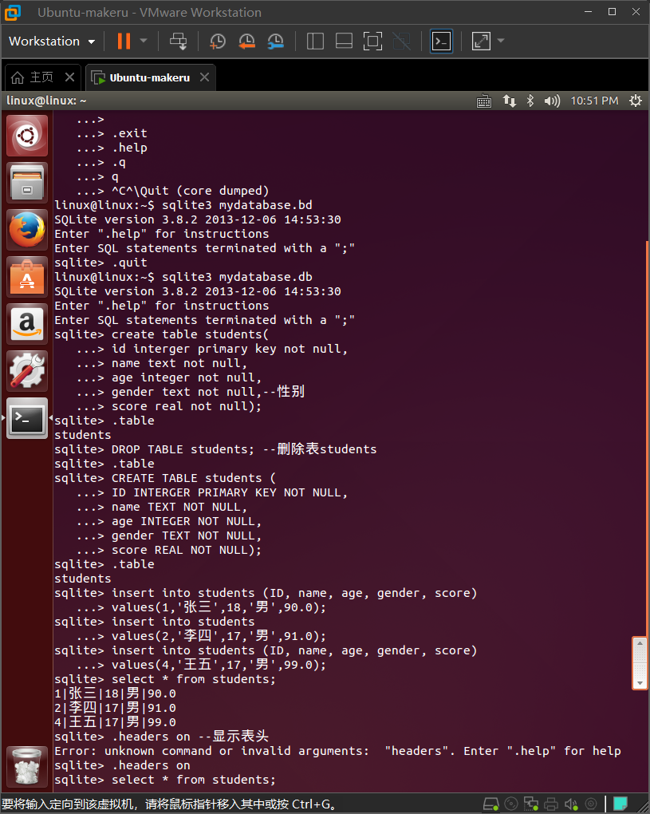
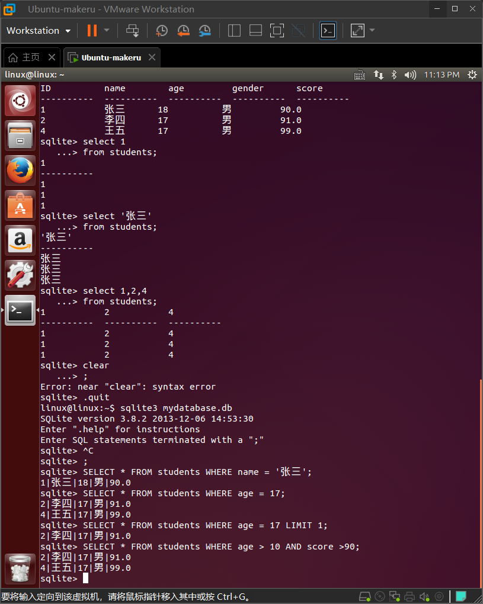

# 14_SQLite3

SQLite3是一个嵌入式数据库系统，它的数据库就是一个文件。SQLite3不需要一个单独的服务器进程或操作系统，不需要配置，这意味着不需要安装或管理，所有的维护都来自于SQLite3软件本身。

## 安装步骤

在Linux上安装SQLite3：

1. `sudo apt-get update` 更新软件库
2. `sudo apt-get install libsqlite3` 安装libsqlite3
3. `sudo apt-get install libsqlite3-dev` 安装libsqlite3依赖库
4. `sqlite3` 运行

# SQLite3的使用

## 以“.”开头的命令

| 命令                                | 说明                                           |
| ----------------------------------- | ---------------------------------------------- |
| .archive ...                        | 管理SQL归档文件                                |
| .auth ON&#124;OFF                   | 显示授权回调函数                               |
| .backup ?DB? FILE                   | 将数据库DB（默认为“main”）备份到FILE           |
| .bail on&#124;off                   | 在错误发生后停止。默认为OFF                    |
| .binary on&#124;off                 | 打开或关闭二进制输出。默认为OFF                |
| .cd DIRECTORY                       | 将工作目录更改为DIRECTORY                      |
| .changes on&#124;off                | 显示SQL更改的行数                              |
| .check GLOB                         | 如果自从.testcase以来的输出不匹配，则失败      |
| .clone NEWDB                        | 从现有数据库克隆数据到NEWDB中                  |
| .databases                          | 列出附加数据库的名称和文件                     |
| .dbconfig ?op? ?val?                | 列出或更改sqlite3_db_config()选项              |
| .dbinfo ?DB?                        | 显示有关数据库的状态信息                       |
| .dump ?TABLE? ...                   | 将所有数据库内容呈现为SQL                      |
| .echo on&#124;off                   | 打开或关闭命令回显                             |
| .eqp on&#124;off&#124;full&#124;... | 启用或禁用自动EXPLAIN QUERY PLAN               |
| .excel                              | 在电子表格中显示下一个命令的输出               |
| .exit ?CODE?                        | 以返回代码CODE退出此程序                       |
| .expert                             | 实验性功能。为查询建议索引                     |
| .explain ?on&#124;off&#124;auto?    | 更改EXPLAIN格式模式。默认值：auto              |
| .filectrl CMD ...                   | 运行各种sqlite3_file_control()操作             |
| .fullschema ?--indent?              | 显示模式和sqlite_stat表的内容                  |
| .headers on&#124;off                | 打开或关闭标题的显示                           |
| .help ?-all? ?PATTERN?              | 显示有关PATTERN的帮助文本                      |
| .import FILE TABLE                  | 将数据从FILE导入TABLE                          |
| .imposter INDEX TABLE               | 在索引INDEX上创建仿冒表TABLE                   |
| .indexes ?TABLE?                    | 显示索引的名称                                 |
| .limit ?LIMIT? ?VAL?                | 显示或更改SQLITE_LIMIT的值                     |
| .lint OPTIONS                       | 报告潜在的模式问题。                           |
| .load FILE ?ENTRY?                  | 加载扩展库                                     |
| .log FILE&#124;off                  | 打开或关闭日志记录。文件可以是stderr/stdout    |
| .mode MODE ?TABLE?                  | 设置输出模式                                   |
| .nullvalue STRING                   | 在NULL值的位置使用字符串STRING                 |
| .once (-e&#124;-x&#124;FILE)        | 仅将下一个SQL命令的输出发送到FILE              |
| .open ?OPTIONS? ?FILE?              | 关闭现有数据库并重新打开FILE                   |
| .output ?FILE?                      | 将输出发送到FILE，如果省略FILE，则发送到stdout |
| .parameter CMD ...                  | 管理SQL参数绑定                                |
| .print STRING...                    | 打印文本字符串STRING                           |
| .progress N                         | 在每个N操作码后调用进度处理程序                |
| .prompt MAIN CONTINUE               | 替换标准提示符                                 |
| .quit                               | 退出此程序                                     |
| .read FILE                          | 从FILE读取输入                                 |
| .recover                            | 尝试从损坏的数据库中恢复尽可能多的数据。       |
| .restore ?DB? FILE                  | 从FILE还原数据库DB（默认为“main”）的内容       |
| .save FILE                          | 将内存中的数据库写入FILE                       |
| .scanstats on&#124;off              | 打开或关闭sqlite3_stmt_scanstatus()指标        |
| .schema ?PATTERN?                   | 显示与PATTERN匹配的CREATE语句                  |
| .selftest ?OPTIONS?                 | 运行在SELFTEST表中定义的测试                   |
| .separator COL ?ROW?                | 更改列和行分隔符                               |
| .session ?NAME? CMD ...             | 创建或控制会话                                 |
| .sha3sum ...                        | 计算数据库内容的SHA3哈希值                     |
| .shell CMD ARGS...                  | 在系统Shell中运行CMD ARGS...                   |
| .show                               | 显示各种设置的当前值                           |
| .stats ?on&#124;off?                | 显示统计信息或打开/关闭统计信息                |
| .system CMD ARGS...                 | 在系统Shell中运行CMD ARGS...                   |
| .tables ?TABLE?                     | 列出LIKE模式为TABLE的表名                      |
| .testcase NAME                      | 开始将输出重定向到“testcase-out.txt”           |
| .testctrl CMD ...                   | 运行各种sqlite3_test_control()操作             |
| .timeout MS                         | 尝试以MS毫秒为间隔打开已锁定表                 |
| .timer on&#124;off                  | 打开或关闭SQL计时器                            |
| .trace ?OPTIONS?                    | 在每个SQL语句执行时输出                        |
| .vfsinfo ?AUX?                      | 有关顶级VFS的信息                              |
| .vfslist                            | 列出所有可用的VFS                              |
| .vfsname ?AUX?                      | 打印VFS堆栈的名称                              |
| .width NUM1 NUM2 ...                | 设置“ column”模式的列宽度                      |

## SQL语句

以下是SQLite 3中常用的SQL语句：

1. 创建表格

```sql
CREATE TABLE table_name (
  column_1 data_type constraints,
  column_2 data_type constraints,
  ...,
  column_n data_type constraints
);
```

字段名`column_1`；数据类型`data_type`；约束条件`constraints`；

2. 删除表格

```sql
DROP TABLE table_name;
```

3. 查询数据

```sql
SELECT column_1, column_2, ..., column_n 
FROM table_name;
```

3. 插入数据

```sql
INSERT INTO table_name (column_1, column_2, ..., column_n)
VALUES (value_1, value_2, ..., value_n);
```

4. 更新数据

```sql
UPDATE table_name
SET column_1 = value_1, column_2 = value_2, ..., column_n = value_n
WHERE condition;
```

5. 删除数据

```sql
DELETE FROM table_name WHERE condition;
```

## 示例：创建

以下是使用SQLite 3创建一个名为“students”的学生信息表并插入三个学生信息的示例：

1.  打开`shell`命令行终端。 
2.  连接到您的SQLite数据库文件。 

```
$ sqlite3 mydatabase.db
```

备注：`$`表示在shell命令行的命令行提示符
出现如下界面表示sqlite3打开成功，版本不同显示信息会略有差异

```
QLite version 3.31.1 2020-01-27 19:55:54
Enter ".help" for usage hints.
sqlite> 
```

3. 创建一个名为“students”的学生信息表。该表将包含以下列：ID，姓名，年龄，性别和成绩。

```sqlite
sqlite> CREATE TABLE students ( --创建表students
   ...> ID INTERGER PRIMARY KEY NOT NULL, 
   ...> name TEXT NOT NULL, 
   ...> age INTEGER NOT NULL,
   ...> gender TEXT NOT NULL,
   ...> score REAL NOT NULL);
```

备注：`sqlite>`和`   ...>`是sqlite3的命令行提示符

作为主键`PRIMARY KEY`；数据类型为整数`INTERGER`；不能为空`NOT NULL`；数据类型为文本`TEXT`；数据类型为实数`REAL`；

此时，可以输入`.table`命令检查表student是否创建成功，如下所示：

```sqlite
sqlite> .table
students
```

如果没有创建成功，或者表被删除，将会什么也不显示，例如此时执行DROP语句，将看不到表了

```
sqlite> DROP TABLE students; --删除表students
sqlite> .table
sqlite>
```

重复上面的`CREATE TABLE`（为了放便大家复制，粘贴后面把`sqlite3>`, `   ...>`都省略了）

```sqlite
CREATE TABLE students (
ID INTERGER PRIMARY KEY NOT NULL,
name TEXT NOT NULL,
age INTEGER NOT NULL,
gender TEXT NOT NULL,
score REAL NOT NULL);
```

4. 插入三个学生信息。例如：

```sqlite
INSERT INTO students (ID, name, age, gender, score)
   ...> values(1,'张三', 18, '男', 90.0);
INSERT INTO students (ID, name, age, gender, score)
values(2,'子涵', 18, '女', 88.5);
INSERT INTO students (ID, name, age, gender, score)
values(3, '张伟', 19, '男', 82.5);
```

这将向学生信息表中添加三条记录。每条记录都包含姓名、年龄、性别和分数等列的值。由于我们使用了自增长的主键列ID，因此每个记录都将在插入时自动被赋予一个唯一的ID值。

5. 确认学生信息已成功插入。可以使用`SELECT`语句来检索学生信息表中的所有行。例如：

```sqlite
select * FROM students;
1|张三|18|男|90.0
2|子涵|18|女|88.5
3|张伟|19|男|82.5
```

如果嫌弃这种界面，可以执行.headers on和.mode column，再执行SELECT语句，就好看了，如下图：

```sqlite
sqlite> .headers on 
sqlite> .mode column
sqlite> select * FROM students;
ID          name        age         gender      score     
----------  ----------  ----------  ----------  ----------
1           张三          18          男           90.0      
2           子涵          18          女           88.5      
3           张伟          19          男           82.5  
```

显示表头`.headers on` ；设置显示方式，每列用空格分开`.mode column` ;

6. 退出SQLite shell或关闭终端会话。

```sqlite
sqlite> .exit
```



## 示例：查询

1. 打开数据库

   ```sqlite
   sqlite3 mydatabase.db
   ```

2. 查询表students中的所有数据

   ```sqlite
   SELECT * FROM students;
   ```

3. 查询年龄为17的学生信息

   ```sqlite
   SELECT * FROM students WHERE age = 17;
   ```

    过滤结果集的关键字`WHERE`;

4. 如果只想返回一条记录，可以使用 `LIMIT` 子句限制结果集的大小

   ```sqlite
   SELECT * FROM students WHERE age = 17 LIMIT 1;
   ```

5. 查询年龄大于17，分数大于90的学生信息

   ```sqlite
   SELECT * FROM students WHERE age > 10 AND score >90;
   ```


