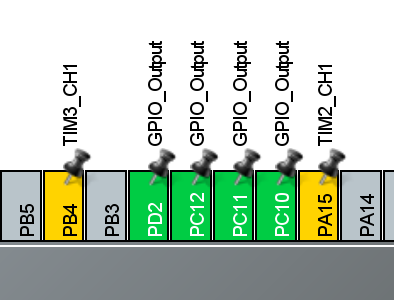

---

---

# 蓝桥杯嵌入式

## 0.初始工程创建

1. 打开CubeMX

   

2. 输入搜索芯片型号

     

3. 开启时钟 

   

4. 时钟初始化设置，最后绿色框处位80，即设置正确

   

5. 设置工程名字（不能有中文），文件保存位置，工具链（MDK-ARM）及最低版本（V5）

   

6. 代码生成设置，勾选生成 '.c/.h' 文件

   

7. 点击右上角Generate Code生成工程文件

## 1.小灯点亮（基础）

### 初始配置

1. 确定八个小灯和一个锁存器的管脚

   

   - 小灯管脚：PC8-PC15
   - 锁存器管脚：PD2

2. 在CubeMX中初始化相应管脚

   

   模式为**GPIO_Output**
   
3. 点击右上角Generate Code生成代码

### 新工程模块创建


1. 在新生成的工程文件中新建BSP文件

2. 新建 led.c和led.h文件，保存到新建的BSP文件中

3. 文件基础内容编写

   led.c

   ```c
   #include "led.h"
   
   ```

   led.h

   ```c
   #ifndef _LED_H_
   #define _LED_H_
   
   #endif
   ```

   *为防止文件被重复引用*

4. 将led.c加入到工程中

   1. 新建组
   
   2. 命名为BSP 
   
   3. 将led.c加入组
   
   4. 引包路径设置
   
      将BSP文件夹添加到引包路径
   
   5. 编译，编译后led.h便会自动加入到led.c下面

---

###  程序代码

#### led模块内容

​	led.c

```c
#include "led.h"
#include "main.h"

unsigned int LED = 0; //无符号型 int 全局变量
/*
@led_turn_on :控制小灯点亮
@para num :小灯的序号
*/
void led_turn_on(int num)
{
	LED = LED | (1<<num);
}
/*
@led_turn_off :控制小灯熄灭
@para num :小灯的序号
*/
void led_turn_off(int num)
{
	LED = LED & (~(1<<num));
}
/*
@led_star:小灯闪烁
@n:小灯的序号
*/
int star_time = 0;
void led_star(int n)
{
	if(star_time<uwTick)
	{
		star_time = uwTick +100;
		LED ^= (1<<n);
	}
}
void led_proc(void)//放入main.c的while循环中
{
    HAL_GPIO_WritePin(GPIOC,GPIO_PIN_All,GPIO_PIN_SET);//GPIOC所有管脚电平置1
	HAL_GPIO_WritePin(GPIOC,LED<<8,GPIO_PIN_RESET);//因为小灯管脚从PC8开始，所以左移8位
	HAL_GPIO_WritePin(GPIOD,GPIO_PIN_2,GPIO_PIN_SET);//打开锁存器
	HAL_GPIO_WritePin(GPIOD,GPIO_PIN_2,GPIO_PIN_RESET);//关闭锁存器
}
```

- `HAL_GPIO_WritePin(GPIOC,GPIO_PIN_All,GPIO_PIN_SET);`
- 库函数位置：/stm32g4xx_hal_gpio.h / Group2 / 第2个

​	屏幕出现了花屏现象（屏幕中会出现小白点、短线等），产生花屏现象的原因是在编写代码时将LED相关代码放在中断中，这样的操作会导致LCD驱动代码被打断，将错误的值写入LCD。

​	LCD、LED共用PC端口高8位，提醒大家在中断中尽量不要操作LED端口（PC8-15），可以使用标志位、查询的方式实现对LED的操作。

**所以要把*led_proc()*放入main.c的while循环中**

led.h

```c
#ifndef _LED_H_   //判断是否没定义_LED_H_，若没定义则执行下面代码
#define _LED_H_   //定义_LED_H_

void led_turn_on(int num);
void led_turn_off(int num);
#endif

```

#### 程序解释

##### 逻辑符号

1. **<<** 左移 将数转换成二进制数 然后左移

   例：(1<<2)  =  100

   ​		(0001<<2) = 0100

2. **|**  逻辑**或** 将数转换成二进制 然后进行或运算

   例：(0010 | 0000) = 0010  *有1为1*

3. **&**  逻辑**与** 将数转换成二进制 然后相与

​		例：(0010 & 0000) = 0000  *有0为0*

​	4.**~**  逻辑**反** 将数转换成二进制 

​		例：**~**(0010) = 1101	*0变成1，1变成0*

##### 程序解析

```c
int NUM = 256;	//256 转为二进制是 0001 0000 0000
HAL_GPIO_WritePin(GPIOC,NUM,GPIO_PIN_RESET);
```

​	第九位是1，所以该函数操作第九位管脚的电平，将pa9 RESET 即置0为低电平

```c
LED = LED | (1<<num);
```

​	例.

​	设 `LED = 32；num = 3;`

​	**LED** =  **0010 0000**	^因为int型数据大小为4字节，1字节=8比特，所以为32位,此处省略前24位^

​	**(1<<num)** = **0000 1000**

​	**LED | (1<<num)**  =  **0010 1000**

```c
LED = LED & (~(1<<num));
```

​	例.

​	设 `LED = 32；num = 5;`

​	**LED** =  **0010 0000**

​	**~(1<<num)** = **1101 1111**

​	**LED &（~ (1<<num)）** = **0000 0000**

#### 点灯

main.c

1. 引入led模块

2. 调用函数

   注意：**main.c** 中的代码一定要写在 `/* USER CODE BEGIN* /` 和 `/ * USER CODE END*/`之间，否则再用CubeMX生成代码之后，写在外面的代码会被清除

编译下载，观察小灯

---

## 2.LCD屏幕

### 驱动代码移植

文件路径：嵌入式资源数据包_STM32G4_2023\竞赛平台\6-液晶驱动参考程序\MDK5_LCD_HAL\Inc

在这里找到 **fonts.h** 和 **lcd.h**

文件路径：嵌入式资源数据包_STM32G4_2023\竞赛平台\6-液晶驱动参考程序\MDK5_LCD_HAL\Src

在这里找到 **lcd.c**

将这三个文件复制到上次新建的文件夹**BSP**中

然后在Keil中将**lcd.c**加入工程

### 程序代码

#### 初始化

main.c 中 while(1) 之前

```c
LCD_Init();//lcd初始化
LCD_SetTextColor(Black);//设置字体颜色
LCD_SetBackColor(White);//设置背景颜色
LCD_Clear(White);//白色清屏
```

- 库函数位置：/ lcd.h

#### 打印字和变量

main.c  while(1)中

```c
char text[50] = {0};
int num = 123;
sprintf(text,"Hellow World");
LCD_DisplayStringLine(Line1,(unsigned char *)text);

sprintf(text,"num = %d",123);
LCD_DisplayStringLine(Line2,(unsigned char *)text);
```

注意：sprintf 需要声明头文件   <stdio.h>

编译下载，观察屏幕

---

## 3.定时中断

### 定时器

***STM32G431RB拥有10个定时器，包括基本定时器、通用定时器和高级控制定时器**。*

- **基本定时器**：2个，分别是**TIM6**和**TIM7**。这些定时器的功能相对较为基础，通常用于简单的时间计数或者作为中断源使用。
- **通用定时器**：6个，分为两组，第一组是**TIM2,TIM3,TIM4**，第二组是**TIM15,TIM16,TIM17**。第一组的通用定时器功能齐全，可以用于多种场合，如PWM输出、输入捕获等。而第二组的通用定时器通道数量较少，可能只有1个或2个通道，适用于需求不那么复杂的场景。
- **高级控制定时器**：2个，即**TIM1**和**TIM8**。这些定时器提供了更多的功能和更高的灵活性，适合用于电机控制等需要高精度和复杂时序控制的应用场景。

### 初始配置

以**TIM6**为例

1. 开启时钟，使能中断

   

2. 设置时钟参数

   - 预分频值 **Prescaler**  80-1
   - 重装载值 **Counter Period**  1000-1
   - 占空比值 **Pulse**  占空比值/重装载值 = 占空比
     - （TIM6为基本定时器，不用设置占空比值）

- 晶振频率为80Mhz = 80 000 000hz

- **$分频后频率 = \frac{晶振频率}{预分频值 + 1} = \frac{80,000,000}{80} = 1,000,000 \text{ Hz}$**

- **$工作频率 = \frac{分频后频率}{1000} = \frac{1,000,000}{1000} = 1,000 { Hz}$**

- **工作频率为1000Hz，即每秒执行中断1000次**


3. 点击右上角Generate Code生成代码

### 程序代码

main.c

```c
HAL_TIM_Base_Start_IT(&htim6);//开启时钟
```

- 库函数位置：stm32g4xx_hal_tim.h / Group4 / Interrupt
- 注意：要写在**MX_TIM6_Init();**之后

#### 方法1：

生成代码后，在stm32g4xx_it.c中找到void TIM6_DAC_IRQHandler(void)，将想写的代码写入函数内；

stm32g4xx_it.c

```c
/**
  * @brief This function handles TIM6 global interrupt, DAC1 and DAC3 channel underrun error interrupts.
  */
void TIM6_DAC_IRQHandler(void)
{
  /* USER CODE BEGIN TIM6_DAC_IRQn 0 */
	time6++;
  /* USER CODE END TIM6_DAC_IRQn 0 */
  HAL_TIM_IRQHandler(&htim6);
  /* USER CODE BEGIN TIM6_DAC_IRQn 1 */

  /* USER CODE END TIM6_DAC_IRQn 1 */
}

```

#### 方法2：


新建 tim6.c，保存到BSP文件夹（**新建的.c和.h文件都保存到BSP,下面不再赘述**）

```c
/*使time6每毫秒加1*/
#include "tim6.h" 
#include "main.h" 
unsigned int time6 = 0;
void HAL_TIM_PeriodElapsedCallback(TIM_HandleTypeDef *htim)//中断服务函数
{
	if(htim->Instance == TIM6)
	{
        time6++;
    }
}
```

- `void HAL_TIM_PeriodElapsedCallback(TIM_HandleTypeDef *htim)`

- 库函数位置：stm32g4xx_hal_tim.h / Group9 / 第一个

新建 tim6.h

```c
#ifndef _TIM6_H_
#define _TIM6_H_

extern unsigned int time6;//声明为全局变量
void HAL_TIM_PeriodElapsedCallback(TIM_HandleTypeDef *htim);
#endif
```


**最后，打印到屏幕**

main.c  while(1)中

```c
sprintf(text,"time6 = %d",time);
LCD_DisplayStringLine(Line2,(unsigned char *)text);
```

编译下载，观察屏幕

---

## 4.按键开关

### 初始配置

1. 确定管脚
2. 使能管脚
3. 点击右上角Generate Code生成代码

### 程序代码

在上面设定好的定时中断的基础上编写

key.c

```c
/*普通按键--------------------------------------------------------------*/
int key_flag[4][2] = {0};
void key_read(void)//读取按键状态
{
	int i;
	key_flag[0][0] = HAL_GPIO_ReadPin(GPIOB,GPIO_PIN_0);
	key_flag[1][0] = HAL_GPIO_ReadPin(GPIOB,GPIO_PIN_1);
	key_flag[2][0] = HAL_GPIO_ReadPin(GPIOB,GPIO_PIN_2);
	key_flag[3][0] = HAL_GPIO_ReadPin(GPIOA,GPIO_PIN_0);
    //读取按键状态 0-按下  1-抬起
	for(i = 0; i<4; i++)
	{
		if(key_flag[i][0] == 0)
			key_flag[i][1]++;//当按键按下数组第二列按键对应行的值增加,在后面按键消抖时会用到
		else
			key_flag[i][1] = 0;//当按键抬起数组第二列按键对应行的值置0
	}
}
int key_down_flag[4] = {0};
int key_down(int i)
{
    if(key_flag[i][1] >5 && key_down_flag[i]==0)//按键刚按下
    {
        key_down_flag[i]==1;
        return 1;
    }
    if(key_flag[i][1] ==0 && key_down_flag[i]==1)//按键刚抬起
        key_down_flag[i]==0;
    
    return 0;
}
```

- `HAL_GPIO_ReadPin(GPIOB,GPIO_PIN_0);`

- 库函数位置：/stm32g4xx_hal_gpio.h / Group2 / 第1个

key.h

```c
#ifndef _KEY_H_
#define _KEY_H_

void key_read(void);
int key_down(int i);

#endif
```

### 模块代码使用

main.c

```c
int number = 0;
while(1)
{
    if(key_down(0))//按键按下一次加1
    {
        number++;
    }
	sprintf(text,"number = %d",number);
	LCD_DisplayStringLine(Line2,(unsigned char *)text);
}
```

编译下载，按B1按键，观察屏幕

### 按键功能拓展

#### 长按短按

```c
/*长短按按键--------------------------------------------------------------*/
int key_flag[4][3] = {0};
void key_read(void)//读取按键状态
{
	int i;
	key_flag[0][0] = HAL_GPIO_ReadPin(GPIOB,GPIO_PIN_0);
	key_flag[1][0] = HAL_GPIO_ReadPin(GPIOB,GPIO_PIN_1);
	key_flag[2][0] = HAL_GPIO_ReadPin(GPIOB,GPIO_PIN_2);
	key_flag[3][0] = HAL_GPIO_ReadPin(GPIOA,GPIO_PIN_0);
    //读取按键状态 0-按下  1-抬起
	for(i = 0; i<4; i++)
	{
		if(key_flag[i][0] == 0)
			key_flag[i][1]++;//当按键按下数组第二列按键对应行的值增加,在后面按键消抖时会用到
		else
			key_flag[i][1] = 0;//当按键抬起数组第二列按键对应行的值置0
	}
}
int key_down_flag[4] = {0};
int key_down(int i)
{
    if(key_flag[i][1] >5 && key_down_flag[i]==0)//按键刚按下
    {
        key_down_flag[i]=1;
    }
    if(key_flag[i][1] >2000 && key_down_flag[i]==1)//长按2s后
    {
        key_down_flag[i]=2;
        return 2;
    }
    if(key_flag[i][1] ==0 && key_down_flag[i] == 1)//短按后抬起
    {
        key_down_flag[i]=0;
        return 1;
    }
    if(key_flag[i][1] ==0 && key_down_flag[i] == 2)//长按后抬起
    {
        key_down_flag[i]=0;
    }
    return 0;
}
```

#### 单击双击

```c
/*单双击按键--------------------------------------------------------------*/
int key_down_flag[4] = {0};//按键按下标志
int key_down_time[4] = {0};//按下时的时间
int key_down(int i)
{
    if(Key_flag[i][1] > 5 && key_down_flag[i]==0)//按下
        key_down_flag[i]=1;
	if(Key_flag[i][1] == 0 && key_down_flag[i]==1)//抬起
    {
        key_down_flag[i]=2;
        key_down_time[i]=uwTick;
    }
	if(Key_flag[i][1] > 5 && key_down_flag[i]==2)//2次按下
    {
        key_down_flag[i]=3;
        return 2;
    }
	if(Key_flag[i][1] == 0 && key_down_flag[i]==3)//2次抬起
        key_down_flag[i]=0;

	if(key_down_flag[i]==2 && (key_down_time[i]+200) < uwTick)//时间内没有再次按下
    {
        key_down_flag[i]=0;
        return 1;
    }
    return 0;
}
```

#### 长按短按+单击双击

```c
/*单双击+长按按键--------------------------------------------------------------*/
int Key_flag[4][3] = {0};
void key_read(void)
{
	int i;
	Key_flag[0][0] = HAL_GPIO_ReadPin(GPIOB,GPIO_PIN_0);
	Key_flag[1][0] = HAL_GPIO_ReadPin(GPIOB,GPIO_PIN_1);
	Key_flag[2][0] = HAL_GPIO_ReadPin(GPIOB,GPIO_PIN_2);
	Key_flag[3][0] = HAL_GPIO_ReadPin(GPIOA,GPIO_PIN_0);

	for(i = 0; i<4; i++)
	{
		if(Key_flag[i][0] == 0)
			Key_flag[i][1]++;
		else
			Key_flag[i][1] = 0;
	}
}
int key_down_flag[4] = {0};
int key_down_time[4] = {0};
int key_down(int i)
{
	if(Key_flag[i][1] > 5 && key_down_flag[i]==0)//第一次按下
	{
		key_down_flag[i]=1;
	}
	if(Key_flag[i][1] == 0 && key_down_flag[i]==1)//第一次抬起
	{
		key_down_flag[i]=2;
		key_down_time[i]=uwTick;
	}
	if(Key_flag[i][1] > 5 && key_down_flag[i]==2)//第二次按下
	{
		key_down_flag[i]=3;
		return 2;
	}
	if(Key_flag[i][1] == 0 && key_down_flag[i]==3)//第二次抬起
	{
		key_down_flag[i]=0;
		return 0;
	}
	if(key_down_flag[i]==2 && (key_down_time[i]+200) < uwTick)//时间内没有再次按下，判断为短按
	{
		key_down_flag[i]=0;
		return 1;
	}
	/*长按*/
	if(Key_flag[i][1]>2000 && key_down_flag[i]==1)
	{
		key_down_flag[i]=5;
		return 3;
	}
	if(Key_flag[i][1] == 0 && key_down_flag[i]==5)//长按后抬起
	{
		key_down_flag[i]=0;
	}
	return 0;
}
```


## 5.**输入捕获**

***输入捕获是一种用于测量信号的周期和频率的功能，常用于微控制器中**。*

*输入捕获是微控制器定时器的一个功能，它允许定时器捕捉外部事件发生的时间点。这个功能通常用于测量脉冲宽度、信号周期和频率等参数。*

### **初始配置**

1. 确定管脚

   

2. CubeMX配置

   

3. 时钟使能，通道开启(**TIM3_CH1**和**TIM2_CH1**)，预分频值设置

   

4. 中断使能（两个）

   

### **程序代码**

main.c

```c
HAL_TIM_IC_Start_IT(&htim2,TIM_CHANNEL_1);//开启捕获中断
HAL_TIM_IC_Start_IT(&htim3,TIM_CHANNEL_1);
```

- 库函数位置：stm32g4xx_hal_**tim**.h / Group4 / Interrupt

新建 ic_it.c

```c
#include "ic_it.h"
uint32_t tim3_cnt1 = 0;
float frequency1 = 0;
uint32_t tim2_cnt1 = 0;
float frequency2 = 0;
void HAL_TIM_IC_CaptureCallback(TIM_HandleTypeDef *htim)
{
    /************法一，用寄存器获取值**************/
	if(htim->Instance == TIM3)//判断中断来自TIM3
	{
		tim3_cnt1 = TIM3->CNT;//获取计数值
		TIM3->CNT = 0;//清零计数值
		frequency1 = (80000000/80)/tim3_cnt1;//频率=(晶振频率/预分频值)/计数值
	}
    /************法二，用库函数获取值**************/
	if(htim->Instance == TIM2)//判断中断来自TIM2
	{
		tim2_cnt1 = __HAL_TIM_GetCounter(htim);//获取计数值
		__HAL_TIM_SetCounter(htim,0);//清零计数值
		frequency2 = (80000000/80) / tim2_cnt1;//频率=(晶振频率/预分频值)/计数值
	}
}
```

​	这里写了两种获取计数值的方法，觉得那个方便用哪个就行。

- `void HAL_TIM_IC_CaptureCallback(TIM_HandleTypeDef *htim)`

- 库函数位置：stm32g4xx_hal_**tim**.h / Group9 / Interrupt

新建 ic_it.h

```c
#ifndef _IC_IT_H_
#define _IC_IT_H_
extern float frequency1;
extern float frequency2;
void HAL_TIM_IC_CaptureCallback(TIM_HandleTypeDef *htim);
#endif
```

### **模块代码使用**

main.c

```c
while(1)
{
    sprintf(text,"F1:%.2f",frequency1);
	LCD_DisplayStringLine(Line2,(unsigned char *)text);
    sprintf(text,"F2:%.2f",frequency2);
	LCD_DisplayStringLine(Line2,(unsigned char *)text);
}
```

编译下载，转动信号发生器旋钮，观察屏幕。

-----

---

## 6.PWM输出

*PWM输出是一种利用数字信号来模拟模拟信号的技术，通过控制方波的占空比来达到调节输出功率的目的。*

### 初始配置

- 选择**通用定时器**：通用定时器有6个，分为两组，第一组是**TIM2,TIM3,TIM4**，第二组是**TIM15,TIM16,TIM17**。第一组的通用定时器功能齐全，可以用于多种场合，如PWM输出、输入捕获等。而第二组的通用定时器通道数量较少，可能只有1个或2个通道，适用于需求不那么复杂的场景。

- 这里以**TIM3**为例

1.找到TIM3的管脚

在：/嵌入式资源数据包_STM32G4_2023/竞赛平台/CT117E_M4_SCH.pdf 中


有**PA6,PA7,PB0,PB1**四个管脚分别对应**TIM3**的四个通道，随便选择其中一个

2.打开CubeMX，配置管脚


3.使能时钟，开启


5.设置PWM波参数

- 预分频值 **Prescaler**  80-1

- 重装载值 **Counter Period**  1000-1

- 占空比值 **Pulse**  占空比值/重装载值 = 占空比

  

**PWM波频率计算**

- ​	晶振频率为80Mhz = 80 000 000hz

- **$分频后频率 = \frac{晶振频率}{预分频值 + 1} = \frac{80,000,000}{80} = 1,000,000 \text{ Hz}$**

- **$工作频率 = \frac{分频后频率}{1000} = \frac{1,000,000}{1000} = 1,000 { Hz}$**

- **工作频率为1000Hz，即每秒执行中断1000次**

### 程序代码

mian.c

```c
HAL_TIM_PWM_Start(&htim3,TIM_CHANNEL_2);//开启PWM通道
```

库函数位置：stm32g4xx_hal_tim.h / Group3 / Polling ^投票^

新建 pwm_Generation.c

```c
#include "PWM_Generation.c"
#define crystal 80000000/80 //预分频后的频率
//PA7-TIM3-CH2
/*
@pwm_PA7T3_Frequency：修改PWM波的频率
*/
void pwm_PA7T3_Frequency(float num)
{
    TIM3->ARR=(crystal/num)-1;
}
/*
@pwm_PA7T3C2_pulse：修改PWM波的占空比
@para num 0.0~1.0
*/
void pwm_PA7T3C2_Pulse(float num)
{
    TIM3->CCR2 = num * (TIM3->ARR+1);
}
```

注意：TIM2的pwm通道改变频率时，波形有时变成一条直线，可以将TIM2的CNT清零即可解决，（不知道为什么，可能是计数值溢出Bug了）

新建 pwm_Generation.h

```c
#ifndef _PWM_GENERATION_H_
#define _PWM_GENERATION_H_
void pwm_PA7T3_Frequency(fl num);
void pwm_PA7T3C2_Pulse(float num);
#endif
```

### 模块代码使用

main.c

```c
int number = 0;
float PA7_pwm = 0;
while(1)
{
    if(key_down(0))
        PA7_pwm+= 0.1;
   
    if(PA7_pwm > = 1)
        PA7_pwm = 0.0;
    
     pwm_PA7T3C2_Pulse(PA7_pwm);
}
```

找一个LED小灯，将小灯两极用杜邦线连接，一头接3V,一头接PA7

编译下载，按B1按键，观察小灯；

每按一下按键B1,灯就会暗一点，按十次之后灯又会重新变亮


-----

## 7.**ADC数模信号转换**

*ADC，即模数转换器（Analog-to-Digital Converter），是**将模拟信号转换为数字信号的设备***

### **初始配置**

1. 确定管脚

   

2. CubeMX配置

   

3. 使能端口

   ​	ADC2_IN15

   ​	ADC_IN11

### **程序代码**

新建my_adc.c  

```c
float getADC(ADC_HandleTypeDef *hadc)
{
	HAL_ADC_Start(hadc);//开启ADC
	return (HAL_ADC_GetValue(hadc)*3.3f/4035);//3.3为额定电压,4096为2的12次幂,校准到了4035
}
```

- `HAL_ADC_Start(hadc);`

  库函数位置：/stm32g4xx_hal_**adc**.h / Group2 / Polling

- `HAL_ADC_GetValue(hadc);`

  库函数位置：/stm32g4xx_hal_**adc**.h / Group2 

### **模块代码使用**

main.c

```c
while(1)
{
    sprintf(text,"F1:%.2f",getADC(&hadc1));
	LCD_DisplayStringLine(Line2,(unsigned char *)text);
    sprintf(text,"F2:%.2f",getADC(&hadc2));
	LCD_DisplayStringLine(Line2,(unsigned char *)text);
}
```

编译下载，转动模拟电压旋钮，观察屏幕

---

## 8.**E2PROM存储器**

*AT24C02芯片（又叫E2PROM存储器、EEPROM存储器），是一种通过**I2C(IIC)协议**通信的掉电保存存储器芯片，其内部含有256个8位字节。*

*I2C总线是一种双向二线制的同步串行总线，它只需要两根线即可在连接于总线上的器件之间传送信息（分别为SDA和SCL）。在I2C总线上，可以有若干个从机（如AT24C02芯片），但只能有一个主机（如单片机）*

*在比赛方提供的资源数据包——底层驱动代码参考中，有用HAL库函数实现的软件I2C的库，我们就基于这个库来使用AT24C02芯片（E2PROM存储器）进行读写操作。*

### **初始配置**

*可以不用CubeMX配置管脚，直接在main函数中写  I2CInit();  即可*

1. 加入两个库文件

   位置：嵌入式资源数据包_STM32G4_2023\竞赛平台\3-底层驱动代码参考\I2C_HAL

   


### **程序代码**

#### 单个字符读写

1. main.c

   `I2CInit();` 

2. 在：竞赛平台/4-芯片资料/**AT24C02.pdf**中找到下图

3. 根据下图图编写**发送**程序

4. 根据下图编写**接收**程序

   

   新建 i2c.c

   ```c
   #include "i2c.h"
   #include "i2c_hal.h"
   //写函数
   void i2_write(unsigned char address,unsigned char data)
   {
   	I2CStart();             //1.start
   	I2CSendByte(0xa0);      //2.send 0xa0
   	I2CWaitAck();           //3.wack
       
   	I2CSendByte(address);   //4.send address
   	I2CWaitAck();			//5.wack
       
   	I2CSendByte(data);		//6.send data
   	I2CWaitAck();			//7.wack
       
   	I2CStop();				//8.stop
       HAL_Delay(20);//写入函数，最后一定要加延时，不然有可能存不进去
   }
   //读函数
   unsigned char i2_read(unsigned char address)
   {
   	unsigned char data;
   	I2CStart();          //1.start
   	I2CSendByte(0xa0);   //2.send 0xa0
   	I2CWaitAck();        //3.wack
       
   	I2CSendByte(address);//4.send address
   	I2CWaitAck();        //5.wack
       
   	I2CStart();          //6.start
   	I2CSendByte(0xa1);   //7.send 0xa1
   	I2CWaitAck();        //8.wack
       
   	data = I2CReceiveByte();//9.receive data
   	I2CSendNotAck();     //10.not ack
       
   	I2CStop();           //11.stop
   	return data;
   }
   ```
   
   - 库函数位置：i2c_hal.h
   
   新建 i2c.h
   
   ```c
   #ifndef _I2C_H_
   #define _I2C_H_
   void i2_write(unsigned char address,unsigned char data);
   unsigned char i2_read(unsigned char address);
   #endif
   ```

#### 8位数据读写

main.c

```c
int key_return_1 = 0;
unsigned char data = 0;
data = i2_read(1);//读取
while(1)
{
    if(key_down(0))//按键按下返回1
    {
        data = 2;
        i2_write(1,data);//写入
        HAL_Delay(10);
    }
    sprintf(text,"data = %d",data);
	LCD_DisplayStringLine(Line2,(unsigned char *)text);
}
```

编译下载，观察屏幕；重新上电后屏幕还显示2；

---

#### 16位数据读写

​	因为 **eeprom** **储存器** 最多存储8位数据 最大值为255，所以若要存储更大的值需要合并两次或多次接收的数据

i2c.c  新加两个函数

```c
void i2_write_long(int send_data)//可发送最大值为65535
{
	unsigned int high = send_data >> 8;//数据左移，留下高八位
	unsigned int low = send_data & 0xff;//和0x00相与，留下低八位
	i2_write(1,high);//高八位发送到地址1
	HAL_Delay(5);//延时等待发送完成
	i2_write(2,low);//低八位发送到地址2
}
unsigned int i2_read_long(void)
{
	unsigned int read_data;
	read_data = (i2_read(1)<<8)+i2_read(2);//将接收到的高八位与第八位相加
	return read_data;
}
```

使用：

main.c

```c
int key_return_1 = 0;
int data = 0;
 data = i2_read_long();//读取
while(1)
{
    if(key_down(0))
    {
        i2_write_long(65535);//写入
        HAL_Delay(10);
    }
    sprintf(text,"data = %d",data);
	LCD_DisplayStringLine(Line2,(unsigned char *)text);
}

```

编译下载，观察屏幕；

#### 字符串读写


```c
/*读函数*/
//pucBuf：字符串首地址
//ucAddr：读取地址
//ucNum：字符串长度
void MEM_Read(unsigned char* pucBuf, unsigned char ucAddr,unsigned char ucNum)
{
  I2CStart();               //1.start
  I2CSendByte(0xa0);        //2.send 0xa0
  I2CWaitAck();             //3.wack

  I2CSendByte(ucAddr);      //4.send address
  I2CWaitAck();             //5.wack
	
  I2CStart();               //6.start
  I2CSendByte(0xa1);        //7.send 0xa1
  I2CWaitAck();             //8.wack

  while(ucNum--)
  {
    *pucBuf++ = I2CReceiveByte();//9.receive data
    if(ucNum)
      I2CSendAck();        //10.sack
    else
      I2CSendNotAck();     //11.not ack
  }
  I2CStop();               //12.stop
}
/*写函数*/
//pucBuf：字符串首地址
//ucAddr：储存地址
//ucNum：字符串长度
void MEM_Write(unsigned char* pucBuf, unsigned char ucAddr,unsigned char ucNum)
{
  I2CStart();               //1.start
  I2CSendByte(0xa0);        //2.0xa0
  I2CWaitAck();             //3.wack

  I2CSendByte(ucAddr); 	   //4.send address
  I2CWaitAck();            //5.wack

  while(ucNum--)
  {
    I2CSendByte(*pucBuf++); //6.send data
    I2CWaitAck();         //7.wack
  }
  I2CStop();              //8.stop
  HAL_Delay(500);
}
```


---

## 9.**USART串口通信**

*USART（Universal Synchronous Asynchronous Receiver Transmitter，通用同步异步收发器）是一种串口通信技术，它支持同步和异步两种通信模式*

### **初始配置**

1. 找到usart1的两个管脚

   

2. CubeMX配置管脚

   

3. 使能USART1中断

   

4. 波特率 数据位 停止位

   

### **程序代码**

main.c

```c
HAL_UART_Receive_IT(&huart1, (uint8_t *)&RX_buffer_IT, 1);//串口中断开启
```

新建 my_usart.c

```c
#include "my_usart.h"
char send_data[] = "HELLOW,WORLD!"
char RX_buffer[RX_N] = {0};//接收缓存区
char RX_buffer_IT;//中断接收缓存区
unsigned int Rx_CNT = 0;//接收计数
/***********中断回调函数**************/
void HAL_UART_RxCpltCallback(UART_HandleTypeDef *huart)
{
	if(huart->Instance == USART1)//判断触发中断的是USART1
	{
		if(Rx_CNT < RX_N)//如果没有溢出
		{
			RX_buffer[Rx_CNT++] = RX_buffer_IT;//接收转存
            HAL_UART_Transmit(&huart1, (uint8_t *)send_data, strlen(send_data), HAL_MAX_DELAY);//向电脑发送数据; 
			if(RX_buffer[Rx_CNT-1] == ' ')//空格为结束标志
				Rx_CNT = 0;//下标置零
		}
		else//数据溢出
			Rx_CNT = 0;//下标置零
		HAL_UART_Receive_IT(&huart1, (uint8_t *)&RX_buffer_IT, 1);
        //再次开启接收中断
	}
}

```

- `void HAL_UART_RxCpltCallback(UART_HandleTypeDef *huart)`
  - 库函数位置：stm32g4xx_hal_**usart**.h / Group2 /倒数第五个
- `HAL_UART_Transmit(&huart1, (uint8_t *)send_data, sizeof(send_data), HAL_MAX_DELAY);`
  - 库函数位置：stm32g4xx_hal_**usart**.h / Group2 /第一个


新建 my_usart.h

```c
#ifndef _MY_USART_H_
#define _MY_USART_H_
#include "main.h"
#define RX_N 50 //数据溢出值
void HAL_UART_RxCpltCallback(UART_HandleTypeDef *huart);
extern char RX_buffer[RX_N];//接收缓存区
extern char RX_buffer_IT;//中断接收缓存区
#endif
```

### **模块代码使用**

main.c

```c
while(1)
{
    sprintf(text,"receive:%s",RX_buffer);
	LCD_DisplayStringLine(Line2,(unsigned char *)text);
}
```

- `HAL_UART_Receive_IT(&huart1, (uint8_t *)&RX_buffer_IT, 1);`
  - 库函数位置：stm32g4xx_hal_**usart**.h / Group2 /第四个

编译下载，打开串口助手，波特率设置为9600，连接串口;

发送数据，以空格结尾;观察屏幕 和 串口助手。

## 10.uwTick计时

*STM32CUBEMX生成的工程，会自动把Systick配置成1ms中断的定时器，并在中断函数里，在中断处理函数中将变量**uwTick**每1ms增加1。这样我们就可以知道芯片的走时情况，直到芯片到目前为止上电多长时间。*

led.c

```c
/***利用uwTick实现小灯定时熄灭***/
int led_times[8] = {0};
void led_time(int leds,int t)//小灯亮t毫秒
{
	led_times[leds] = uwTick + t;
    led_turn_on(leds);
}
void led_time_chack(int leds)//检查时间是否到了
{
	if(led_times[leds] < uwTick && (LED&(1<<leds) != 0))//时间到了且小灯没灭
		led_turn_off(leds);
}
```

main.c

```c
while(1)
{
    if(Key_flag[0][1] > 5)//检测按键0，是否按下
		led_time(0,1000);//第0个小灯，亮1000毫秒
	led_time_chack(0);
}
```

编译下载，观察小灯；

## 库函数总结

**IT** - 中断 (interrupt)

**IC** - 输入捕获 (input capture)

**Callback** - 回调

​	管脚

- ```c
  HAL_GPIO_WritePin(); //小灯
  ```

  - /stm32g4xx_hal_**gpio**.h / Group2 / 第2个

- ```c
  HAL_GPIO_ReadPin(GPIOB,GPIO_PIN_0);
  ```

  - /stm32g4xx_hal_**gpio**.h / Group2 / 第1个

----

​	屏幕

- ```c
  LCD_Init();//lcd初始化
  ```

  - **lcd**.h

----

​	时钟

- ```c
  HAL_TIM_Base_Start_IT(&htim6);//开启时钟和中断
  ```

  - stm32g4xx_hal_**tim**.h / Group1 / Interrupt

- ```c
  void HAL_TIM_PeriodElapsedCallback(TIM_HandleTypeDef *htim)//中断回调函数
  ```

  - stm32g4xx_hal_**tim**.h / Group9 / 第一个

- ```c
  HAL_TIM_PWM_Start(&htim3,TIM_CHANNEL_2);//开启PWM通道
  ```

  - stm32g4xx_hal_**tim**.h / Group3 / Polling ^投票^

----

​	捕获

- ```c
  HAL_TIM_IC_Start_IT(&htim2,TIM_CHANNEL_1);//开启捕获中断
  ```

  - stm32g4xx_hal_**tim**.h / Group4 / Interrupt

----

​	串口

- ```c
  HAL_UART_Receive_IT(&huart1, (uint8_t *)&RX_buffer_IT, 1);//开启接收中断
  ```

  - stm32g4xx_hal_**usart**.h / Group2 /第四个

- ```c
  void HAL_UART_RxCpltCallback(UART_HandleTypeDef *huart);//接收中断回调函数
  ```

  - stm32g4xx_hal_**usart**.h / Group2 /倒数第五个


## LCD反转

上下翻转


左右翻转


