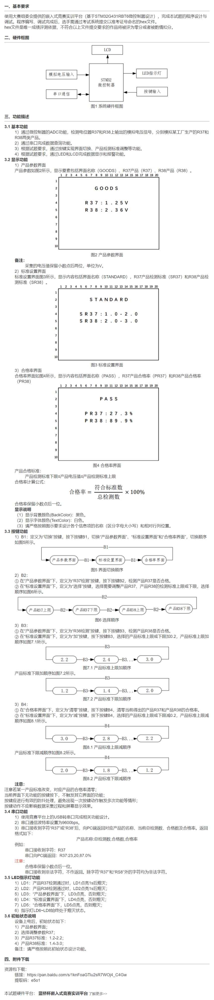

# 蓝桥杯嵌入式模拟题14-1

## 题目


## 程序

### my_core.c

```c
#include "my_core.h"
int test = 0;
char test2 =0;

float lcd_VR37 = 0;
int lcd_menu = 0;
int lcd_PA7 = 1000;
float lcd_VP1 = 0.3;

float pa7_d = 0.1;
/*-------------------------------------------LED*/
unsigned int LED_S = 0;
void led_turn(int n,int s)
{
	if(s == 1)
	{
		LED_S =LED_S | (1<<n);
	}
	if(s == 0)
		LED_S =LED_S & (~(1<<n));
}
int led_star_time = 0;
int star_i = 0;
void led_star(void)
{
	if(led_star_time<uwTick)
	{
		led_star_time=uwTick+100;
		star_i++;
		led_turn(2,star_i%2);
	}
}
void led_proc(void)
{
	if(lcd_menu%2 == 0)
		led_turn(0,1);
	else
		led_turn(0,0);
	
	if(lcd_menu%2 == 1)
		led_turn(1,1);
	else
		led_turn(1,0);
	if(lcd_VR37>lcd_VP1)
		led_star();
	else
		led_turn(2,0);
	HAL_GPIO_WritePin(GPIOC,GPIO_PIN_All,GPIO_PIN_SET);
	HAL_GPIO_WritePin(GPIOC,LED_S<<8,GPIO_PIN_RESET);
	HAL_GPIO_WritePin(GPIOD,GPIO_PIN_2,GPIO_PIN_SET);
	HAL_GPIO_WritePin(GPIOD,GPIO_PIN_2,GPIO_PIN_RESET);
}
/*-------------------------------------------LCD*/
int lcd_teme = 0;
char lcd_text[30] = {0};
void lcd_proc(void)
{
	if(lcd_teme>uwTick)
		return;
	lcd_teme = uwTick+100;
	if(lcd_menu%2 == 0)
	{
		sprintf(lcd_text,"        DATA    ");
		LCD_DisplayStringLine(Line3,(u8 *)lcd_text);
		sprintf(lcd_text,"     VR37:%.2fV    ",lcd_VR37);
		LCD_DisplayStringLine(Line4,(u8 *)lcd_text);
		sprintf(lcd_text,"     PA7:%dHz     ",lcd_PA7);
		LCD_DisplayStringLine(Line5,(u8 *)lcd_text);
	}
	if(lcd_menu%2 == 1)
	{
		sprintf(lcd_text,"        PARA        ");
		LCD_DisplayStringLine(Line3,(u8 *)lcd_text);
		sprintf(lcd_text,"      VP1:%.1fV      ",lcd_VP1);
		LCD_DisplayStringLine(Line4,(u8 *)lcd_text);
		sprintf(lcd_text,"                    ");
		LCD_DisplayStringLine(Line5,(u8 *)lcd_text);
	}
//	sprintf(lcd_text,"%.2f  ",pa7_d);
//	LCD_DisplayStringLine(Line7,(u8 *)lcd_text);
//	sprintf(lcd_text,"%d  %.2f  ",test,getADC(&hadc2));
//	LCD_DisplayStringLine(Line8,(u8 *)lcd_text);
//	sprintf(lcd_text,"%d   %c ",fre_pa2,usa_buffer_it);
//	LCD_DisplayStringLine(Line9,(u8 *)lcd_text);
}
/*-------------------------------------------KEY*/
int key_flag[4][2] = {0};
void key_read(void)
{
	int i;
	key_flag[0][0] = HAL_GPIO_ReadPin(GPIOB,GPIO_PIN_0);
	key_flag[1][0] = HAL_GPIO_ReadPin(GPIOB,GPIO_PIN_1);
	key_flag[2][0] = HAL_GPIO_ReadPin(GPIOB,GPIO_PIN_2);
	key_flag[3][0] = HAL_GPIO_ReadPin(GPIOA,GPIO_PIN_0);
	for(i=0; i<4; i++)
	{
		if(key_flag[i][0] == 0)
			key_flag[i][1]++;
		else
			key_flag[i][1] = 0;
	}
}
int key_down_flag[4] ={0};
int key_down(int n)
{
	if(key_down_flag[n] == 0 && key_flag[n][1]>5)
	{
		key_down_flag[n] = 1;
		return 1;
	}
	if(key_down_flag[n] == 1 && key_flag[n][1]==0)
		key_down_flag[n] = 0;
	return 0;
}
void key_proc(void)
{
	if(key_down(0))
		lcd_menu++;
	if(lcd_menu%2 ==1)
	{
		if(key_down(1))
		{
			lcd_VP1+=0.3f;
			if(lcd_VP1 >3.31f)
				lcd_VP1 = 0.0;
		}
	}
	if(lcd_menu%2 == 0)
	{
		if(key_down(2))
		{
			lcd_PA7+=1000;
			if(lcd_PA7>10000)
				lcd_PA7 = 1000;
		}
	}
}
/*-------------------------------------------ADC*/
//R37-PB15-ADC2
float getADC(ADC_HandleTypeDef *hadc)
{
	 HAL_ADC_Start(hadc);
	return (HAL_ADC_GetValue(hadc)*3.3/4035);
}
/*-------------------------------------------PWM*/
//PA7-TIM3-CH2
void pwm_Hz(int n)
{
	TIM3->ARR = (10000000/n)-1;
}
void pwm_D(float n)
{
	TIM3->CCR2 = (TIM3->ARR+1)*n;
}
void pwm_proc(void)
{
	lcd_VR37 = getADC(&hadc2);
	pwm_Hz(lcd_PA7);
	pwm_D(pa7_d);
}
//频率捕获 PA2-TIM15-CH1 （测试用）
int fre_pa2 = 0;
void HAL_TIM_IC_CaptureCallback(TIM_HandleTypeDef *htim)
{
	if(htim->Instance == TIM15)
	{
		fre_pa2 = 1000000/TIM15->CNT;
		TIM15->CNT = 0;
	}
}
/*-------------------------------------------USART*/
//USART1-9600
char usa_buffer_it;
char usa_buffer[50]={0};
int usa_cnt = 0;
void HAL_UART_RxCpltCallback(UART_HandleTypeDef *huart)
{
	if(huart->Instance == USART1)
	{
		if(usa_cnt<50)
		{
			usa_buffer[usa_cnt++] = usa_buffer_it;
			if(usa_buffer[usa_cnt-1]>='1' && usa_buffer[usa_cnt-1]<='9')
			{
				pa7_d = (float)(usa_buffer[usa_cnt-1]-48)/10;
				usa_cnt = 0;
			}
			else
				HAL_UART_Transmit(&huart1, (uint8_t *)"Error", strlen("Error"), HAL_MAX_DELAY);
		}
		else
			usa_cnt = 0;
		HAL_UART_Receive_IT(&huart1,(uint8_t *)&usa_buffer_it,1);
	}
}


```

### my_core.h

```c
#ifndef _MY_CORE_H_
#define _MY_CORE_H_
#include "main.h"
#include "adc.h"
#include "tim.h"
#include "usart.h"
#include "gpio.h"
#include "stdio.h"
#include "lcd.h"
#include "string.h"

void led_turn(int n,int s);
void led_proc(void);
void lcd_proc(void);
void key_read(void);
int key_down(int n);
void key_proc(void);
float getADC(ADC_HandleTypeDef *hadc);
void pwm_proc(void);

extern char usa_buffer_it;
extern int fre_pa2;
#endif

```

### main.c

```c
int main(void)
{
  /* USER CODE BEGIN 1 */
	
  /* USER CODE END 1 */

  /* MCU Configuration--------------------------------------------------------*/

  /* Reset of all peripherals, Initializes the Flash interface and the Systick. */
  HAL_Init();

  /* USER CODE BEGIN Init */

  /* USER CODE END Init */

  /* Configure the system clock */
  SystemClock_Config();

  /* USER CODE BEGIN SysInit */

  /* USER CODE END SysInit */

  /* Initialize all configured peripherals */
  MX_GPIO_Init();
  MX_ADC2_Init();
  MX_TIM3_Init();
  MX_TIM15_Init();
  MX_USART1_UART_Init();
  /* USER CODE BEGIN 2 */
	LCD_Init();
	LCD_SetTextColor(White);
	LCD_SetBackColor(Black);
	LCD_Clear(Black);
	
	HAL_UART_Receive_IT(&huart1,(uint8_t *)&usa_buffer_it,1);
	//HAL_TIM_IC_Start_IT(&htim15,TIM_CHANNEL_1);（测试用）
	HAL_TIM_PWM_Start(&htim3,TIM_CHANNEL_2);
  /* USER CODE END 2 */

  /* Infinite loop */
  /* USER CODE BEGIN WHILE */
  while (1)
  {
		led_proc();
		lcd_proc();
		key_proc();
		pwm_proc();
    /* USER CODE END WHILE */

    /* USER CODE BEGIN 3 */
  }
  /* USER CODE END 3 */
}
```

### stm32g4xx_it.c

```c
void SysTick_Handler(void)
{
  /* USER CODE BEGIN SysTick_IRQn 0 */
	key_read();
  /* USER CODE END SysTick_IRQn 0 */
  HAL_IncTick();
  /* USER CODE BEGIN SysTick_IRQn 1 */

  /* USER CODE END SysTick_IRQn 1 */
}
```

# 蓝桥杯嵌入式模拟题14-2

## 题目


## 程序

### my_core.c

```c
#include "my_core.h"

int start = 0;
/*=============MENU====================*/
int PA1_Hz = 1000, PA7_Hz = 1000;//ƵÂÊ
float PA1_D = 0.1,PA7_D = 0.1;//Õ¼¿Õ±È

float fre_PA3 = 0;
int cnt_15 = 0;


int menu_n = 0;//²Ëµ¥Çл»
int c_mode = 0;//¿ØÖÆģʽÇл»

void menu0(void)
{
	key_down(3,&c_mode,1);
	
	if(c_mode%2 == 0)//°´¼üģʽ
		key_down(2,&menu_n,1);
	else if(c_mode%2 == 1)//´®¿Úģʽ
	{
		;
	}
	if(menu_n%2 == 0)
	{
		if(key_down(0,&PA1_Hz,1000))//ƵÂÊ
		{
			if(PA1_Hz>10000)
			{
				PA1_Hz=1000;
			}
		}
		if(key_down_f(1,&PA1_D,0.1))//Õ¼¿Õ±È
		{
		if(PA1_D>0.91f)
			PA1_D=0.1;
		}
		lcd_menu(1);
	}
	else if(menu_n%2 == 1)
	{
		if(key_down(0,&PA7_Hz,1000))//ƵÂÊ
		{
			if(PA7_Hz>10000)
				PA7_Hz=1000;
		}
		if(key_down_f(1,&PA7_D,0.1))//Õ¼¿Õ±È
		{
			if(PA7_D>0.91f)
				PA7_D=0.1;
		}
		lcd_menu(2);
	}
	/********led***********///²ÎÊý¿ØÖÆСµÆ
//led1
	if(PA1_Hz>PA7_Hz)
		led_star(0);
	else if(menu_n%2 == 0 &&  PA1_Hz<=PA7_Hz)
		led_turn(0,0);
	else
		led_turn(0,1);//¹ØµÆ
//led2
	if(PA1_Hz<PA7_Hz)
		led_star(1);
	else if(menu_n%2 == 1 &&  PA1_Hz>=PA7_Hz)
		led_turn(1,0);
	else
		led_turn(1,1);//¹ØµÆ
//led3
	if(c_mode%2 == 0)
		led_turn(2,0);
	else
		led_turn(2,1);
}

char lcd_text[30];
int lcd_time = 0;
void lcd_menu(int n)
{
	if(lcd_time>uwTick)
		return;
	else
		lcd_time = uwTick+100;
	if(n==1)
	{
		sprintf(lcd_text,"        PA1         ");
		LCD_DisplayStringLine(Line3, (u8 *)lcd_text);
		sprintf(lcd_text,"      F:%dHz          ",PA1_Hz);
		LCD_DisplayStringLine(Line4, (u8 *)lcd_text);
		sprintf(lcd_text,"      D:%.0f%%         ",PA1_D*100);
		LCD_DisplayStringLine(Line5, (u8 *)lcd_text);
	}
	else if(n==2)
	{
		sprintf(lcd_text,"        PA7         ");
		LCD_DisplayStringLine(Line3, (u8 *)lcd_text);
		sprintf(lcd_text,"      F:%dHz          ",PA7_Hz);
		LCD_DisplayStringLine(Line4, (u8 *)lcd_text);
		sprintf(lcd_text,"      D:%.0f%%         ",PA7_D*100);
		LCD_DisplayStringLine(Line5, (u8 *)lcd_text);
	}
	
/*===============TEST===============*/
	
	sprintf(lcd_text,"      psc:%d         ",TIM2->PSC);
	LCD_DisplayStringLine(Line0, (u8 *)lcd_text);
	sprintf(lcd_text,"      fre_PA3:%.1f         ",fre_PA3);
	LCD_DisplayStringLine(Line1, (u8 *)lcd_text);
	sprintf(lcd_text,"      CNT_15:%d         ",TIM2->PSC);
	LCD_DisplayStringLine(Line8, (u8 *)lcd_text);
	sprintf(lcd_text,"      2ARR:%d         ",TIM2->ARR);
	LCD_DisplayStringLine(Line9, (u8 *)lcd_text);
	
}
/*=============USART====================*/
int RX_usart_cnt = 0;
unsigned char RX_usart_buffer_it;
unsigned char RX_usart_buffer[50];
char tx_data1[]="ERROR";
char tx_data2[]="KEY CONTROL";

void HAL_UART_RxCpltCallback(UART_HandleTypeDef *huart)
{
	if(huart->Instance == USART1)
	{
		if(RX_usart_cnt<50)
		{
			RX_usart_buffer[RX_usart_cnt++]=RX_usart_buffer_it;
			if(c_mode%2 == 0)//°´¼üģʽ
			{
				HAL_UART_Transmit(&huart1, (uint8_t *)tx_data2, sizeof(tx_data2)-1, HAL_MAX_DELAY);
			}
			else if(c_mode%2 == 1)//´®¿Úģʽ
			{
				if(RX_usart_buffer[RX_usart_cnt-1] == '@')
					menu_n = 0;
				else if(RX_usart_buffer[RX_usart_cnt-1] == '#')
					menu_n = 1;
				else
				{
					HAL_UART_Transmit(&huart1, (uint8_t *)tx_data1, sizeof(tx_data1)-1, HAL_MAX_DELAY);
				}
			}
			
		}
		else
			RX_usart_cnt = 0;
		HAL_UART_Receive_IT(&huart1, &RX_usart_buffer_it, sizeof(RX_usart_buffer_it));
	}
}


/*=============PWM====================*/
//PA1-TIM2-CH2
//PA7-TIM3-CH2
void pwm_PA1_Hz(int n)
{
	TIM2->ARR=(10000000/n)-1;
}
void pwm_PA7_Hz(int n)
{
	TIM3->ARR=(10000000/n)-1;
}
void pwm_PA1_D(float n)
{
	TIM2->CCR2=(TIM2->ARR+1)*n;
}
void pwm_PA7_D(float n)
{
	TIM3->CCR2=(TIM3->ARR+1)*n;
}
void pwm_proc(void)
{
	pwm_PA1_Hz(PA1_Hz);
	pwm_PA1_D(PA1_D);
	pwm_PA7_Hz(PA7_Hz);
	pwm_PA7_D(PA7_D);
}
/*=============ÊäÈ벶»ñ===============*/

float get_fre(void)
{
	cnt_15 = TIM15->CNT;
	TIM15->CNT = 0;
	return (1000000/cnt_15);
}
void HAL_TIM_IC_CaptureCallback(TIM_HandleTypeDef *htim)
{
	if(htim->Instance == TIM15)
	{
		fre_PA3 = get_fre();
	}
}

/*=============LED====================*/
unsigned int LED_s = 0;
void led_turn(int led_n,int s)
{
	if(s==0 && !(LED_s & (1<<led_n)))
		LED_s = LED_s | (1<<led_n);//ÁÁ
	else if(s==1 && LED_s & (1<<led_n))
		LED_s = LED_s & (~(1<<led_n));//Ãð
}
void led_proc(void)
{
	HAL_GPIO_WritePin(GPIOC,GPIO_PIN_All,GPIO_PIN_SET);
	HAL_GPIO_WritePin(GPIOC,LED_s<<8,GPIO_PIN_RESET);
	HAL_GPIO_WritePin(GPIOD,GPIO_PIN_2,GPIO_PIN_SET);
	HAL_GPIO_WritePin(GPIOD,GPIO_PIN_2,GPIO_PIN_RESET);
}
int led_star_flag[2]={0};
int led_star_time[2]={0};
void led_star(int n)
{
	if(led_star_time[n]<uwTick)
	{
		led_star_time[n]=uwTick+100;
		if(LED_s & (1<<n))
			led_star_flag[n]=1;
		else
			led_star_flag[n]=0;
		led_turn(n,led_star_flag[n]);
	}
}
/*=============KEY====================*/
int key_flag[4][2]={0};
void key_read(void)
{
	key_flag[0][0]=HAL_GPIO_ReadPin(GPIOB,GPIO_PIN_0);
	key_flag[1][0]=HAL_GPIO_ReadPin(GPIOB,GPIO_PIN_1);
	key_flag[2][0]=HAL_GPIO_ReadPin(GPIOB,GPIO_PIN_2);
	key_flag[3][0]=HAL_GPIO_ReadPin(GPIOA,GPIO_PIN_0);
	int i;
	for(i=0;i<4;i++)
	{
		if(key_flag[i][0]==0)
			key_flag[i][1]++;
		else
			key_flag[i][1]=0;
	}
}
int key_down_flag[4]={0};
int key_down(int key_n,int * num,int d)
{
	if(key_flag[key_n][1]>10 && key_down_flag[key_n]==0)
	{
		(*num)+=d;
		key_down_flag[key_n]=1;
		return 1;
	}
	else if(key_flag[key_n][1]==0 && key_down_flag[key_n]==1)
		key_down_flag[key_n]=0;
	return 0;
}
int key_down_f(int key_num,float * num,float d)
{
	if(key_flag[key_num][1]>10 && key_down_flag[key_num]==0)
	{
		(*num)+=d;
		key_down_flag[key_num]=1;
		return 1;
	}
	else if(key_flag[key_num][1]==0 && key_down_flag[key_num]==1)
		key_down_flag[key_num]=0;
	return 0;
}
```

### my_core.h

```c
#ifndef _MY_CORE_H_
#define _MY_CORE_H_

extern int start;

#include "lcd.h"
#include "main.h"
#include "stdio.h"
#include "usart.h"
#include "tim.h"
#include "stm32_hal_legacy.h"
extern unsigned char RX_usart_buffer_it;

void menu0(void);
void lcd_menu(int n);

void key_read(void);
int key_down(int key_num,int * num,int d);
int key_down_f(int key_num,float * num,float d);

void led_turn(int led_n,int s);
void led_proc(void);
void led_star(int n);

extern int led_star_flag[2];
extern int led_star_time[2];

void pwm_PA1_Hz(int n);
void pwm_PA7_Hz(int n);
void pwm_PA1_D(float n);
void pwm_PA7_D(float n);
void pwm_proc(void);

void HAL_TIM_IC_CaptureCallback(TIM_HandleTypeDef *htim);
float get_fre(void);
#endif

```

### stm32g4xx_it.c

```c
void SysTick_Handler(void)
{
  /* USER CODE BEGIN SysTick_IRQn 0 */
	if(start == 1)
		key_read();
  /* USER CODE END SysTick_IRQn 0 */
  HAL_IncTick();
  /* USER CODE BEGIN SysTick_IRQn 1 */

  /* USER CODE END SysTick_IRQn 1 */
}

void TIM2_IRQHandler(void)
{
  /* USER CODE BEGIN TIM2_IRQn 0 */
	pwm_proc();
  /* USER CODE END TIM2_IRQn 0 */
  HAL_TIM_IRQHandler(&htim2);
  /* USER CODE BEGIN TIM2_IRQn 1 */

  /* USER CODE END TIM2_IRQn 1 */
}
```

### main.c

```c
int main(void)
{
  /* USER CODE BEGIN 1 */

  /* USER CODE END 1 */

  /* MCU Configuration--------------------------------------------------------*/

  /* Reset of all peripherals, Initializes the Flash interface and the Systick. */
  HAL_Init();

  /* USER CODE BEGIN Init */

  /* USER CODE END Init */

  /* Configure the system clock */
  SystemClock_Config();

  /* USER CODE BEGIN SysInit */

  /* USER CODE END SysInit */

  /* Initialize all configured peripherals */
  MX_GPIO_Init();
  MX_TIM2_Init();
  MX_TIM3_Init();
  MX_USART1_UART_Init();
  MX_TIM15_Init();
  /* USER CODE BEGIN 2 */
	LCD_Init();
	LCD_SetTextColor(White);
	LCD_SetBackColor(Black);
	LCD_Clear(Black);
	
	
	HAL_UART_Receive_IT(&huart1, &RX_usart_buffer_it, sizeof(RX_usart_buffer_it));
	
	HAL_TIM_IC_Start_IT(&htim15,TIM_CHANNEL_2);

	HAL_TIM_PWM_Start_IT(&htim2,TIM_CHANNEL_2);
	HAL_TIM_PWM_Start(&htim3,TIM_CHANNEL_2);
	pwm_proc();
	start = 1;
  /* USER CODE END 2 */

  /* Infinite loop */
  /* USER CODE BEGIN WHILE */
  while (1)
  {
		
		menu0();
		led_proc();
		
    /* USER CODE END WHILE */

    /* USER CODE BEGIN 3 */
  }
  /* USER CODE END 3 */
}
```


# 蓝桥杯嵌入式模拟题15-1

## 题目


## 程序

### my_core.c

```c
#include "my_core.h"
int start = 0;

float ADC_37 = 0;
float car_d = 0;
char FangXiang = 'S';


/*========================================MENU*/
//B3-×óת
//B4-ÓÒת
int menu_flag = 0;
void menu(void)
{
	ADC_37 = get_adc(&hadc2);
	car_d = ADC_37*100;
	if(car_d>300)
		car_d = 300;
	
	if(menu_flag%2 == 0)//数据界面
	{
		turn_proc();
		if((key_down(2,NULL) || key_down(3,NULL)) && FangXiang == 'S')
		{
			menu_flag = 1;
			HAL_UART_Transmit(&huart1, (uint8_t *)"Warn\r\n",sizeof("Warn\r\n")-1, HAL_MAX_DELAY);
		}
			
		lcd_menu(1);
	}
	/********************************************/
	if(menu_flag%2 == 1)//偏离界面
	{
		if(key_down(0,NULL))//掉头
		{
			menu_flag = 0;
			FangXiang = 'S';
			HAL_UART_Transmit(&huart1, (uint8_t *)"Success\r\n",sizeof("Success\r\n")-1, HAL_MAX_DELAY);
		}
		lcd_menu(2);
	}
/*-------------LED--------------------*/
	if(FangXiang == 'R' && menu_flag%2 == 0)
		led_star(1);
	else
		led_turn(1,0);
	if(FangXiang == 'L' && menu_flag%2 == 0)
		led_star(0);
	else
			led_turn(0,0);
	if(menu_flag%2 == 1)
		led_turn(7,1);
	else
		led_turn(7,0);
}
/*========================================USART*/
char usart_RX_data_IT = 0;
int usart_cnt = 0;
char usart_data_buffer[50] = {0};

void HAL_UART_RxCpltCallback(UART_HandleTypeDef *huart)
{
	if(huart->Instance == USART1)
	{
		if(usart_cnt<50)
		{
			usart_data_buffer[usart_cnt++] = usart_RX_data_IT;
			
			//数据界面
			if(menu_flag%2 == 0)
			{
				if(usart_data_buffer[usart_cnt-1] == 'L' && turn_flag == 0)
				{
					FangXiang = 'L';
					turn_time = 0;
				}
				else if(usart_data_buffer[usart_cnt-1] == 'R' && turn_flag == 0)
				{
					FangXiang = 'R';
					turn_time = 0;
				}
				else
				{
					HAL_UART_Transmit(&huart1, (uint8_t *)"ERROR\r\n",sizeof("ERROR\r\n")-1, HAL_MAX_DELAY);
				}
			}
			//偏离界面
			else
				HAL_UART_Transmit(&huart1, (uint8_t *)"WAIT\r\n",sizeof("WAIT\r\n")-1, HAL_MAX_DELAY);
		}
		else
			usart_cnt = 0;
		HAL_UART_Receive_IT(&huart1, (uint8_t *)&usart_RX_data_IT, sizeof(usart_RX_data_IT));
	}
}
/*========================================TURN*/
int turn_time = 0;
int turn_flag = 0;//0-等待信号；1-等待按键；2-成功转弯；3-转弯失败；
void turn_proc(void)
{
	if(FangXiang == 'L' )
	{
		if(turn_time == 0 && turn_flag == 0)
		{
			turn_time = uwTick + 5000;
			turn_flag = 1;
		}
		if(turn_flag == 1 && turn_time>uwTick)
		{
			if(key_down(2,NULL))//成功
			{
				turn_flag = 2;
				FangXiang = 'S';
				HAL_UART_Transmit(&huart1, (uint8_t *)"Success\r\n",sizeof("Success\r\n")-1, HAL_MAX_DELAY);
			}
			if(key_down(3,NULL))//转错，失败
			{
				turn_flag = 3;
				menu_flag = 1;
				HAL_UART_Transmit(&huart1, (uint8_t *)"Warn\r\n",sizeof("Warn\r\n")-1, HAL_MAX_DELAY);
			}
		}
		if(turn_flag == 1 && turn_time<uwTick)//超时，失败
		{
			turn_flag = 3;
			menu_flag = 1;
			HAL_UART_Transmit(&huart1, (uint8_t *)"Warn\r\n",sizeof("Warn\r\n")-1, HAL_MAX_DELAY);
		}
	}
	if(FangXiang == 'R' )
	{
		if(turn_time == 0 && turn_flag == 0)
		{
			turn_time = uwTick + 5000-1;
			turn_flag = 1;
		}
		if(turn_flag == 1 && turn_time>uwTick)
		{
			if(key_down(3,NULL))//成功
			{
				FangXiang = 'S';
				turn_flag = 2;
				HAL_UART_Transmit(&huart1, (uint8_t *)"Success\r\n",sizeof("Success\r\n")-1, HAL_MAX_DELAY);
			}
			if(key_down(2,NULL))//转错，失败
			{
				turn_flag = 3;
				menu_flag = 1;
				HAL_UART_Transmit(&huart1, (uint8_t *)"Warn\r\n",sizeof("Warn\r\n")-1, HAL_MAX_DELAY);
			}
				
		}
		if(turn_flag == 1 && turn_time<uwTick)//超时，失败
		{
			turn_flag = 3;
			menu_flag = 1;
			HAL_UART_Transmit(&huart1, (uint8_t *)"Warn\r\n",sizeof("Warn\r\n")-1, HAL_MAX_DELAY);
		}
	}
	if(turn_time<uwTick && turn_flag != 0)//等待信号
		turn_flag = 0;

}
/*========================================LCD*/
int lcd_menu_time = 0;
char lcd_text[30] = {0};
void lcd_menu(int n)
{
	if(lcd_menu_time > uwTick)
		return;
	lcd_menu_time = uwTick+100;
	
	if(n == 1)
	{
		sprintf(lcd_text,"        DATA       ");
		LCD_DisplayStringLine(Line1,(u8 *)lcd_text);
		sprintf(lcd_text,"       N:%c       ",FangXiang);
		LCD_DisplayStringLine(Line3,(u8 *)lcd_text);
		sprintf(lcd_text,"       D:%.1f       ",car_d);
		LCD_DisplayStringLine(Line4,(u8 *)lcd_text);
		
	}
	else if(n == 2)
	{
		sprintf(lcd_text,"                   ");
		LCD_DisplayStringLine(Line1,(u8 *)lcd_text);
		sprintf(lcd_text,"                ");
		LCD_DisplayStringLine(Line3,(u8 *)lcd_text);
		sprintf(lcd_text,"        WARN       ");
		LCD_DisplayStringLine(Line4,(u8 *)lcd_text);
	}
//	sprintf(lcd_text,"%d        ",menu_flag);
//	LCD_DisplayStringLine(Line5,(u8 *)lcd_text);
//	sprintf(lcd_text,"%d        ",turn_flag);
//	LCD_DisplayStringLine(Line6,(u8 *)lcd_text);
//	sprintf(lcd_text,"%d        ",turn_time);
//	LCD_DisplayStringLine(Line7,(u8 *)lcd_text);
//	sprintf(lcd_text,"%d        ",uwTick);
//	LCD_DisplayStringLine(Line8,(u8 *)lcd_text);
}
/*========================================KEY*/

int key_flag[4][2] = {0};

void key_read(void)
{
	int i;
	key_flag[0][0] = HAL_GPIO_ReadPin(GPIOB,GPIO_PIN_0);
	key_flag[1][0] = HAL_GPIO_ReadPin(GPIOB,GPIO_PIN_1);
	key_flag[2][0] = HAL_GPIO_ReadPin(GPIOB,GPIO_PIN_2);
	key_flag[3][0] = HAL_GPIO_ReadPin(GPIOA,GPIO_PIN_0);
	for(i = 0; i<4; i++)
	{
		if(key_flag[i][0] == 0)
			key_flag[i][1]++;
		else
			key_flag[i][1] = 0;
	}
}
int key_down_flag[4];
int key_down(int i,int * num)
{
	if(key_flag[i][1]>5 && key_down_flag[i] == 0)
	{
		(*num)++;
		key_down_flag[i] = 1;
		return 1;
	}
	else if(key_flag[i][1]==0 && key_down_flag[i] == 1)
	{
		key_down_flag[i] = 0;
	}
	return 0;
}
/*========================================ADC*/

float get_adc(ADC_HandleTypeDef *hadc)
{
	HAL_ADC_Start(&hadc2);
	float adc = 0;
	adc = HAL_ADC_GetValue(hadc);
	return adc * 3.3f/4095;
}
/*========================================LED*/
unsigned int LED_s = 0;
void led_turn(int n ,int s)
{
	if(s == 1)//ÁÁ
	{
		LED_s = LED_s | (1<<n);
	}
	if(s == 0)
	{
		LED_s = LED_s & (~(1<<n));
	}
}
int led_star_time[2] = {0};
void led_star(int n)
{
	if(led_star_time[n] < uwTick)
	{
		led_star_time[n] = uwTick+99;
		if(LED_s & (1<<n))//亮
			led_turn(n,0);
		else
			led_turn(n,1);
	}
}
void led_proc(void)
{
	HAL_GPIO_WritePin(GPIOC,GPIO_PIN_All,GPIO_PIN_SET);
	HAL_GPIO_WritePin(GPIOC,LED_s<<8,GPIO_PIN_RESET);
	HAL_GPIO_WritePin(GPIOD,GPIO_PIN_2,GPIO_PIN_SET);
	HAL_GPIO_WritePin(GPIOD,GPIO_PIN_2,GPIO_PIN_RESET);
}
```

### my_core.h

```c
#ifndef _MY_CORE_H_
#define _MY_CORE_H_
#include "main.h"
#include "gpio.h"
#include "lcd.h"
#include "stdio.h"
#include "adc.h"
#include "usart.h"
extern int turn_time;
extern char usart_RX_data_IT;
extern int key_flag[4][2];
extern int start;
extern int menu_flag;
extern int turn_flag;

void turn_proc(void);
float get_adc(ADC_HandleTypeDef *hadc);

void lcd_menu(int n);
void menu(void);

int key_down(int i,int * num);
void key_read(void);

void led_proc(void);
void led_star(int n);
void led_turn(int n ,int s);

#endif

```

### stm32g4xx_it.c

```c
void TIM6_DAC_IRQHandler(void)
{
  /* USER CODE BEGIN TIM6_DAC_IRQn 0 */
	if(start ==1)
		key_read();
  /* USER CODE END TIM6_DAC_IRQn 0 */
  HAL_TIM_IRQHandler(&htim6);
  /* USER CODE BEGIN TIM6_DAC_IRQn 1 */

  /* USER CODE END TIM6_DAC_IRQn 1 */
}
```

### main.c

```c
int main(void)
{
  /* USER CODE BEGIN 1 */

  /* USER CODE END 1 */

  /* MCU Configuration--------------------------------------------------------*/

  /* Reset of all peripherals, Initializes the Flash interface and the Systick. */
  HAL_Init();

  /* USER CODE BEGIN Init */

  /* USER CODE END Init */

  /* Configure the system clock */
  SystemClock_Config();

  /* USER CODE BEGIN SysInit */

  /* USER CODE END SysInit */

  /* Initialize all configured peripherals */
  MX_GPIO_Init();
  MX_ADC2_Init();
  MX_USART1_UART_Init();
  MX_TIM6_Init();
  /* USER CODE BEGIN 2 */
	LCD_Init();
	LCD_SetTextColor(White);
	LCD_SetBackColor(Black);
	LCD_Clear(Black);
	
	HAL_UART_Receive_IT(&huart1, (uint8_t *)&usart_RX_data_IT, sizeof(usart_RX_data_IT));
	HAL_TIM_Base_Start_IT(&htim6);
	
	start = 1;
  /* USER CODE END 2 */

  /* Infinite loop */
  /* USER CODE BEGIN WHILE */
  while (1)
  {
		menu();
		led_proc();
    /* USER CODE END WHILE */

    /* USER CODE BEGIN 3 */
  }
  /* USER CODE END 3 */
}
```

# 蓝桥杯嵌入式模拟题15-2

## 题目


## 程序

### my_core.c

```c
#include "my_core.h"


float TEMP = 20;//ζÈ
int MODE = 0;//ģʽ  0-×Ô¶¯£¬1-ÊÖ¶¯
char lcd_MODE[10] = "Auto";
int GEAR = 1;//µ²Î»
int sleep_time = 0;

/*-----------------------------------------------------menu*/
int menu_n = 0;
void menu_proc(void)
{
	//ζÈ
	TEMP = (getADC(&hadc2)*10)+10;
	if(TEMP>40)
		TEMP = 40;
	if(TEMP<20)
		TEMP = 20;
	//ģʽ
	if(MODE%2 == 0)
		sprintf(lcd_MODE,"Auto");
	else
		sprintf(lcd_MODE,"Manu");
	//µ²Î»
	if(MODE%2 == 0)//-------------×Ô¶¯Ä£Ê½
	{
		if(TEMP<25)
			GEAR = 1;
		else if(TEMP>=25 && TEMP<=30)
			GEAR = 2;
		else if(TEMP>30)
			GEAR = 3;
		if(usa_flag>1)
		{
			usa_flag = 0;
			sleep_time = uwTick+5000;
		}
//		else if(usa_flag == 1)
//		{
//			MODE++;
//			usa_flag = 0;
//			sleep_time = uwTick+5000;
//		}
		if(key_down(1,NULL)||key_down(2,NULL))
			;
	}
	if(sleep_time<uwTick)//---Çл»Ë¯Ãß
		menu_n = 1;
	else
		menu_n = 0;
	if(menu_n%2==0)//Êý¾Ý½çÃæ
	{
		if(MODE%2 == 1)//-------------ÊÖ¶¯Ä£Ê½
		{
			if(key_down(1,NULL))//b2
			{
				if(GEAR<3)
					GEAR++;
				//sleep_time = uwTick+5000;
			}
			if(usa_flag == 2)//usa_b2
			{
				if(GEAR<3)
					GEAR++;
				sleep_time = uwTick+5000;
				usa_flag = 0;
			}
			if(key_down(2,NULL))//b3
			{
				if(GEAR>1)
					GEAR--;
				//sleep_time = uwTick+5000;
			}
			if(usa_flag == 3)//usa_b3
			{
				if(GEAR>1)
					GEAR--;
				sleep_time = uwTick+5000;
				usa_flag = 0;
			}
		}
		if(key_down(0,NULL))//b1
		{
			MODE++;
			//sleep_time = uwTick+5000;
		}
		if(usa_flag == 1)//usa_b1
		{
			MODE++;
			sleep_time = uwTick+5000;
			usa_flag = 0;
		}
		lcd_menu(1);
	}
	else if(menu_n%2==1)//˯Ãß½çÃæ
	{
		//»½ÐÑ
		if(key_down(0,NULL)||key_down(1,NULL)||key_down(2,NULL))
			;
		if(usa_flag>0)
		{
			menu_n = 0;
			sleep_time = uwTick+5000;
			usa_flag = 0;
		}
		lcd_menu(2);
	}
}
/*-----------------------------------------------------LED*/
unsigned int LED_S = 0;
void led_turn(int n,int s)//0-Ãð
{
	if(s == 1)
	{
		LED_S = LED_S | (1<<n);
	}
	else
		LED_S = LED_S & (~(1<<n));
}
int LED4_time = 0;
void led_proc(void)
{
	if(MODE%2 == 0)//×Ô¶¯
		led_turn(7,1);
	else
		led_turn(7,0);
	
	if(GEAR == 1)//1µµ
		led_turn(0,1);
	else
		led_turn(0,0);
		
	if(GEAR == 2)//2µµ
		led_turn(1,1);
	else
		led_turn(1,0);
	
	if(GEAR == 3)//3µµ
		led_turn(2,1);
	else
		led_turn(2,0);
	
	if(LED4_time>uwTick)//´®¿Ú½ÓÊÕÃüÁî
		led_turn(3,1);
	else
		led_turn(3,0);

	
	
	HAL_GPIO_WritePin(GPIOC,GPIO_PIN_All,GPIO_PIN_SET);
	HAL_GPIO_WritePin(GPIOC,LED_S<<8,GPIO_PIN_RESET);
	HAL_GPIO_WritePin(GPIOD,GPIO_PIN_2,GPIO_PIN_SET);
	HAL_GPIO_WritePin(GPIOD,GPIO_PIN_2,GPIO_PIN_RESET);
}
/*-----------------------------------------------------KEY*/
int key_flag[4][2] = {0};
void key_read(void)
{
	int i;
	key_flag[0][0]=HAL_GPIO_ReadPin(GPIOB,GPIO_PIN_0);
	key_flag[1][0]=HAL_GPIO_ReadPin(GPIOB,GPIO_PIN_1);
	key_flag[2][0]=HAL_GPIO_ReadPin(GPIOB,GPIO_PIN_2);
	key_flag[3][0]=HAL_GPIO_ReadPin(GPIOA,GPIO_PIN_0);
	for(i=0; i<4; i++)
	{
		if(key_flag[i][0]==0)
			key_flag[i][1]++;
		else
			key_flag[i][1]=0;
	}
}
int key_down_flag[4]={0};
int key_down(int i,int * num)
{
	if(key_down_flag[i]==0 && key_flag[i][1]>5)
	{
		(*num)++;
		sleep_time = uwTick+5000;
		key_down_flag[i]=1;
		return 1;
	}
	if(key_down_flag[i]==1 && key_flag[i][1]==0)
	{
		key_down_flag[i]=0;
	}
	return 0;
}
/*-----------------------------------------------------LCD*/
int lcd_time = 0;
char lcd_text[30] = {0};
void lcd_menu(int i)
{
	if(lcd_time>uwTick)
		return;
	lcd_time = uwTick+100;
	
	if(i == 1)//Êý¾Ý½çÃæ
	{
		sprintf(lcd_text,"        DATA       ");
		LCD_DisplayStringLine(Line1, (u8 *)lcd_text);
		sprintf(lcd_text,"     TEMP:%.1f         ",TEMP);
		LCD_DisplayStringLine(Line3, (u8 *)lcd_text);
		sprintf(lcd_text,"     MODE:%s         ",lcd_MODE);
		LCD_DisplayStringLine(Line4, (u8 *)lcd_text);
		sprintf(lcd_text,"     GEAR:%d         ",GEAR);
		LCD_DisplayStringLine(Line5, (u8 *)lcd_text);
	}
	if(i == 2)//˯Ãß½çÃæ
	{
		sprintf(lcd_text,"                    ");
		LCD_DisplayStringLine(Line1, (u8 *)lcd_text);
		sprintf(lcd_text,"                    ");
		LCD_DisplayStringLine(Line3, (u8 *)lcd_text);
		sprintf(lcd_text,"     SLEEPING       ");
		LCD_DisplayStringLine(Line4, (u8 *)lcd_text);
		sprintf(lcd_text,"     TEMP:%.1f         ",TEMP);
		LCD_DisplayStringLine(Line5, (u8 *)lcd_text);
	}
//	sprintf(lcd_text,"%.2f         ",getADC(&hadc2));
//	LCD_DisplayStringLine(Line6, (u8 *)lcd_text);
//	sprintf(lcd_text,"%d        ",usa_flag);
//	LCD_DisplayStringLine(Line7, (u8 *)lcd_text);
//	sprintf(lcd_text,"         ");
//	LCD_DisplayStringLine(Line8, (u8 *)lcd_text);
}

/*-----------------------------------------------------USART*/
//PA9-PA10
int usa_cnt = 0;
unsigned char usa_buffer_it = 0;
char usa_buffer[50] = {0};

int rx_flag = 0;
int usa_flag = 0;
int usa_time = 0;
char usa_send_data[10] = {0};
void usa_chack(void)//¼ì²é½ÓÊÕÊý¾Ý
{
	if(usa_time<uwTick && rx_flag == 1)
	{
		rx_flag = 0;
		if(usa_buffer[usa_cnt-2] == 'B')
		{
			if(usa_buffer[usa_cnt-1]=='1')
				usa_flag = 1;
			else if(usa_buffer[usa_cnt-1]=='2')
				usa_flag = 2;
			else if(usa_buffer[usa_cnt-1]=='3')
				usa_flag = 3;
			else
			{
				sprintf(usa_send_data,"NULL");
				HAL_UART_Transmit(&huart1, (uint8_t *)usa_send_data, 4, HAL_MAX_DELAY);
			}
			if(usa_flag>0)
				LED4_time=uwTick+3000;
		}
		else
		{
			sprintf(usa_send_data,"NULL");
			HAL_UART_Transmit(&huart1, (uint8_t *)usa_send_data, 4, HAL_MAX_DELAY);
		}
		usa_cnt = 0;
	}
}
void HAL_UART_RxCpltCallback(UART_HandleTypeDef *huart)
{
	if(huart->Instance == USART1)
	{
		if(usa_cnt<50)
		{
			usa_buffer[usa_cnt++]=usa_buffer_it;
			usa_time = uwTick +10;
			rx_flag = 1;
		}
		else
			usa_cnt=0;
		HAL_UART_Receive_IT(&huart1, &usa_buffer_it, sizeof(usa_buffer_it));
	}
}

/*-----------------------------------------------------ADC*/
//R37-PB15
float getADC(ADC_HandleTypeDef *hadc)
{
	HAL_ADC_Start(hadc);
	return HAL_ADC_GetValue(hadc)*3.3/4030;
}

/*-----------------------------------------------------PWM*/
//PA1-TIM2-CH2
void pwm_Hz(int n)
{
	TIM2->ARR = 10000000/n;
}
void pwm_D(float n)
{
	TIM2->CCR2 = TIM2->ARR*n;
}
void pwm_proc(void)
{
	pwm_Hz(2000);
	if(GEAR == 1)
		pwm_D(0.1);
	else if(GEAR == 2)
		pwm_D(0.4);
	else if(GEAR == 3)
		pwm_D(0.8);
}
/*-----------------------------------------------------IC*/
//PA6-TIM3-CH1
float fre = 0.0;
void HAL_TIM_IC_CaptureCallback(TIM_HandleTypeDef *htim)
{
	if(htim->Instance == TIM3)
	{
		fre = 1000000/TIM3->CNT;
		TIM3->CNT = 0;
	}
}
```

### my_core.h

```c
#ifndef _MY_CORE_H_
#define _MY_CORE_H_

#include "main.h"
#include "gpio.h"
#include "lcd.h"
#include "stdio.h"
#include "usart.h"
#include "adc.h"
#include "tim.h"

void menu_proc(void);

void led_turn(int n,int s);
void led_proc(void);

void key_read(void);
int key_down(int i,int * num);

void lcd_menu(int i);

extern unsigned char usa_buffer_it;

float getADC(ADC_HandleTypeDef *hadc);
void pwm_Hz(int n);
void pwm_D(float n);

void usa_chack(void);

void pwm_proc(void);
extern float fre;
extern int sleep_time;
extern int usa_flag;
extern char usa_send_data[10];

#endif

```

### stm32g4xx_it.c

```c
void SysTick_Handler(void)
{
  /* USER CODE BEGIN SysTick_IRQn 0 */
	usa_chack();
  /* USER CODE END SysTick_IRQn 0 */
  HAL_IncTick();
  /* USER CODE BEGIN SysTick_IRQn 1 */

  /* USER CODE END SysTick_IRQn 1 */
}
```

### main.c

```c
int main(void)
{
  /* USER CODE BEGIN 1 */

  /* USER CODE END 1 */

  /* MCU Configuration--------------------------------------------------------*/

  /* Reset of all peripherals, Initializes the Flash interface and the Systick. */
  HAL_Init();

  /* USER CODE BEGIN Init */

  /* USER CODE END Init */

  /* Configure the system clock */
  SystemClock_Config();

  /* USER CODE BEGIN SysInit */

  /* USER CODE END SysInit */

  /* Initialize all configured peripherals */
  MX_GPIO_Init();
  MX_USART1_UART_Init();
  MX_ADC2_Init();
  MX_TIM2_Init();
  MX_TIM3_Init();
  /* USER CODE BEGIN 2 */
	LCD_Init();
	LCD_SetTextColor(White);
	LCD_SetBackColor(Black);
	LCD_Clear(Black);
	
	HAL_UART_Receive_IT(&huart1, &usa_buffer_it, sizeof(usa_buffer_it));
	HAL_TIM_IC_Start_IT(&htim3,TIM_CHANNEL_1);
	HAL_TIM_PWM_Start_IT(&htim2,TIM_CHANNEL_2);
	
	
	sleep_time = uwTick+5000;
  /* USER CODE END 2 */

  /* Infinite loop */
  /* USER CODE BEGIN WHILE */
  while (1)
  {
		pwm_proc();
		key_read();
		menu_proc();
		led_proc();
    /* USER CODE END WHILE */

    /* USER CODE BEGIN 3 */
  }
  /* USER CODE END 3 */
}int main(void)
{
  /* USER CODE BEGIN 1 */

  /* USER CODE END 1 */

  /* MCU Configuration--------------------------------------------------------*/

  /* Reset of all peripherals, Initializes the Flash interface and the Systick. */
  HAL_Init();

  /* USER CODE BEGIN Init */

  /* USER CODE END Init */

  /* Configure the system clock */
  SystemClock_Config();

  /* USER CODE BEGIN SysInit */

  /* USER CODE END SysInit */

  /* Initialize all configured peripherals */
  MX_GPIO_Init();
  MX_USART1_UART_Init();
  MX_ADC2_Init();
  MX_TIM2_Init();
  MX_TIM3_Init();
  /* USER CODE BEGIN 2 */
	LCD_Init();
	LCD_SetTextColor(White);
	LCD_SetBackColor(Black);
	LCD_Clear(Black);
	
	HAL_UART_Receive_IT(&huart1, &usa_buffer_it, sizeof(usa_buffer_it));
	HAL_TIM_IC_Start_IT(&htim3,TIM_CHANNEL_1);
	HAL_TIM_PWM_Start_IT(&htim2,TIM_CHANNEL_2);
	
	
	sleep_time = uwTick+5000;
  /* USER CODE END 2 */

  /* Infinite loop */
  /* USER CODE BEGIN WHILE */
  while (1)
  {
		pwm_proc();
		key_read();
		menu_proc();
		led_proc();
    /* USER CODE END WHILE */

    /* USER CODE BEGIN 3 */
  }
  /* USER CODE END 3 */
}
```


# 蓝桥杯嵌入式模拟题15-3

## 题目



### my_core.h

```c
#include "my_core.h"

int menu_flag = 0;
float ADC_R37 = 0;
float ADC_R38 = 0;
float SR37q = 1.2,SR37h = 2.2;
float SR38q = 1.4,SR38h = 3.0;
float PR37 = 0,PR38 = 0;
int p37num = 0,p38num = 0;
int p37num_bed = 0,p38num_bed = 0;
int RQH_flag = 0;
/*----------------------------------------------------LED*/
int LED_S = 0;
void led_turn(int n,int s)
{
	if(s == 1)//ÁÁ
		LED_S = LED_S | (1<<n);
	if(s == 0)
		LED_S = LED_S & (~(1<<n));
}
int led_time_flag[8]={0};
void led_turn_time(int n,int time)
{
	led_time_flag[n]=uwTick+time;
}
void led_turn_time_chack(int n)
{
	if(led_time_flag[n]>uwTick )
	{
		led_turn(n,1);
	}
	else
		led_turn(n,0);
}
int led_37pass = 0,led_38pass = 0;
void led_proc(void)
{
	led_turn_time_chack(0);
	led_turn_time_chack(1);
	//·ÀÖ¹ÇåÁãºóÁÁµÆ
	if(p37num == 0)
		led_37pass = 0;
	if(p38num == 0)
		led_38pass = 0;
	//Èç¹ûºÏ¸ñ+1
	if(led_37pass != p37num)
	{
		led_37pass=p37num;
		led_turn_time(0,1000);
	}
	if(led_38pass != p38num)
	{
		led_38pass=p38num;
		led_turn_time(1,1000);
	}
	//¼ì²éÁÁµÆʱ¼ä
	led_turn_time_chack(0);
	led_turn_time_chack(1);
	//½çÃæµÆ
	if(menu_flag%3 == 0)
		led_turn(2,1);
	else
		led_turn(2,0);
	if(menu_flag%3 == 1)
		led_turn(3,1);
	else
		led_turn(3,0);
	if(menu_flag%3 == 2)
		led_turn(4,1);
	else
		led_turn(4,0);
	HAL_GPIO_WritePin(GPIOC,GPIO_PIN_All,GPIO_PIN_SET);
	HAL_GPIO_WritePin(GPIOC,LED_S<<8,GPIO_PIN_RESET);
	HAL_GPIO_WritePin(GPIOD,GPIO_PIN_2,GPIO_PIN_SET);
	HAL_GPIO_WritePin(GPIOD,GPIO_PIN_2,GPIO_PIN_RESET);
}
/*----------------------------------------------------LCD*/
char lcd_text[30] ={0};
int lcd_time = 0;
void lcd_proc(void)
{
	if(lcd_time>uwTick)
		lcd_time = uwTick + 100;
	if(menu_flag%3 == 0)
	{
		sprintf(lcd_text,"       GOODS   ");
		LCD_DisplayStringLine(Line1, (u8 *)lcd_text);
		sprintf(lcd_text,"     R37:%.2fV   ",ADC_R37);
		LCD_DisplayStringLine(Line3, (u8 *)lcd_text);
		sprintf(lcd_text,"     R38:%.2fV   ",ADC_R38);
		LCD_DisplayStringLine(Line4, (u8 *)lcd_text);
	}
	else if(menu_flag%3 == 1)
	{
		sprintf(lcd_text,"      STANDARD      ");
		LCD_DisplayStringLine(Line1, (u8 *)lcd_text);
		sprintf(lcd_text,"    SR37:%.1f-%.1f   ",SR37q,SR37h);
		LCD_DisplayStringLine(Line3, (u8 *)lcd_text);
		sprintf(lcd_text,"    SR38:%.1f-%.1f   ",SR38q,SR38h);
		LCD_DisplayStringLine(Line4, (u8 *)lcd_text);
	}
	else if(menu_flag%3 == 2)
	{
		sprintf(lcd_text,"        PASS      ");
		LCD_DisplayStringLine(Line1, (u8 *)lcd_text);
		sprintf(lcd_text,"     PR37:%.1f%%   ",PR37*100);
		LCD_DisplayStringLine(Line3, (u8 *)lcd_text);
		sprintf(lcd_text,"     PR38:%.1f%%   ",PR38*100);
		LCD_DisplayStringLine(Line4, (u8 *)lcd_text);
	}
//	sprintf(lcd_text,"%d    ",RQH_flag);
//	LCD_DisplayStringLine(Line5, (u8 *)lcd_text);
//	sprintf(lcd_text,"%d    %d   %.2f",p37num,p37num_bed,PR37);
//	LCD_DisplayStringLine(Line6, (u8 *)lcd_text);
//	sprintf(lcd_text,"%d    %d",p38num,p38num_bed);
//	LCD_DisplayStringLine(Line7, (u8 *)lcd_text);
}
/*----------------------------------------------------KEY*/
int KEY_flag[4][2] = {0};
void key_read(void)
{
	int i;
	KEY_flag[0][0] = HAL_GPIO_ReadPin(GPIOB,GPIO_PIN_0);
	KEY_flag[1][0] = HAL_GPIO_ReadPin(GPIOB,GPIO_PIN_1);
	KEY_flag[2][0] = HAL_GPIO_ReadPin(GPIOB,GPIO_PIN_2);
	KEY_flag[3][0] = HAL_GPIO_ReadPin(GPIOA,GPIO_PIN_0);
	for(i=0; i<4; i++)
	{
		if(KEY_flag[i][0]==0)
		{
			KEY_flag[i][1]++;
		}
		else
			KEY_flag[i][1]=0;
	}
}
int KEY_down_flag[4]={0};
int key_down(int i,int *num,int d)
{
	if(KEY_down_flag[i] == 0 && KEY_flag[i][1] >5)
	{
		(*num)+=d;
		KEY_down_flag[i] = 1;
		return 1;
	}
	else if(KEY_down_flag[i] == 1 && KEY_flag[i][1] == 0)
		KEY_down_flag[i] = 0;
	return 0;
}
int key_down_f(int i,float *num,float d)
{
	if(KEY_down_flag[i] == 0 && KEY_flag[i][1] >5)
	{
		(*num)+=d;
		KEY_down_flag[i] = 1;
		return 1;
	}
	else if(KEY_down_flag[i] == 1 && KEY_flag[i][1] == 0)
		KEY_down_flag[i] = 0;
	return 0;
}
void key_proc(void)
{
	if(key_down(0,&menu_flag,1))
		RQH_flag = 0;
	if(p37num == 0)
		PR37 = 0.0;	
	else
		PR37 = (float)p37num/((float)p37num+(float)p37num_bed);
	if(p38num == 0)
		PR38 = 0.0;
	else
		PR38 = (float)p38num/((float)p38num+(float)p38num_bed);
	/*----------------------²ÎÊý½çÃæ---------------------------------------*/
	if(menu_flag%3 == 0)
	{
		if(key_down(1,NULL,0))
		{
			if(ADC_R37<SR37h && ADC_R37>SR37q)
				p37num++;
			else
				p37num_bed++;
		}
		if(key_down(2,NULL,0))
		{
			if(ADC_R38<SR38h && ADC_R38>SR38q)
				p38num++;
			else
				p38num_bed++;
		}
	}
	/*----------------------±ê×¼½çÃæ---------------------------------------*/
	if(menu_flag%3 == 1)
	{
		key_down(1,&RQH_flag,1);
		
		if(RQH_flag%4 == 1)
		{
			if(key_down_f(2,&SR37q,0.2))
			{
				p37num=0;
				p37num_bed=0;
			}
		}
		else if(RQH_flag%4 == 0)
		{
			if(key_down_f(2,&SR37h,0.2))
			{
				p37num=0;
				p37num_bed=0;
			}
		}
		else if(RQH_flag%4 == 3)
		{
			if(key_down_f(2,&SR38q,0.2))
			{
				p38num=0;
				p38num_bed=0;
			}
		}
		else if(RQH_flag%4 == 2)
		{
			if(key_down_f(2,&SR38h,0.2))
			{
				p38num=0;
				p38num_bed=0;
			}
		}
		
		if(SR37q>2.1f)
			SR37q = 1.2;
		if(SR37h>3.1f)
			SR37h = 2.2;
		if(SR38q>2.1f)
			SR38q = 1.2;
		if(SR38h>3.1f)
			SR38h = 2.2;
		
		if(RQH_flag%4 == 1)
		{
			if(key_down_f(3,&SR37q,-0.2))
			{
				p37num=0;
				p37num_bed=0;
			}
		}
		else if(RQH_flag%4 == 0)
		{
			if(key_down_f(3,&SR37h,-0.2))
			{
				p37num=0;
				p37num_bed=0;
			}
		}
		else if(RQH_flag%4 == 3)
		{
			if(key_down_f(3,&SR38q,-0.2))
			{
				p38num=0;
				p38num_bed=0;
			}
		}
		else if(RQH_flag%4 == 2)
		{
			if(key_down_f(3,&SR38h,-0.2))
			{
				p38num=0;
				p38num_bed=0;
			}
		}
		if(SR37q<1.1f)
			SR37q = 2.0;
		if(SR37h<2.1f)
			SR37h = 3.0;
		if(SR38q<1.1f)
			SR38q = 2.0;
		if(SR38h<2.1f)
			SR38h = 3.0;
	}
	if(menu_flag%3 == 2)
	{
		if(key_down(3,NULL,0))
		{
			p37num=0;
			p37num_bed=0;
			p38num=0;
			p38num_bed=0;
		}
	}
}
/*----------------------------------------------------USART*/
unsigned char usa_buff_it;
char usa_buff[50] = {0};
int usa_cnt = 0;

void HAL_UART_RxCpltCallback(UART_HandleTypeDef *huart)
{
	if(huart->Instance == USART1)
	{
		if(usa_cnt<50)
		{
			usa_buff[usa_cnt++]=usa_buff_it;
		}
		else
			usa_cnt = 0;
		HAL_UART_Receive_IT(&huart1, &usa_buff_it, sizeof(usa_buff_it));
	}
}
char usa_send_data[20] = {0};
void usa_proc(void)
{
	if(usa_buff[usa_cnt-3]=='R' && usa_buff[usa_cnt-2]=='3')
	{
		if(usa_buff[usa_cnt-1]=='7')
		{
			sprintf(usa_send_data,"R37:%d,%d,%.1f%%",p37num+p37num_bed,p37num,PR37*100);
			HAL_UART_Transmit_IT(&huart1, (uint8_t *)usa_send_data, strlen(usa_send_data));
		}
		if(usa_buff[usa_cnt-1]=='8')
		{
			sprintf(usa_send_data,"R38:%d,%d,%.1f%%",p38num+p38num_bed,p38num,PR38*100);
			HAL_UART_Transmit_IT(&huart1, (uint8_t *)usa_send_data, strlen(usa_send_data));
		}
		usa_cnt = 0;
	}
}
/*----------------------------------------------------ADC*/
//R37-ADC2
//R38-ADC1
float getADC(ADC_HandleTypeDef *hadc)
{
	HAL_ADC_Start(hadc);
	return (HAL_ADC_GetValue(hadc)*3.3f/4035);
}
void ADC_proc(void)
{
	ADC_R37 = getADC(&hadc2);
	ADC_R38 = getADC(&hadc1);
	
}
```

### my_core.h

```c
#ifndef _MY_CORE_H
#define _MY_CORE_H

#include "lcd.h"
#include "main.h"
#include "gpio.h"
#include "stdio.h"
#include "adc.h"
#include "usart.h"
#include "string.h"

void led_proc(void);
void led_turn(int n,int s);
void lcd_proc(void);
void key_read(void);
int key_down(int i,int *num,int d);
int key_down_f(int i,float *num,float d);
void key_proc(void);
float getADC(ADC_HandleTypeDef *hadc);
void ADC_proc(void);
void led_turn_time(int n,int time);
void led_turn_time_chack(int n);
void usa_proc(void);

extern unsigned char usa_buff_it;

#endif

```

### stm32g4xx_it.c

```c
void SysTick_Handler(void)
{
  /* USER CODE BEGIN SysTick_IRQn 0 */
	key_read();
  /* USER CODE END SysTick_IRQn 0 */
  HAL_IncTick();
  /* USER CODE BEGIN SysTick_IRQn 1 */

  /* USER CODE END SysTick_IRQn 1 */
}
```

### main.c

```c
int main(void)
{
  /* USER CODE BEGIN 1 */

  /* USER CODE END 1 */

  /* MCU Configuration--------------------------------------------------------*/

  /* Reset of all peripherals, Initializes the Flash interface and the Systick. */
  HAL_Init();

  /* USER CODE BEGIN Init */

  /* USER CODE END Init */

  /* Configure the system clock */
  SystemClock_Config();

  /* USER CODE BEGIN SysInit */

  /* USER CODE END SysInit */

  /* Initialize all configured peripherals */
  MX_GPIO_Init();
  MX_ADC1_Init();
  MX_ADC2_Init();
  MX_USART1_UART_Init();
  /* USER CODE BEGIN 2 */
	LCD_Init();
	LCD_SetTextColor(White);
	LCD_SetBackColor(Black);
	LCD_Clear(Black);
	
	HAL_UART_Receive_IT(&huart1, &usa_buff_it, sizeof(usa_buff_it));
  /* USER CODE END 2 */

  /* Infinite loop */
  /* USER CODE BEGIN WHILE */
  while (1)
  {
		usa_proc();
		led_proc();
		lcd_proc();
		key_proc();
		ADC_proc();
    /* USER CODE END WHILE */

    /* USER CODE BEGIN 3 */
  }
  /* USER CODE END 3 */
}
```


