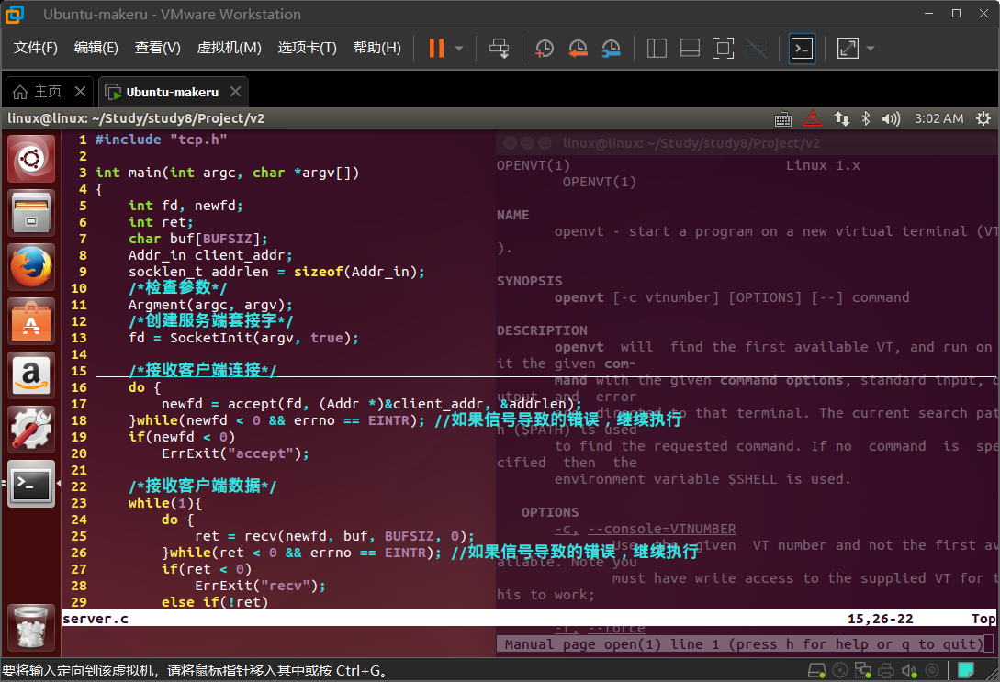
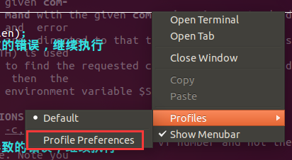
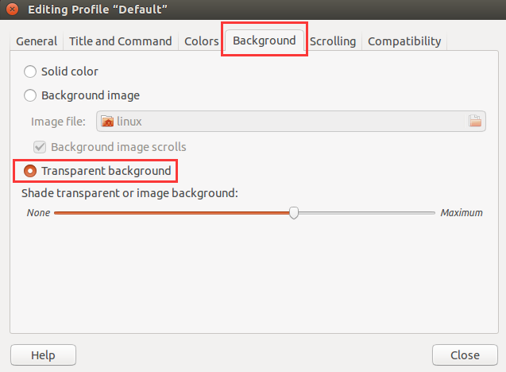

# Linux_tips

## 8进制数表示文件权限

在八进制中，每个数字代表一个不同的权限集

权限的数字表示法是三组rwx的组合，每组rwx分别对应4,2,1，因此最大的权限数字是777（即**拥有者**、**组**和**其他用户**都有读、写、执行权限）

权限说明：

-  `r`：可读（read）
-  `w`：可写（write）
-  `x`：可执行（execute）

数字说明：

-  数字`7`代表**读写执行**权限（即`rwx`）
-  数字`6`代表**读写**权限（即`rw-`）
-  数字`4`代表**只读**权限（即`r--`）
-  而数字`2`代表**只写**权限（即`--w`）

这些数字可以组合起来，形成一个完整的权限集，如`644`代表用户有读写权限，组有只读权限，其他用户也有只读权限。


## chmod-修改文件权限

-  语法：chmod [选项] [模式] [文件名/目录名]
-  选项：
   -  `-R`：递归地改变指定目录及其子目录下的所有文件的权限。
   -  `-v`：显示操作的详细过程。
   -  `-c`：类似 -v，但只显示有更改权限的操作。
   -  `-f`：不显示错误信息。
-  模式：
   -  数字模式：使用三个数字分别表示用户、组和其他用户的权限，如`chmod 753 file.txt`。
   -  符号模式：
      -  操作符`+`表示添加权限，`-`表示删除权限，`=`表示设置权限。
      -  使用字母和符号表示权限，如`chmod u=rwx,g=rx,o=rx file.txt`。


## 目录文件表示符

Linux系统中的文件和目录有多种表示方法，以下是一些常见的表示方法：

1. **当前目录**：使用点（`.`）表示当前工作目录。
2. **上级目录**：使用两点（`..`）表示当前工作目录的父目录。
3. **子目录和文件**：使用点加斜杠（`./`）后跟子目录或文件的名称，可以访问当前目录下的子目录或文件。
4. **上级目录中的文件或子目录**：使用两点加斜杠（`../`）后跟名称，可以访问上一级目录中的文件或子目录。
5. **根目录**：单独一个斜杠（`/`）表示系统的根目录，它是文件系统层级结构的最顶层。
6. **用户的主目录**：使用波浪号（`~`）来快速表示当前登录用户的主目录。
7. **隐藏文件**：如果文件名或目录名前面带有点号（`.`），则表示该文件或目录为隐藏文件，通常使用`ls -a`命令查看。
8. **绝对路径**：以斜杠（`/`）开头的路径，它直接指向目标文件或目录，从根目录开始定位文件的位置。
9. **相对路径**：不以斜杠（`/`）开头的路径，是相对于当前工作目录的位置来定位文件或目录。


## vim 复制粘贴

使用`:set paste`命令进入粘贴模式

使用 `set nopaste` 命令可以恢复到正常的编辑模式


## vim 批量替换

`:%s/my_addr/peer_addr/g`  将my_addr替换为peer_addr

-  `:`：表示进入命令模式。
-  `%`：表示在整个文件中进行操作。
-  `s`：表示执行替换操作。
-  `my_addr`：表示要查找的字符串。
-  `peer_addr`：表示要替换成的字符串。
-  `g`：表示全局替换，即替换每一行中的所有匹配项。


## vim 查找

`/fd`  高亮显示 fd


## Linux 终端窗口设置为透明



1.  打开终端

2.  右键鼠标

3.  选择`Profile Preferences`

    

4.  点击`Background`

5.  选择 Transparent background

6.  拖动滑条调整透明度

    

7.  完成。

## const 声明常量

使用const关键字可以保护变量的值不被意外修改，提高代码的可读性和安全性。

```c
const int a = 10; // 声明一个整型常量a，值为10
int b = 20;
const int *p = &b; // 声明一个指向整型的常量指针p，指向变量b的地址
*p = 30; // 错误，不能修改常量指针所指向的值
int * const q = &b; // 声明一个指向整型的常量指针q，指向变量b的地址
*q = 40; // 正确，可以修改常量指针所指向的值
const int * const r = &b; // 声明一个指向整型的常量指针r，指向变量b的地址
*r = 50; // 错误，不能修改常量指针所指向的值
```

