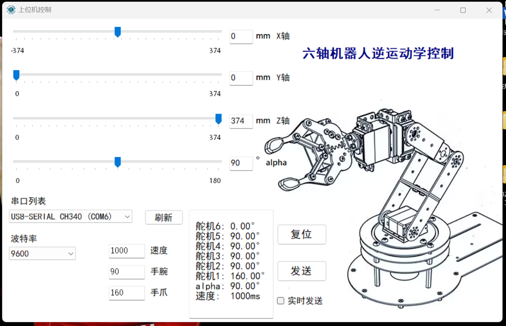
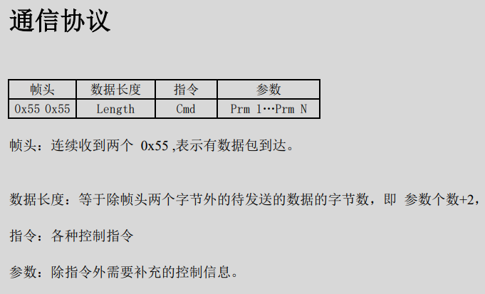
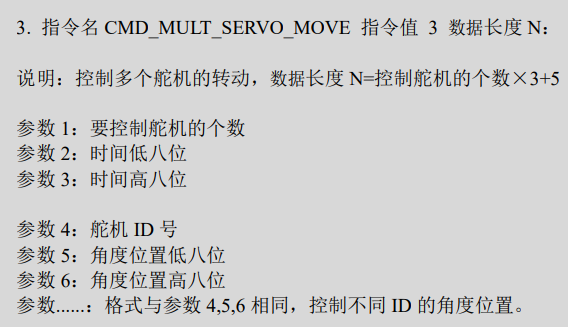
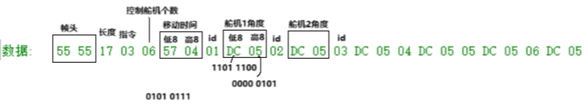
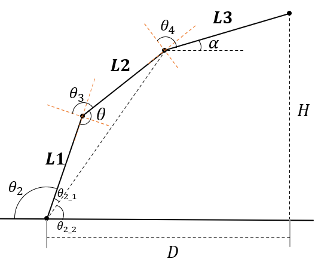

# 六轴机器人逆运动学上位机控制

## 最终效果

通过开发的上位机软件，能够实现对机械臂末端的精准操控。具体而言，该软件接收输入的坐标与角度参数，经过算法处理计算出机械臂各关节轴的目标角度。随后，这些角度值被转换为对应的脉冲宽度调制（PWM）信号数值并传输至下位机，进而驱动舵机偏转至指定位置。这一过程完整地体现了机器人逆运动学控制的实现机制。

## 准备

机器人下位机已经写好信号接收和舵机控制的程序；

电脑上安装好Visual Studio 和CH341串口驱动；

## 软件编写

### 编写流程

1. 打开 Visual Studio 。
2. 在起始页中，选择“创建新项目”。
3. 在“创建新项目”窗口中，选择“Windows 桌面”类别。
4. 在右侧的模板列表中，选择“Windows 窗体应用(.NET Framework)”或“控制台应用程序”等您想要创建的应用程序类型。
5. 为项目指定一个名称和存储位置，然后点击“确定”。
6. 根据选择的应用程序类型，Visual Studio 会创建基本的项目结构和代码框架。
7. 然后就可以在相应的代码文件（例如 Form1.cs 或 Program.cs）中编写 C# 代码来实现应用程序逻辑。

### 软件界面部分代码

```c
private void UpdateSendDataTextBox()
{
    double x_input = trackBar1.Value - x_origin;
    double y_input = trackBar2.Value;
    double z_input = trackBar3.Value;
    alpha = trackBar4.Value;


    label_Xmin.Text = $"-{x_origin}";
    label_Xmax.Text = $"{x_origin}";
    label_Ymax.Text = $"{z_origin}";
    label_Zmax.Text = $"{z_origin}";

    textBox_alpha.Text = trackBar4.Value.ToString();
    textBox_Z.Text = trackBar3.Value.ToString();
    textBox_Y.Text = trackBar2.Value.ToString();
    textBox_X.Text = (trackBar1.Value - x_origin).ToString();
    textBox_wrist.Text = theta5.ToString();
    textBox_hand.Text = theta6.ToString();

    if (JiSuan(x_input, y_input,z_input, alpha))
    {
        textBoxSendData.Text =
        $"\r\n 舵机6: {theta1:F2}°" +
        $"\r\n 舵机5: {theta2:F2}°" +
        $"\r\n 舵机4: {theta3:F2}°" +
        $"\r\n 舵机3: {theta4:F2}°" +
        $"\r\n 舵机2: {theta5:F2}°" +
        $"\r\n 舵机1: {theta6:F2}°" +
        $"\r\n alpha: {alpha:F2}°" +
        $"\r\n 速度:  {Value_speed}ms";
        Solvable_flage = true;
    }
    else
    {
        textBoxSendData.Text = 
        $"\r\n 舵机6: 无解" +
        $"\r\n 舵机5: 无解" +
        $"\r\n 舵机4: 无解" +
        $"\r\n 舵机3: 无解" +
        $"\r\n 舵机2: {theta5:F2}°" +
        $"\r\n 舵机1: {theta6:F2}°" +
        $"\r\n alpha: {alpha:F2}°" +
        $"\r\n 速度:  {Value_speed}ms";
        Solvable_flage = false;
    }
}
/*复位按钮*/
private void buttonPlus1_Click(object sender, EventArgs e)
{
    trackBar1.Value = x_origin;
    trackBar2.Value = y_origin;
    trackBar3.Value = z_origin;
    trackBar4.Value = 90;
    Value_speed = 1000;
    theta5 = wrist_origin;
    theta6 = hand_origin;
    textBox_speed.Text = $"{Value_speed}";

    UpdateSendDataTextBox();
    SendData();
}
//=滑动条及输入框部分================================================================================================

private void textBox_wrist_KeyDown(object sender, KeyEventArgs e)
{
    if (e.KeyCode == Keys.Enter)
    {
        if (int.TryParse(textBox_wrist.Text, out int value))
        {
            //textBox_X.Text = trackBar1.Value.ToString();
            if (value >= 0 && value <= 180)
            {
                theta5 = value;
            }
            else
            {
                MessageBox.Show($"请输入范围在 0 到 180 之间的整数！");
            }
        }
        else
        {
            MessageBox.Show("请输入一个有效的整数！");
        }
        UpdateSendDataTextBox();
    }
    if (isRealtimeSendEnabled)
    {
        SendData();
    }
}

private void textBox_hand_KeyDown(object sender, KeyEventArgs e)
{
    if (e.KeyCode == Keys.Enter)
    {
        if (int.TryParse(textBox_hand.Text, out int value))
        {
            //textBox_X.Text = trackBar1.Value.ToString();
            if (value >= 0 && value <= 180)
            {
                theta6 = value;
            }
            else
            {
                MessageBox.Show($"请输入范围在 0 到 180 之间的整数！");
            }
        }
        else
        {
            MessageBox.Show("请输入一个有效的整数！");
        }
        UpdateSendDataTextBox();
    }
    if (isRealtimeSendEnabled)
    {
        SendData();
    }
}
private void textBox_speed_KeyDown(object sender, KeyEventArgs e)
{
    if (e.KeyCode == Keys.Enter)
    {
        if (int.TryParse(textBox_speed.Text, out int value))
        {
            //textBox_X.Text = trackBar1.Value.ToString();
            if (value >= 100 && value <= 3000)
            {
                Value_speed = value;
            }
            else
            {
                MessageBox.Show($"请输入范围在 100 到 3000 之间的整数！");
            }
        }
        else
        {
            MessageBox.Show("请输入一个有效的整数！");
        }
        UpdateSendDataTextBox();
    }
}
//-----滑动条-文本框alpha-----------------------------------------------------------------
/*输入框alpha*/
private void textBox_alpha_KeyDown(object sender, KeyEventArgs e)
{
    if (e.KeyCode == Keys.Enter)
    {
        if (int.TryParse(textBox_alpha.Text, out int value))
        {
            textBox_alpha.Text = trackBar4.Value.ToString();
            if (value >= trackBar4.Minimum && value <= trackBar4.Maximum)
            {
                trackBar4.Value = value;
            }
            else
            {
                MessageBox.Show($"请输入范围在 {trackBar4.Minimum} 到 {trackBar4.Maximum} 之间的整数！");
            }
        }
        else
        {
            MessageBox.Show("请输入一个有效的整数！");
        }
        UpdateSendDataTextBox();
    }
    if (isRealtimeSendEnabled)
    {
        SendData();
    }
}
private void trackBar4_ValueChanged(object sender, EventArgs e)
{
    UpdateSendDataTextBox();
    if (isRealtimeSendEnabled)
    {
        SendData();
    }
}
//-------滑动条-文本框Z-----------------------------------------------------------
private void trackBar3_Scroll(object sender, EventArgs e)
{
    UpdateSendDataTextBox();
    if (isRealtimeSendEnabled)
    {
        SendData();
    }
}
/*输入框Z*/
private void textBox_Z_KeyDown(object sender, KeyEventArgs e)
{
    if (e.KeyCode == Keys.Enter)
    {
        if (int.TryParse(textBox_Z.Text, out int value))
        {
            textBox_Z.Text = trackBar3.Value.ToString();
            if (value >= trackBar3.Minimum && value <= trackBar3.Maximum)
            {
                trackBar3.Value = value;
            }
            else
            {
                MessageBox.Show($"请输入范围在 {trackBar3.Minimum} 到 {trackBar3.Maximum} 之间的整数！");
            }
        }
        else
        {
            MessageBox.Show("请输入一个有效的整数！");
        }
        UpdateSendDataTextBox();
    }
}
//-------------------------------------------------------------------
/*检查滑动条trackBar2*/
private void trackBar2_Scroll(object sender, EventArgs e)
{
    UpdateSendDataTextBox();
    if (isRealtimeSendEnabled)
    {
        SendData();
    }
}
/*输入框Y*/
private void textBox_Y_KeyDown(object sender, KeyEventArgs e)
{
    if (e.KeyCode == Keys.Enter)
    {
        if (int.TryParse(textBox_Y.Text, out int value))
        {
            textBox_Y.Text = trackBar2.Value.ToString();
            if (value >= trackBar2.Minimum && value <= trackBar2.Maximum)
            {
                trackBar2.Value = value;
            }
            else
            {
                MessageBox.Show($"请输入范围在 {trackBar2.Minimum} 到 {trackBar2.Maximum} 之间的整数！");
            }
        }
        else
        {
            MessageBox.Show("请输入一个有效的整数！");
        }
        UpdateSendDataTextBox();
    }
}
//---------------------------------------------------------------
/*检查滑动条trackBar1*/
private void trackBar1_Scroll(object sender, EventArgs e)
{
    UpdateSendDataTextBox();
    if (isRealtimeSendEnabled)
    {
        SendData();
    }
}
/*输入框X*/
private void textBox_X_KeyDown(object sender, KeyEventArgs e)
{
    if (e.KeyCode == Keys.Enter)
    {
        if (int.TryParse(textBox_X.Text, out int value))
        {
            textBox_X.Text = trackBar1.Value.ToString();
            if (value >= trackBar1.Minimum-x_origin && value <= trackBar1.Maximum-x_origin)
            {
                trackBar1.Value = value+x_origin;
            }
            else
            {
                MessageBox.Show($"请输入范围在 {trackBar1.Minimum} 到 {trackBar1.Maximum} 之间的整数！");
            }
        }
        else
        {
            MessageBox.Show("请输入一个有效的整数！");
        }
        UpdateSendDataTextBox();
    }
}
```


## 串口通信协议





根据上面的通信协议内容，便可以基本明确串口应该如何发送数据。

### 示例：

下图是控制六个舵机，每个舵机的角度值为1500 (0x5DC)，移动速度为1111 (0x457)时的数据格式



### 为什么要分成高八位和低八位：

-  **单字节传输机制**：串口通信中，数据是以字节为单位进行传输的。每个字节包含8位，这是由串口的硬件结构决定的。

-  **连续传输需求**：当需要传输的数据超过一个字节，即大于8位时，必须将数据分割成多个字节进行连续传输。

-  **缓存限制**：串口的收发寄存器SBUF是八位的，这意味着一次只能处理8位数据。如果赋予SBUF超过8位的数据，它只能取低八位。

   所以，当传输的数据大于八位，即大于255时，就需要将其分成高八位和低八位。

### 串口数据格式代码

```c#
/*转换为数据帧格式*/
private void UnifcatData() 
{
    // t1角度 - 6舵机
    // t2角度 - 5舵机
    // t3角度 - 4舵机
    // t4角度 - 3舵机
    // t5角度 - 2舵机
    // t6角度 - 1舵机
    //舵机pwm值范围为500~2500,对应角度0~180
    PWMval1 = (int)(theta6 * 11.11) + 500;
    PWMval2 = (int)(theta5 * 11.11) + 500;
    PWMval3 = (int)(theta4 * 11.11) + 500;
    PWMval4 = (int)(theta3 * 11.11) + 500;
    PWMval5 = (int)(theta2 * 11.11) + 500;
    PWMval6 = (int)(theta1 * 11.11) + 500;

    bytesToSend[0] = 85;//0x55
    bytesToSend[1] = 85;//0x55 帧头
    bytesToSend[2] = 23;//0x17 长度
    bytesToSend[3] = 3;//0x03 指令
    bytesToSend[4] = 6;//0x06 控制舵机个数
    bytesToSend[5] = (byte)Value_speed;//移动时间 Value_speed
    bytesToSend[6] = (byte)(Value_speed >> 8);//0x04 
    bytesToSend[7] = 1;//0x01 id1
    bytesToSend[8] = (byte)PWMval1;//0x04 
    bytesToSend[9] = (byte)(PWMval1 >> 8);//0x04
    bytesToSend[10] = 2;//0x02 id2
    bytesToSend[11] = (byte)PWMval2;//0x04
    bytesToSend[12] = (byte)(PWMval2 >> 8);//0x04
    bytesToSend[13] = 3;//0x03 id3
    bytesToSend[14] = (byte)PWMval3;//0x04
    bytesToSend[15] = (byte)(PWMval3 >> 8);//0x04
    bytesToSend[16] = 4;//0x04 id4
    bytesToSend[17] = (byte)PWMval4;//0x04
    bytesToSend[18] = (byte)(PWMval4 >> 8);//0x04
    bytesToSend[19] = 5;//0x05 id5
    bytesToSend[20] = (byte)PWMval5;//0x04
    bytesToSend[21] = (byte)(PWMval5 >> 8);//0x04
    bytesToSend[22] = 6;//0x06 id6
    bytesToSend[23] = (byte)PWMval6;//0x04
    bytesToSend[24] = (byte)(PWMval6 >> 8);//0x04
}
```

### 串口连接代码

```c#
private void InitializeComboBox()
{
    // 常用波特率
    int[] baudRates = { 300, 600, 1200, 2400, 4800, 9600, 14400, 19200, 38400, 57600, 115200 };

    // 将波特率添加到ComboBox中
    object[] baudRateObjects = Array.ConvertAll(baudRates, item => (object)item);
    comboBoxBaudRate.Items.AddRange(baudRateObjects);

    // 设置默认波特率为9600
    comboBoxBaudRate.SelectedItem = 9600;

    // 注册事件处理器
    comboBoxBaudRate.SelectedIndexChanged += ComboBoxBaudRate_SelectedIndexChanged;
}
private void comboBoxBaudRate_SelectedIndexChanged(object sender, EventArgs e)
{
    // 当ComboBox的选定值改变时，更新bot_val变量
    bot_val = (int)comboBoxBaudRate.SelectedItem;
    //MessageBox.Show($"波特率已更改为: {bot_val}");
}
/*波特率选项框*/
private void ComboBoxBaudRate_SelectedIndexChanged(object sender, EventArgs e)
{
    throw new NotImplementedException();
}

/*串口搜索框*/
private void GetAvailablePorts()
{
    comboBoxPorts.Items.Clear();

    var searcher = new ManagementObjectSearcher("SELECT * FROM Win32_PnPEntity WHERE Caption LIKE '%(COM%)'");
    var portNames = SerialPort.GetPortNames();
    var ports = new List<string>();

    foreach (ManagementObject queryObj in searcher.Get())
    {
        string name = queryObj["Caption"].ToString();
        foreach (string port in portNames)
        {
            if (name.Contains(port))
            {
                ports.Add(name);
                break;
            }
        }
    }

    comboBoxPorts.Items.AddRange(ports.ToArray());
}

/*串口刷新按钮*/
private void buttonRefresh_Click(object sender, EventArgs e)
{
    GetAvailablePorts();
}

/*串口发送按钮*/
private void buttonSend_Click(object sender, EventArgs e)
{
    SendData();
}

private void Form1_Load(object sender, EventArgs e)
{

}

/*检查串口搜索框，连接串口*/
private void comboBoxPorts_SelectedIndexChanged(object sender, EventArgs e)
{
    if (serialPort != null && serialPort.IsOpen)
    {
        serialPort.Close();
    }

    string selectedPortInfo = comboBoxPorts.SelectedItem.ToString();
    string selectedPort = selectedPortInfo.Substring(selectedPortInfo.LastIndexOf("(COM")).Replace("(", "").Replace(")", "");

    serialPort = new SerialPort(selectedPort)
    {
        BaudRate = bot_val, // 设置波特率
        ReadTimeout = 3000, // 读取超时设置为3秒
        WriteTimeout = 3000 // 写入超时设置为3秒
    };
    //serialPort.DataReceived += SerialPort_DataReceived;

    try
    {
        serialPort.Open();
    }
    catch (UnauthorizedAccessException ex)
    {
        MessageBox.Show("访问串口被拒绝: " + ex.Message, "错误", MessageBoxButtons.OK, MessageBoxIcon.Error);
    }
    catch (IOException ex)
    {
        MessageBox.Show("串口打开失败: " + ex.Message, "错误", MessageBoxButtons.OK, MessageBoxIcon.Error);
    }
    catch (ArgumentException ex)
    {
        MessageBox.Show("无效的串口参数: " + ex.Message, "错误", MessageBoxButtons.OK, MessageBoxIcon.Error);
    }
    catch (InvalidOperationException ex)
    {
        MessageBox.Show("串口状态无效: " + ex.Message, "错误", MessageBoxButtons.OK, MessageBoxIcon.Error);
    }
}
/*检查是否勾选实时发送*/
private void checkBoxRealtimeSend_CheckedChanged(object sender, EventArgs e)
{
    isRealtimeSendEnabled = checkBoxRealtimeSend.Checked;
}

/*向串口发送数据*/
private void SendData()
{
    if (serialPort != null && serialPort.IsOpen)
    {
        if (Solvable_flage)
        {
            try
            {
                UnifcatData();
                serialPort.Write(bytesToSend, 0, bytesToSend.Length);
                //System.Threading.Thread.Sleep(1000);// 等待数据发送完成
            }
            catch (Exception ex)
            {
                MessageBox.Show("发送数据时出错: " + ex.Message, "错误", MessageBoxButtons.OK, MessageBoxIcon.Error);
            }
        }
        else
        {
            if (!isRealtimeSendEnabled)
                MessageBox.Show("无解，请调整坐标 " , "错误", MessageBoxButtons.OK, MessageBoxIcon.Error);
        }    
    }
    else
    {
        MessageBox.Show("请选择一个串口并确保它是打开的", "错误", MessageBoxButtons.OK, MessageBoxIcon.Error);
    }
}
```


## 运动学逆解



### 计算步骤

已知机械臂末端坐标(x,y,z)和α角，求角

首先，测量出机械臂的长度(mm)：

- $L_1 = 105.0$
- $L_2 = 89.0$
- $L_3 = 180.0$​
- **计算在xy平面内的底盘舵机角度 $\theta_1$** ：
   - $\theta_1 = \arctan(\frac{y}{x})$​ 


**将三维立体坐标转换到二维平面内**：

- 机械臂末端的高度和水平距离 ：
   - $D = \sqrt{|x^2 + y^2|}$，$H = z$ 

- $L_3$在 $x$ 方向和 $y$ 方向的分量：
   - $x_{\alpha} = L_3 \times \cos(\alpha_{rad})$ ，$y_{\alpha} = L_3 \times \sin(\alpha_{rad})$​
- 连杆$L_1$和$L_2$的 $x$ 和 $y$ 分量：
   - $x_{\theta} = D - x_{\alpha}$ ，$y_{\theta} = H - y_{\alpha}$
- 连杆$L_2$末端到原点的距离:
   - $d_{\theta} = \sqrt{x_{\theta}^2 + y_{\theta}^2}$​
- 连杆$L_1$与$L_2$之间的夹角 $\Theta$：
   - $\Theta = \arccos(\frac{L_1^2 + L_2^2 - d_{\theta}^2}{2 \times L_1 \times L_2})$
- 舵机 4 的角度 $\theta_3$：
   - $\theta_3 = 180 - \frac{\pi \times 1.5 - \Theta}{180}$​​ （转换为角度）
- 角度$\theta_{2_1}$和$\theta_{2_2}$：
   - $\theta_{2_1} = \arccos(\frac{L_1^2 + d_{\theta}^2 - L_2^2}{2 \times L_1 \times d_{\theta}})$ ，$\theta_{2_2} = \arccos(\frac{x_{\theta}}{d_{\theta}})$
- 舵机 5 的角度 $\theta_2$：
   - $\theta_2 = 180 - (\frac{\theta_{2_1}}{180} + \frac{\theta_{2_2}}{180})$ 
- 舵机 3 的角度$\theta_4$：
   -  $\theta_4 = |\frac{\Theta - \alpha_{rad} + \theta_{2_1} + \theta_{2_2}}{180} - 90|$ 

### 逆解代码

```c
private const double PI = Math.PI;
private const double L1 = 105.0;  // 机械臂长度
private const double L2 = 89.0;  // 机械臂长度
private const double L3 = 180.0;  // 机械臂长度 
/*计算底盘舵机角度，并将坐标转换到二维*/
public static bool JiSuan(double x, double y, double z, double alpha)
{
    //计算底盘舵机角度
    theta1 = Rad2Deg(Math.Atan2(y, x));
    double H = z; // 高度
    double D = Math.Sqrt(Math.Abs(x * x) + y * y); // 水平距离

    return (My_Model(D, H, alpha));
}

//在二维平面计算角度
public static bool My_Model(double D, double H, double alpha)
{
    alpha = Deg2Rad(alpha);//转为弧度
    double x_alpha = L3 * Math.Cos(alpha);
    double y_alpha = L3 * Math.Sin(alpha);

    double x_theta = D - x_alpha;
    double y_theta = H - y_alpha;
    double d_theta = Math.Sqrt(x_theta* x_theta+ y_theta* y_theta);

    double Theta = Math.Acos((L1*L1+L2*L2-d_theta*d_theta)/(L1*L2*2));

    theta3 = Rad2Deg(PI*1.5 - Theta); // 舵机4
    double theta2_1 = Math.Acos((L1*L1+d_theta*d_theta-L2*L2)/(L1*d_theta*2));
    double theta2_2 = Math.Acos(x_theta/d_theta);
    theta2 =180 - Rad2Deg(theta2_1+theta2_2); // 舵机5

    theta4 = Math.Abs(Rad2Deg(Theta- alpha + theta2_1 + theta2_2) - 90);// 舵机3

    return IsSolutionValid(theta1, theta2, theta3, theta4);
}

/*检查解是否在有效范围内*/
static bool IsSolutionValid(double theta1, double theta2, double theta3, double theta4)
{
    return (theta1 >= 0 && theta1 <= 180 &&
            theta2 >= 0 && theta2 <= 180 &&
            theta3 >= 0 && theta3 <= 180 &&
            theta4 >= 0 && theta4 <= 180);
}
/*弧度转换为度*/
static double Rad2Deg(double rad)
{
    return rad * 180 / Math.PI;
}
/*角度转换为弧度*/
static double Deg2Rad(double rad)
{
    return rad * Math.PI / 180;
}
```

